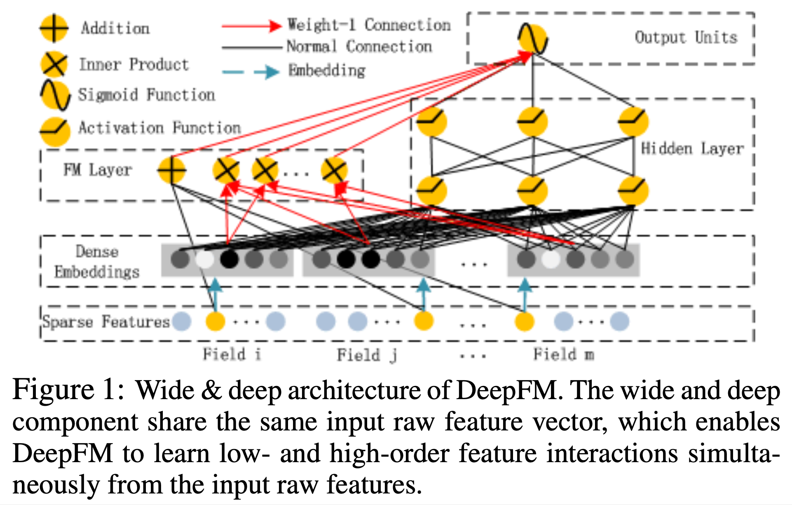
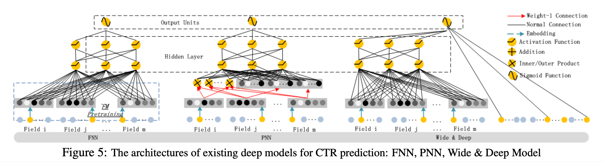
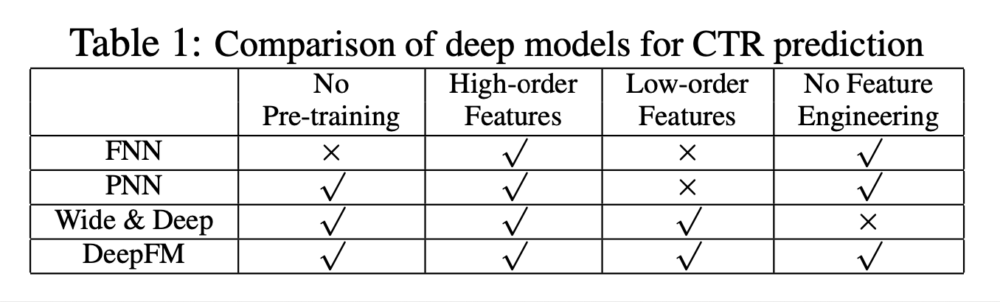
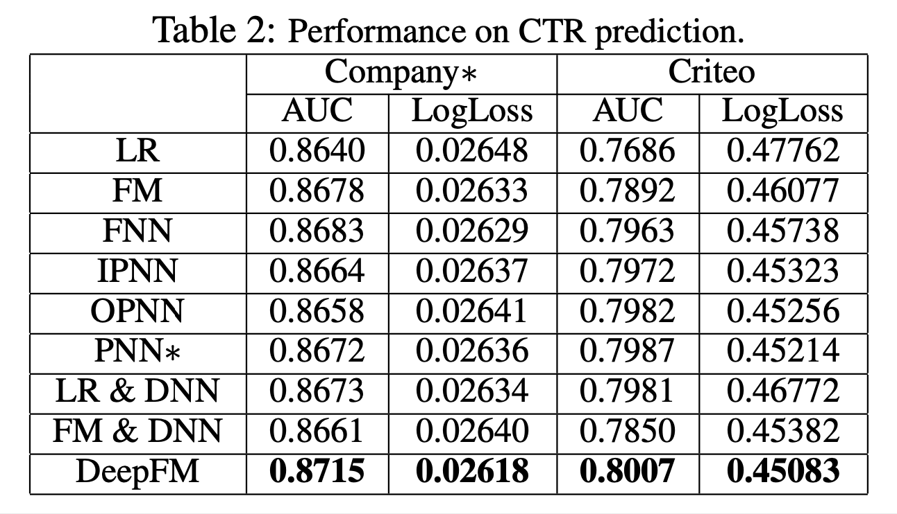

# **DeepFM: A Factorization-Machine based Neural Network for CTR Prediction** (2017), H. Guo et al. 

###### contributors: [@GitYCC](https://github.com/GitYCC)

\[[paper](https://arxiv.org/pdf/1703.04247)\] \[[code](https://github.com/ChenglongChen/tensorflow-DeepFM)\]

---

**TR;DR**

- design advantages:
  - it does not need any pre-training
  - it learns both high- and low-order feature interactions
  - it introduces a sharing strategy of feature embedding to avoid feature engineering
- performance:
  - DeepFM outperforms the state-of- the-art models in terms of AUC and Logloss on both datasets (Criteo Dataset and Company Dataset)
  - The efficiency of DeepFM is comparable to the most effi- cient deep model in the state-of-the-art

**Introduction**

- prediction target: click-through rate (CTR)
- feature interactions
  - download apps for food delivery at meal-time, suggesting that the (order-2) interaction between app category and time-stamp
  - male teenagers like shooting games and RPG games, which means that the (order-3) interaction of app category, user gender and age

**Approach**

(Weight-1 Connection: point-wise operation to keep embedding vector format and information)

- denote
  - size of the features: $M$
  - size of the feature fields: $F$
  - size of the feature embedding: $K$
- FM Component: first order
  - obtain $\{w_m x_m\}$ terms
- FM Component: second order
  - obtain $\{x_ix_j(V_i\odot V_j)\}$ ($i\neq j$ ; $i,j=1,...,M$) terms
- Deep Component
  - $a^{(l+1)}=\sigma(W^{(l)}a^{(l)}+b^{(l)})$
- DeepFM: FM Component: first order + second order & Deep Component
  - output: $sigmoid(concat[\{w_m x_m\}, \{x_ix_j(V_i\odot V_j)\},a^{(L)}])$

- benefits:
  - it learns both low- and high-order fea- ture interactions from raw features
  - there is no need for ex- pertise feature engineering of the input, as required in Wide & Deep

**Relationship with the other Neural Networks**

**Experiments**

- datasets:
  - Criteo Dataset
  - Company Dataset
- Model Comparison: We compare 9 models in our experiments: LR, FM, FNN, PNN (three variants), Wide & Deep, and DeepFM.

