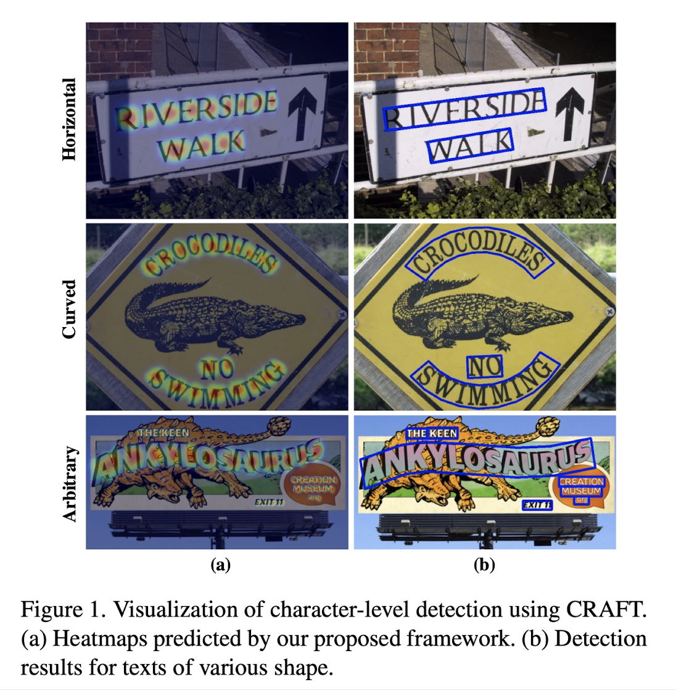
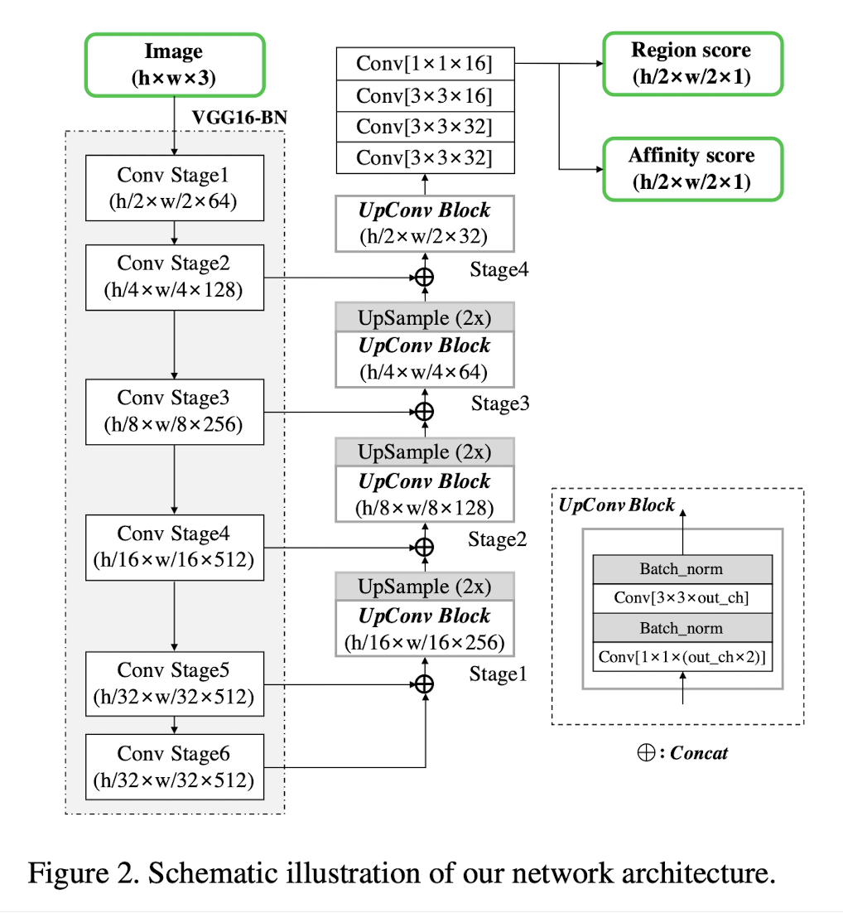
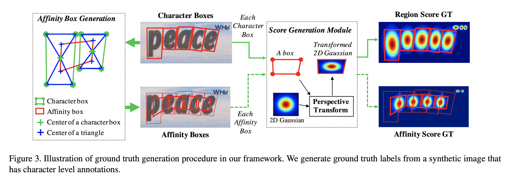
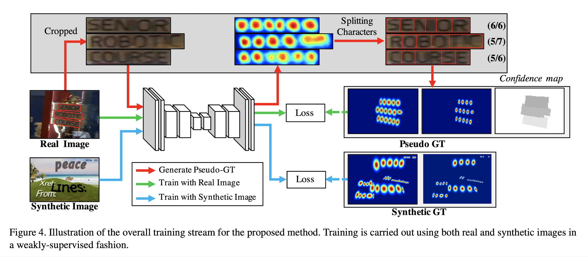
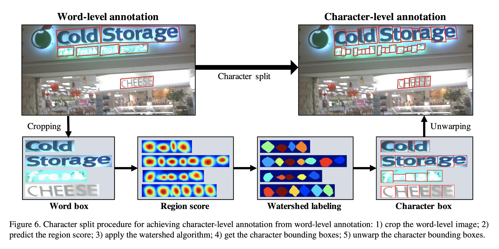
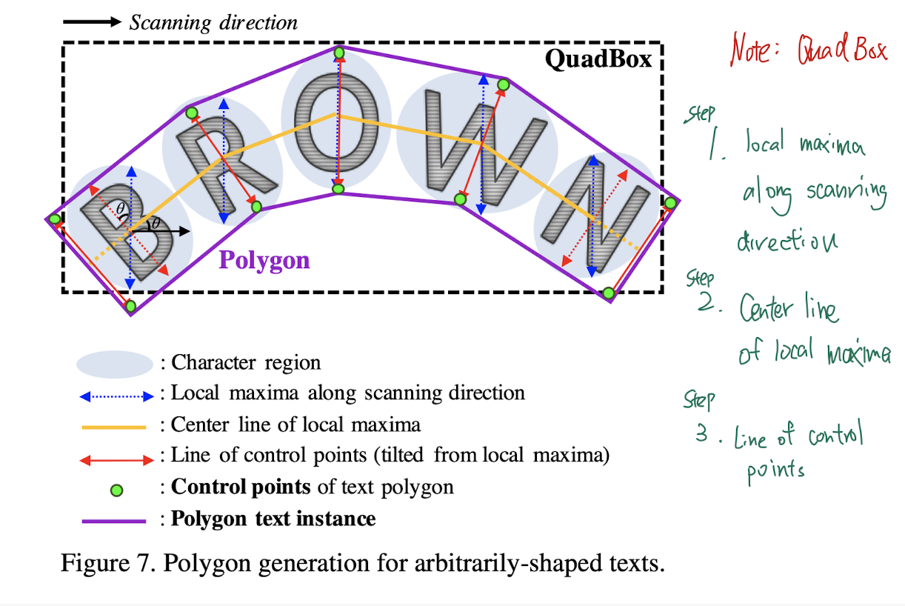

# Character Region Awareness for Text Detection (2019), Youngmin Baek et al.

###### contributors: [@GitYCC](https://github.com/GitYCC)

\[[paper](https://arxiv.org/pdf/1904.01941.pdf)\] \[[code](https://github.com/clovaai/CRAFT-pytorch)\]

---

### Introduction

- Character-level awareness has many advantages when handling challenging texts by linking the successive characters in a bottom-up manner. Unfortunately, most of the existing text datasets do not provide character- level annotations, and the work needed to obtain character- level ground truths is too costly.
- In this paper, we propose a novel text detector that localizes the individual character regions and links the detected characters to a text instance.
- Our framework, referred to as CRAFT for Character Region Awareness For Text detection, is designed with a convolutional neural network producing the character *region score* and *affinity score*. To compensate for the lack of character-level annotations, we propose a weakly- supervised learning framework that estimates character-level ground truths in existing real word-level datasets.
  - The *region score* is used to localize individual characters in the image.
  - The *affinity score* is used to group each character into a single instance.

### Related Work

- Regression-based text detectors: box regression adapted from popular object detector
  - TextBoxes, DMPNet, Rotation-Sensitive Regression Detector (RSDD)
- Segmentation-based text detectors: aims to seek text regions at the pixel level
  - Multi-scale FCN, Holistic-prediction, PixelLink, SSTD, TextSnake
- End-to-end text detectors: trains the detection and recognition modules simultaneously
  - FOTS, EAA, Mask TextSpotter
- Character-level text detectors
  - Zhang et al., Yao et al., Seglink, WordSup

### Methodology

**Architecture**

- backbone: VGG-16 with batch normalization
- Our model has skip connections in the decoding part, which is similar to U-net.

**Training - Ground Truth Label Generation**

- We use the heatmap representation to learn both the region score and the affinity score.
- Unlike a binary segmentation map, which labels each pixel discretely, we encode the probability of the character center with a Gaussian heatmap.

**Training - Weakly-Supervised Learning**

- Unlike synthetic datasets, real images in a dataset usually have word-level annotations. Here, we generate character boxes from each word-level annotation in a weakly- supervised manner.
  - 
- Character splitting
  - 

- Confidence Map: the pixel-wise confidence map $S_c$ for an image is computed as,
  $$
  S_c(p)=s_{conf}(w)\ \text{if}\ p\in R(w)\ \text{else}\ 1
  $$

  - $R(w)$: the bounding box region of the sample $w$
  - $s_{conf}(w)=\frac{l(w)−min(l(w),|l(w)−l^c(w)|)}{l(w)}$
    - $l(w)$: word length of sample $w$
    - $l^c(w)$: prediction of $l(w)$

- $L=\sum_p S_c (p) · (||S_r (p) − S_r^∗(p)||^2_2 + ||S_a (p) − S_a^∗ (p)||^2_2)$

  - pixel-wise loss
  - where $S_r^∗(p)$ and $S_a^∗ (p)$ denote the pseudo-ground truth region score and affinity map, respectively, and $S_r(p)$ and $S_a(p)$ denote the predicted region score and affinity score, respectively.

**Inference**

- The post-processing for finding bounding boxes
  - step1- the binary map $M$: $M(p)$ is set to $1$ if $S_r(p) > τ_r$ or $S_a(p) > τ_a$, where $τ_r$ is the region threshold and $τ_a$ is the affinity threshold
  - step2 - Connected Component Labeling (CCL) on M is performed (connectedComponents in openCV)
  - step3 - QuadBox is obtained by finding a rotated rectangle with the minimum area enclosing the connected components corresponding to each of the labels.  (minAreaRect in openCV)
- Note that an advantage of CRAFT is that it does not need any further post-processing methods, like Non-Maximum Suppression (NMS). Since we have image blobs of word regions separated by CCL, the bounding box for a word is simply defined by the single enclosing rectangle.
- Additionally, we can generate a polygon around the entire character region to deal with curved texts effectively.
  - 

