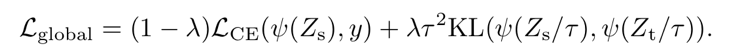
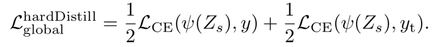
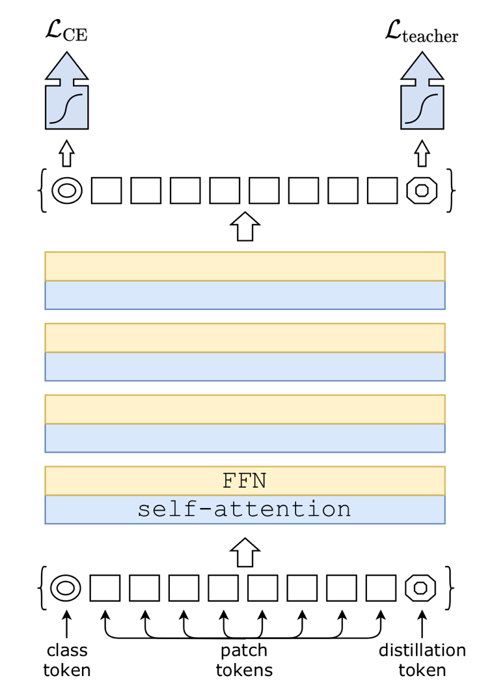
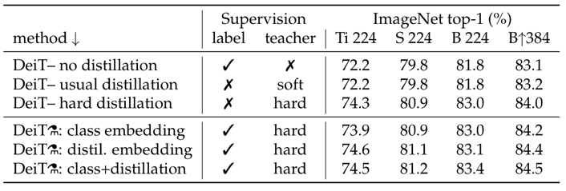
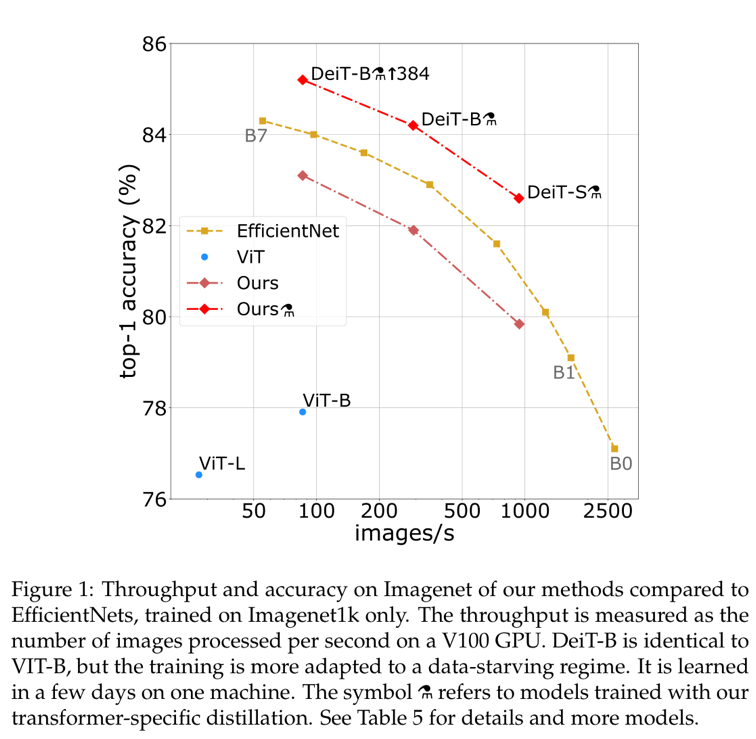

# Training data-efficient image transformers & distillation through attention (2020), Hugo Touvron et al.

###### contributors: [@GitYCC](https://github.com/GitYCC)

\[[paper](https://arxiv.org/abs/2012.12877)\] \[[code](https://github.com/facebookresearch/deit)\]

---

### Introduction

- Data-efficient image Transformers (DeiT)
- we introduce a teacher-student strategy specific to transformers
- In this paper, we train a vision transformer on a single 8-GPU node in two to three days (53 hours of pre-training, and optionally 20 hours of fine-tuning).
  - The paper of ViT concluded that transformers “do not generalize well when trained on insufficient amounts of data”, and the training of these models involved extensive computing resources.

### Distillation through attention

- This section covers two axes of distillation: hard distillation versus soft distillation, and classical distillation versus the distillation token
- Soft distillation
  - minimizes the Kullback-Leibler divergence between the softmax of the teacher and the softmax of the student model
  - 
    - $Z_t$ : the logits of the teacher model
    - $Z_s$ : the logits of the student model
    - $\tau$ : the temperature for the distillation
    - $\lambda$ : the coefficient balancing the Kullbak-Leibler divergence loss and the cross-entropy
    - $y$ : ground true labels
    - $ψ$ : the softmax function
- Hard-label distillation
  - We introduce a variant of distillation where we take the hard decision of the teacher as a true label.
  - 
- Distillation token
  - 

### Experiment

- Distillation
  - default teacher is a RegNetY-16GF (84M parameters)
  - Hard distillation significantly outperforms soft distillation for transformers
    - 
  - Interestingly, the distilled model outperforms its teacher in terms of the trade-off between accuracy and throughput.
    - 