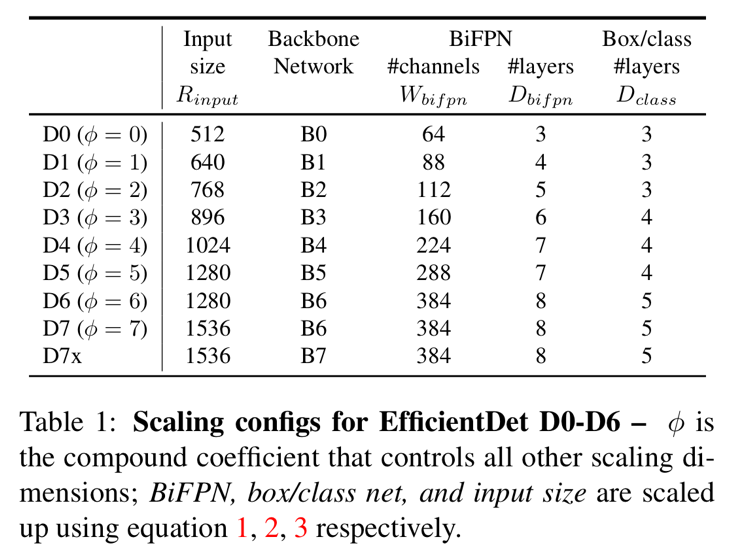

# EfficientDet: Scalable and Efficient Object Detection (2020), Mingxing Tan et al.

###### contributors: [@GitYCC](https://github.com/GitYCC)

\[[paper](https://arxiv.org/abs/1911.09070)\] \[[code](https://github.com/google/automl/tree/master/efficientdet)\]

---

- related work
  - AmoebaNet-based NASFPN
    - but large model sizes and expensive computation costs
  - more efficient detector architectures: one-stage, anchor-free
    - but sacrifice accuracy
- contributions
  - we propose a weighted bi-directional feature pyramid network (BiFPN), which allows easy and fast multiscale feature fusion
  - we propose a compound scaling method that uniformly scales the resolution, depth, and width for all backbone, feature network, and box/class prediction networks at the same time
- challenges
  - Challenge 1: efficient multi-scale feature fusion
    - related: FPN, PANet, NAS-FPN (employs neural architecture search to search for better cross-scale feature network topology)
    - bi-directional feature pyramid network (BiFPN)
      - which introduces learnable weights to learn the importance of different input features, while repeatedly applying top-down and bottom-up multi-scale feature fusion
  - Challenge 2: model scaling
- BiFPN
  - 
    - $P_i^{in}$ represents a feature level with resolution of $1/2i$ of the input images
  - Cross-Scale Connections
    - First, we remove those nodes that only have one input edge. Our intuition is simple: if a node has only one input edge with no feature fusion, then it will have less contribution to feature network that aims at fusing different features
    - Second, we add an extra edge from the original input to output node if they are at the same level, in order to fuse more features without adding much cost
    - Third, bidirectional (top-down & bottom-up) path
  - Weighted Feature Fusion
    - All previous methods treat all input features equally without distinction
    - Fast normalized fusion: $O=\sum_i\frac{w_i}{ε+\sum_jw_j}I_i$
- EfficientDet
  - 
  - ImageNet-pretrained EfficientNets as the backbone network
    - same width/depth scaling coefficients of EfficientNet-B0 to B6
  - Compound Scaling
    - jointly scaling up all dimensions of network width, depth, and input resolution
    - 
      - $W_{bifpn}$: # of channels in BiFPN layers
        - we perform a grid search on a list of values {1.2, 1.25, 1.3, 1.35, 1.4, 1.45}, and pick the best value 1.35 as the BiFPN width scaling factor
      - $D_{bifpn}$: BiFPN depth (# of layers)
    - 
    - 
  - 
  - 
- Experiments
  - 
  - 
  - 

