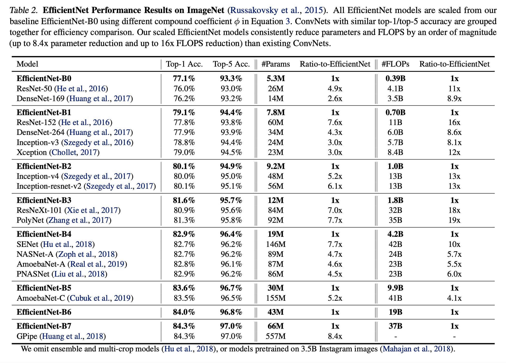

# EfficientNet: Rethinking Model Scaling for Convolutional Neural Networks (2020), Mingxing Tan et al.

###### contributors: [@GitYCC](https://github.com/GitYCC)

\[[paper](https://arxiv.org/abs/1905.11946)\] \[[code](https://github.com/qubvel/efficientnet)\]

---

- Our empirical study shows that it is critical to balance all dimensions of network width/depth/resolution, and surprisingly such balance can be achieved by simply scaling each of them with constant ratio.
- Compound Model Scaling
  - Problem Formulation
    - A ConvNet Layer $i$ can be defined as a function: $Y_i = F_i(X_i)$, where $F_i$ is the operator, $Y_i$ is output tensor, $X_i$ is input tensor, with tensor shape $\langle H_i, W_i, C_i\rangle$, where $H_i$ and $W_i$ are spatial dimension and $C_i$ is the channel dimension.
    - Define a ConvNet as:
      
      - where $F^{L_i}_i$ denotes layer $F_i$ is repeated $L_i$ times in stage $i$, $\langle H_i, W_i, C_i\rangle$ denotes the shape of input tensor $X$ of layer $i$
    - Unlike regular ConvNet designs that mostly focus on finding the best layer architecture $F_i$, model scaling tries to expand the network length ($L_i$), width ($C_i$), and/or resolution ($H_i$,$W_i$) without changing $F_i$ predefined in the baseline network.
    - In order to further reduce the design space, we restrict that all layers must be scaled uniformly with constant ratio.
    - So, the optimization problem:
      
  - Scaling Dimensions
    - 
      - Observation 1 – Scaling up any dimension of network width, depth, or resolution improves accuracy, but the accuracy gain diminishes for bigger models.
  - Compound Scaling
    - 
      - Observation 2 – In order to pursue better accuracy and efficiency, it is critical to balance all dimensions of network width, depth, and resolution during ConvNet scaling.
    - 
    - In this paper, we propose a new **compound scaling method**, which use a compound coefficient $\phi$ to uniformly scales network width, depth, and resolution in a principled way:
      
      - where $\alpha$, $\beta$, $\gamma$ are constants that can be determined by a small grid search
      - Notably, the FLOPS of a regular convolution op is proportional to $d$, $w^2$, $r^2$, i.e., doubling network depth will double FLOPS, but doubling network width or resolution will increase FLOPS by four times.
      - In this paper, we constraint $\alpha\cdot\beta^2\cdot\gamma^2=2$  such that for any new $\phi$, the total FLOPS will approximately increase by $2^\phi$
- EfficientNet Architecture
  - Inspired by (Tan et al., 2019, [MnasNet](cv/MnasNet.md)), we develop our baseline network by leveraging a multi-objective neural architecture search that optimizes both accuracy and FLOPS.
  - Our search produces an efficient network, which we name EfficientNet-B0.
    - 
  - Starting from the baseline EfficientNet-B0, we apply our compound scaling method to scale it up with two steps:
    - STEP 1: we first fix $\phi=1$ , assuming twice more resources available, and do a small grid search of  $\alpha$, $\beta$, $\gamma$ based on Equation 2 and 3. In particular, we find the best values for EfficientNet-B0 are $\alpha=1.2$, $\beta=1.1$, $\gamma=1.15$, under constraint of $\alpha\cdot\beta^2\cdot\gamma^2=2$ .
    - STEP 2: we then fix $\alpha$, $\beta$, $\gamma$ as constants and scale up baseline network with different $\phi$ using Equation 3, to obtain EfficientNet-B1 to B7 (Details in Table 2).
  - 

- Experiments
  - 
  - 

