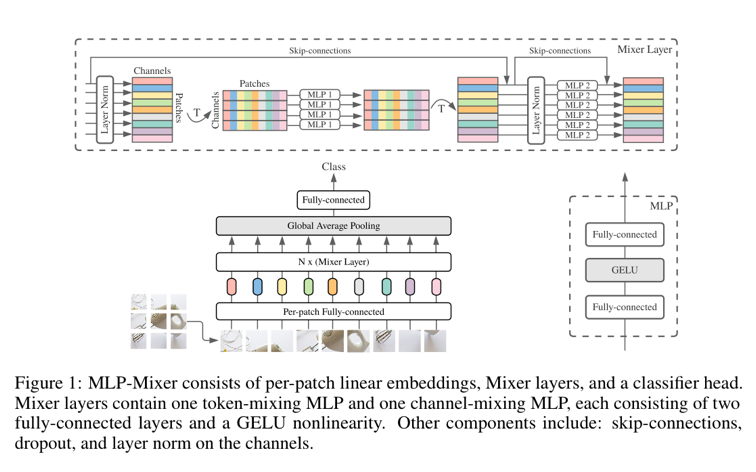
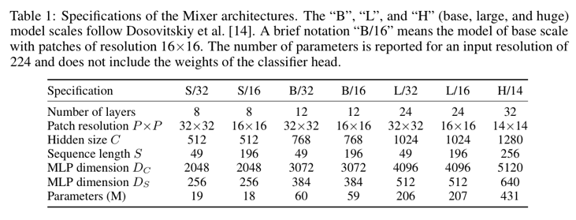
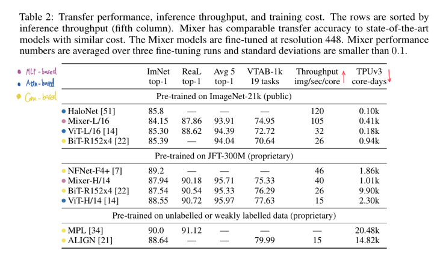

# MLP-Mixer: An all-MLP Architecture for Vision (2021), Ilya Tolstikhin et al.

###### contributors: [@GitYCC](https://github.com/GitYCC)

\[[paper](https://arxiv.org/abs/2105.01601)\] \[[code](https://github.com/google-research/vision_transformer)\]

---

- In this paper we show that while convolutions and attention are both sufficient for good performance, neither of them are necessary. We present MLP-Mixer, an architecture based exclusively on multi-layer perceptrons (MLPs).
- 
  - MLP-Mixer contains two types of layers:
    - one with MLPs applied across patches (i.e. “mixing” spatial information)
    - one with MLPs applied independently to image patches (i.e. “mixing” the per-location features)
  - Unlike ViTs, Mixer does not use position embeddings because the token-mixing MLPs are sensitive to the order of the input tokens.
  - Finally, Mixer uses a standard classification head with the global average pooling layer followed by a linear classifier.
- In the extreme case, our architecture can be seen as a very special CNN, which uses 1×1 convolutions for channel mixing, and single-channel depth-wise convolutions of a full receptive field and parameter sharing for token mixing.
- Experiment Setup
  - dataset for pre-training
    - ILSVRC2021 ImageNet
    - ImageNet-21k
    - JFT-300M
  - 
- When trained on large datasets, or with modern regularization schemes, MLP-Mixer attains competitive scores on image classification benchmarks, with pre-training and inference cost comparable to state-of-the-art models.
  - 

