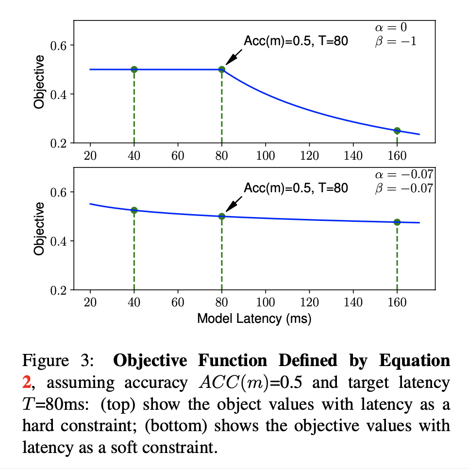
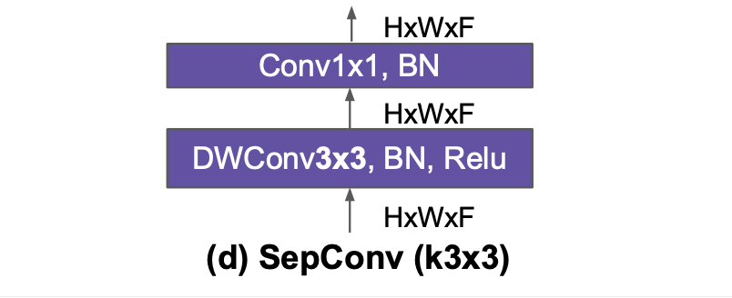
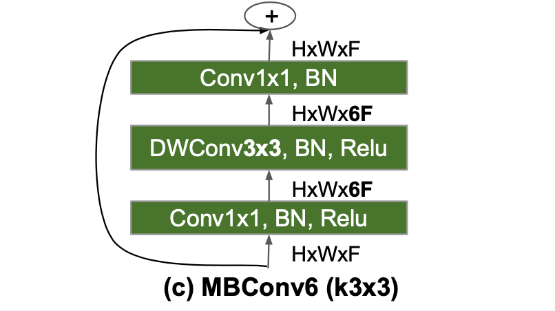
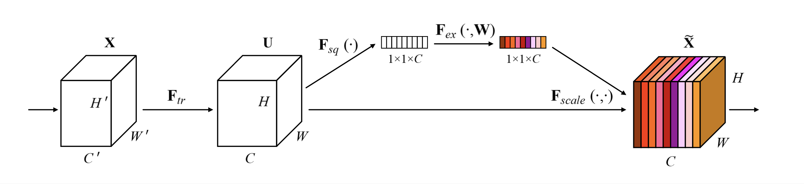
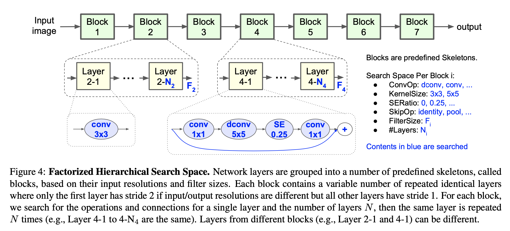
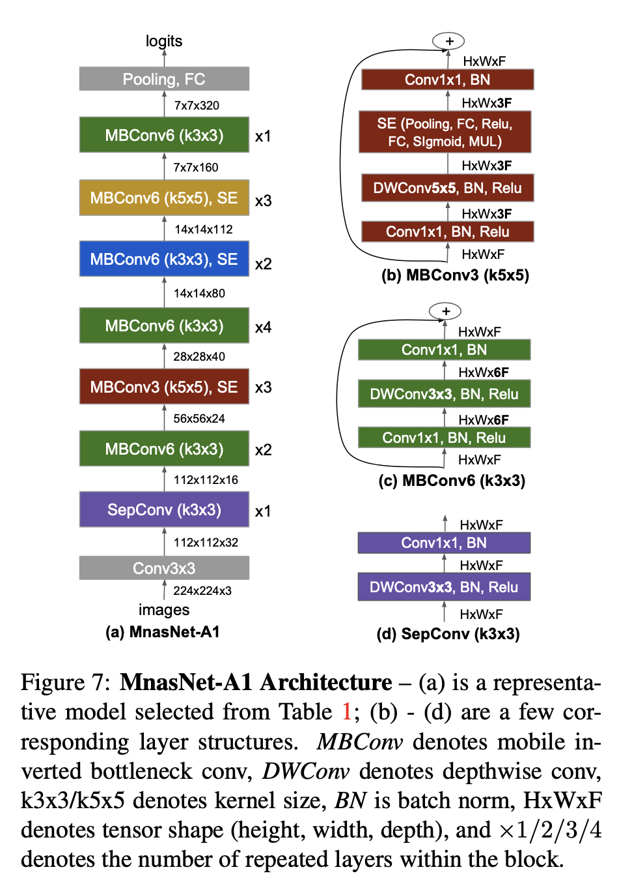
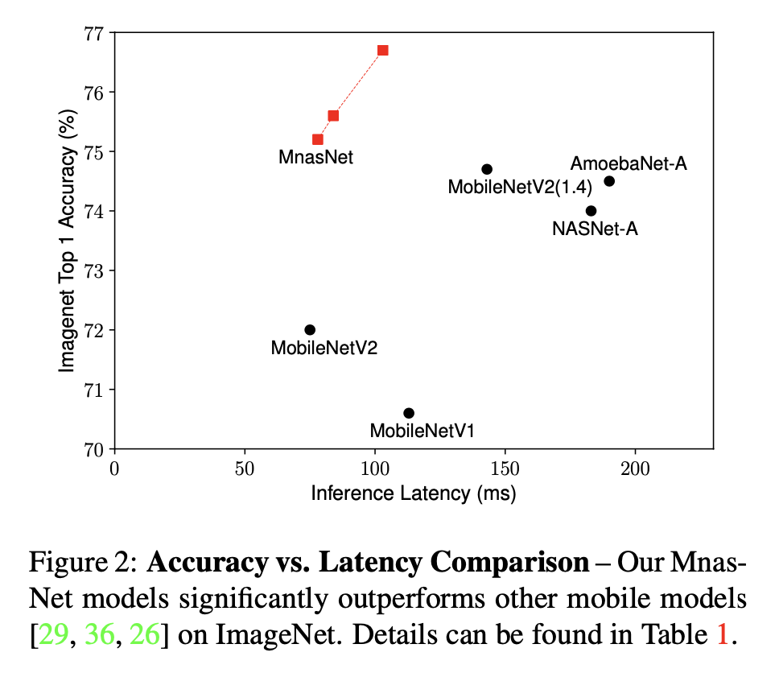
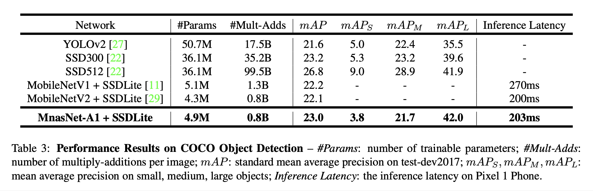

# MnasNet: Platform-Aware Neural Architecture Search for Mobile (2019), Mingxing Tan et al.

###### contributors: [@GitYCC](https://github.com/GitYCC)

\[[paper](https://arxiv.org/abs/1807.11626)\] \[[code](https://github.com/mingxingtan/mnasnet)\]

---

- Introduction
  - In this paper, we propose an automated mobile neural architecture search (MNAS) approach, which explicitly incorporate model latency into the main objective so that the search can identify a model that achieves a good trade-off between accuracy and latency.
  - Unlike previous work, where latency is considered via another, often inaccurate proxy (e.g., FLOPS), our approach directly measures real-world inference latency by executing the model on mobile phones.
  - To further strike the right balance between flexibility and search space size, we propose a novel factorized hierarchical search space that encourages layer diversity throughout the network.
- We introduce a multi-objective neural architecture search approach that optimizes both accuracy and real- world latency on mobile devices.
  - A common method: $argmax_m ACC(m)\ s.t.\ LAT(m)\leq T$
  - However, above approach only maximizes a single metric and does not provide multiple Pareto optimal solutions. Informally, a model is called Pareto optimal if either it has the highest accuracy without increasing latency or it has the lowest latency without decreasing accuracy. 
  - Our method: $argmax_m ACC(m)*[LAT(m)/T]^w$
    - $w=\alpha\ \text{if}\ LAT(m)\leq T\ \text{else}\ \beta$
  - 
  - Assumption of soft constraint: Given two models: (1) M1 has latency $l$ and accuracy $a$; (2) M2 has latency $2l$ and $5\%$ higher accuracy $a · (1 + 5\%)$, they should have similar reward: $Reward(M2) = a · (1 + 5\%)·(2l/T)^\beta\sim Reward(M1)=a·(l/T)^\beta$. Solving this gives $\beta\sim -0.07$. Therefore, we use $\alpha=\beta=-0.07$ in our experiments unless explicitly stated.
- We propose a novel factorized hierarchical search space to enable layer diversity yet still strike the right balance between flexibility and search space size, called "Factorized Hierarchical Search Space".
  - A sub search space for a block $i$ consists of the following choices:
    - Convolutional ops *ConvOp*:
      - regular conv (Conv)
      - depthwise conv (DWConv)
        - 
      - mobile inverted bottleneck conv (MBConv)
        - 
    - Convolutional kernel size *KernelSize*: 3x3, 5x5
    - Squeeze-and-excitation ratio *SERatio*: 0, 0.25
      - 
    - Skip ops *SkipOp*: pooling, identity residual, or no skip
    - Output filter size $F_i$
    - Number of layers per block $N_i$
  - 
  - Search Algorithm: 
    - The search framework consists of three components: a recurrent neural network (RNN) based controller, a trainer to obtain the model accuracy, and a mobile phone based inference engine for measuring the la- tency.
    - trainer: Proximal Policy Optimization (PPO)
- We demonstrate new state-of-the-art accuracy on both ImageNet classification and COCO object detection under typical mobile latency constraints.
  - 
  - 
  - 

