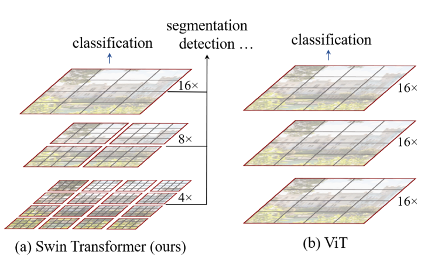

# Swin Transformer: Hierarchical Vision Transformer using Shifted Windows (2021), Ze Liu et al.

###### contributors: [@GitYCC](https://github.com/GitYCC)

\[[paper](https://arxiv.org/abs/2103.14030)\] \[[code](https://github.com/microsoft/Swin-Transformer)\]

---

- Problem: large variations in the scale of visual entities and the high resolution of pixels in images
  - Need 1: flexibility to model at various scales
  - Need 2: linear computational complexity with respect to image size

- Empirically, we find our Swin Transformer architecture to achieve the best speed-accuracy trade-off among these methods on image classification, even though our work focuses on general-purpose performance, e.g. object detection and segmentation , rather than specifically on classification.

### Model

- Shifted Window based Self-Attention
  - Self-attention in non-overlapped windows
    - For efficient modeling, we propose to compute self-attention within local windows. The windows are arranged to evenly partition the image in a non-overlapping manner.
    - Supposing each window contains $M × M$ patches, the computational complexity of a global MSA (Multi-head Self-Attention) module and a window based one on an image of $h × w$ patches are:
      
      
  - Shifted window partitioning in successive blocks
    - The window-based self-attention module lacks connections across windows, which limits its modeling power. To introduce cross-window connections while maintaining the efficient computation of non-overlapping windows, we propose a shifted window partitioning approach which alternates between two partitioning configurations in consecutive Swin Transformer blocks.
      - Shown in Figure 3(b)
    - 
  - Efficient batch computation for shifted configuration
    - we propose a more efficient batch computation approach by cyclic-shifting toward the top-left direction, as illustrated in Figure 4
    - After this shift, a batched window may be composed of several sub-windows that are not adjacent in the feature map, so a masking mechanism is employed to limit self-attention computation to within each sub-window.
    - 
  - Relative position bias
    - 
    - Since the relative position along each axis lies in the range $[−M + 1, M − 1]$, we parameterize a smaller-sized bias matrix $\hat{B} ∈ R^{(2M−1)×(2M−1)}$, and values in $B$ are taken from $\hat{B}$.
      - 
- Architecture Variants
  - 

- combine different scale feature maps to do down-stream tasks
  - 

### Experiments

- image classification
  - 
- object detection
  - 
- semantic segmentation
  - 
