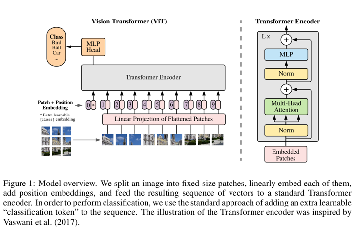
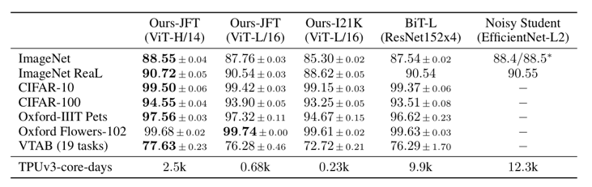
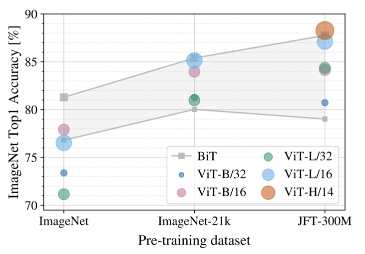
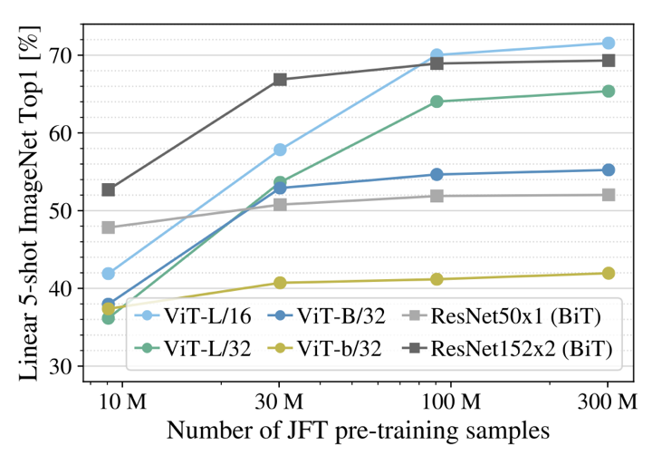
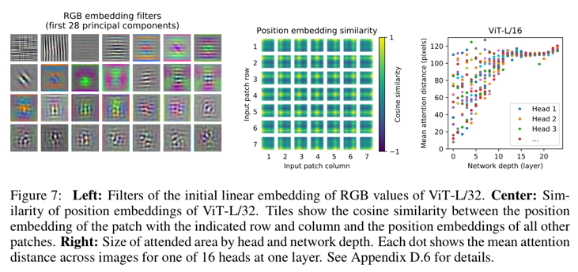
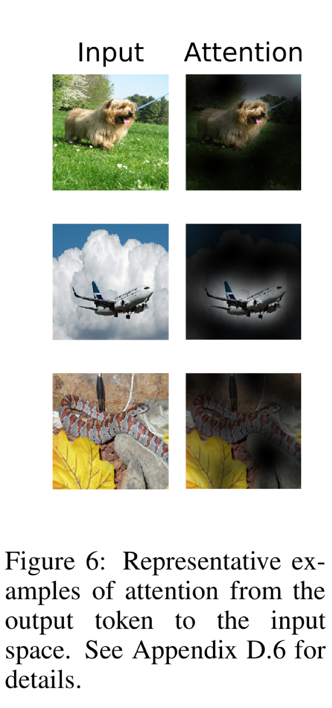

# An Image is Worth 16x16 Words: Transformers for Image Recognition at Scale (2020), Alexey Dosovitskiy et al.

###### contributors: [@GitYCC](https://github.com/GitYCC)

\[[paper](https://arxiv.org/abs/2010.11929)\] \[[code](https://github.com/google-research/vision_transformer)\]

---

### Introduction

- In vision, attention is either applied in conjunction with convolutional networks, or used to replace certain components of convolutional networks while keeping their overall structure in place. 

  - We show that this reliance on CNNs is not necessary and a pure transformer applied directly to sequences of image patches can perform very well on image classification tasks.
- When trained on mid-sized datasets such as ImageNet, such models yield modest accuracies of a few percentage points below ResNets of comparable size. This seemingly discouraging outcome may be expected: Transformers lack some of the inductive biases inherent to CNNs, such as translation equivariance and locality, and therefore do not generalize well when trained on insufficient amounts of data. 
- However, the picture changes if the models are trained on larger datasets (14M-300M images).
- Vision Transformer (ViT)
  - We split an image into patches and provide the sequence of linear embeddings of these patches as an input to a Transformer. Image patches are treated the same way as tokens (words) in an NLP application. 
  - We train the model on image classification in supervised fashion. (both pretrain and fine-tuning)

### Method: Vision Transformer (ViT)

- patches: To handle 2D images, we reshape the image $x ∈ R^{(H×W)×C}$ into a sequence of flattened 2D patches $x_p∈ R^{N×(P^2·C)}$.
- linear projection of flatten patches: The Transformer uses constant latent vector size $D$ through all of its layers, so we flatten the patches and map to $D$ dimensions with a trainable linear projection.
- position embeddings: We use standard learnable 1D position embeddings, since we have not observed significant performance gains from using more advanced 2D-aware position embeddings.
- Hybrid Architecture: the patch embedding projection $E$  (Eq. 1) is applied to patches extracted from a CNN feature map (spatial size $1×1$ Conv)
- Pretraining-Fine-tuning Fashion: we pre-train ViT on large datasets, and fine-tune to (smaller) downstream tasks

### Experiments

- Setup

  - dataset
    - ILSVRC-2012 ImageNet dataset with 1k classes and 1.3M images
    - ImageNet-21k with 21k classes and 14M images
    - JFT with 18k classes and 303M high-resolution images
  - benchmark models
    - Big Transfer (BiT)
      - performs supervised transfer learning with large ResNets
      - replace the Batch Normalization layers (Ioffe & Szegedy, 2015) with Group Normalization (Wu & He, 2018), and used standardized convolutions (Salimans & Kingma, 2016)
    - Noisy Student (Xie et al., 2020)
      - is a large EfficientNet trained using semi-supervised learning on ImageNet and JFT300M with the labels removed

- Comparison to State of the Art

  - 

- Pre-training Data Requirements

  - 
  - 

- Inspecting Vision Transformer

  - 
  - the patch embedding projection $E$  (**Left**)
    - The first layer of the Vision Transformer linearly projects the flattened patches into a lower-dimensional space (Eq. 1). Figure 7 (left) shows the top principal components of the the learned embedding filters. The components resemble plausible basis functions for a low-dimensional representation of the fine structure within each patch.
  - similarity of positional embedding (**Center**)
    - closer patches tend to have more similar position embeddings
    - patches in the same row/column have similar embeddings
  - mean attention distance (**Right**)
    - This “attention distance” is analogous to receptive field size in CNNs.

  - 

