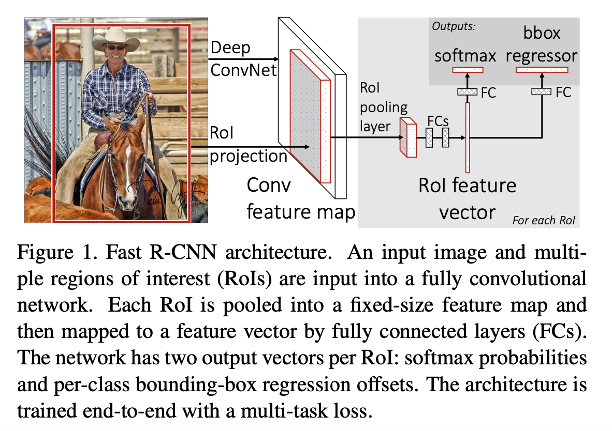
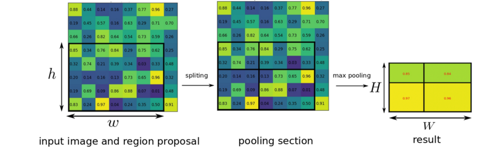
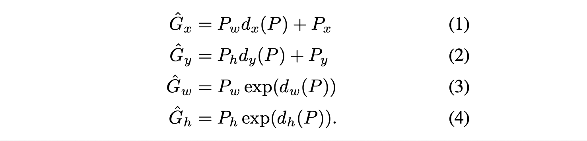
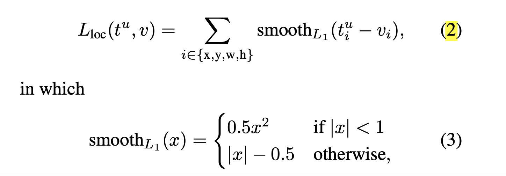
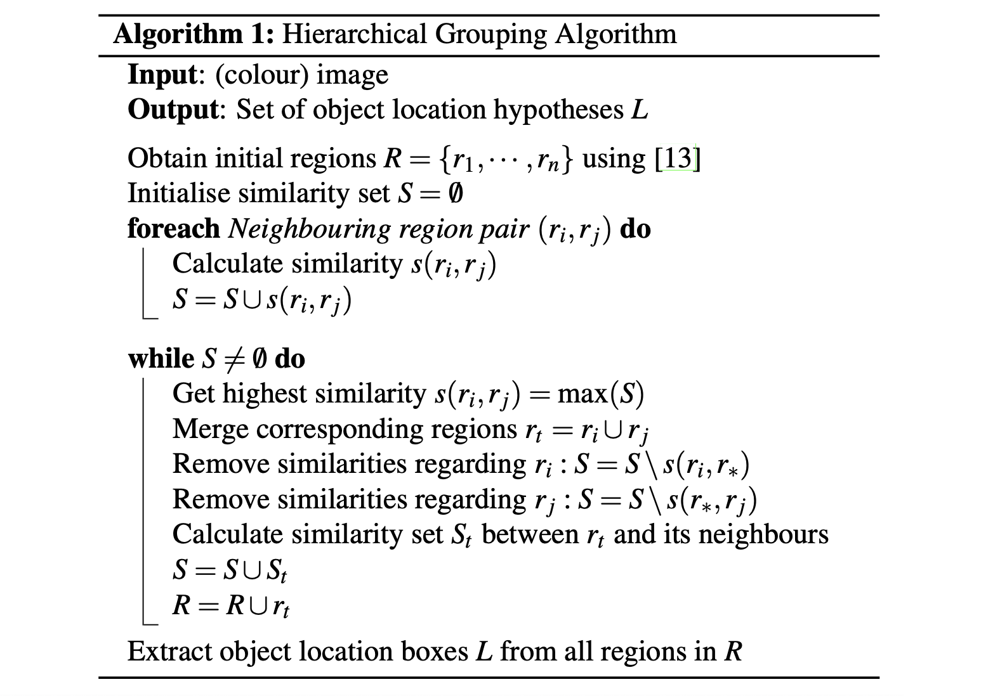

# Fast R-CNN (2015), Ross Girshick.

###### contributors: [@GitYCC](https://github.com/GitYCC)

\[[paper](https://arxiv.org/abs/1504.08083)\] \[[code](https://github.com/rbgirshick/fast-rcnn)\]

---

### Prerequisite

[Rich feature hierarchies for accurate object detection and semantic segmentation (2014), Ross Girshick et al.](cv/fast_rcnn.md)

### Introduction

- Drawbacks of R-CNN
  - Training is a multi-stage pipeline: training a softmax classifier, SVMs, and regressors in three separate stages
  - Training is expensive in space and time: For SVM and bounding-box regressor training, features are extracted from each object proposal in each image and written to disk.
  - Object detection is slow: R-CNN is slow because it performs a ConvNet forward pass for each object proposal, without sharing computation.
- Contributions
  - Higher detection quality (mAP) than R-CNN, SPPnet
  - Training is single-stage, using a multi-task loss
  - Training can update all network layers
  - No disk storage is required for feature caching

### Fast R-CNN

**Step0: Prepare**

- Initializing from pre-trained ImageNet networks:

  - **S**: CaffeNet (essentially AlexNet)
  - **M**: VGG_CNN_M_1024
  - **L**: VGG16

- First, the last max pooling layer is replaced by a RoI pooling layer.

  - 

    (from: https://mc.ai/review-fast-r-cnn-object-detection/)

  - RoI max pooling works by dividing the $h × w$ RoI window into an $H × W$ grid of sub-windows of approximate size $h/H × w/W$ and then max-pooling the values in each sub-window into the corresponding output grid cell. Pooling is applied independently to each feature map channel, as in standard max pooling.

- Second, the network’s last fully connected layer and softmax are replaced with the two sibling layers: 

  - a fully connected layer and softmax over $K+1$ categories

  - category-specific bounding-box regressors

    - We parameterize the transformation in terms of four functions $d_x(P)$, $d_y(P)$, $d_w(P)$, $d_h(P)$

    - After learning these functions, we can transform an input proposal $P$ into a predicted ground-truth box $\hat{G}$ by applying  the transformation: 

      

    - 
      

- Multi-task loss: $L(p,u,t^u,v)=L_{cls}(p,u)+\lambda [u\geq 1]L_{loc}(t^u,v)$

  - By convention the catch-all background class is labeled $u = 0$
  - $[u \geq 1]$ evaluates to $1$ when $u \geq 1$ and $0$ otherwise
  - The hyper-parameter $\lambda$  controls the balance between the two task losses (All experiments use $\lambda = 1$)

- Third, the network is modified to take two data inputs: a list of images and a list of RoIs in those images.

**Step1: Region Proposals**

 Selective Search ([Selective Search for Object Recognition (2012), J.R.R. Uijlings et al.](http://www.huppelen.nl/publications/selectiveSearchDraft.pdf))

- 
- Simiarity Calculation: a combination of the below four similarities
  - colour similarity
  - texture similarity
  - size similarity (encourages small regions to merge early)
  - fill similarity (measures how well region $r_i$ and $r_j$ fit into each other)
- Where: initial regions $R=\{r_1,...,r_n\}$ using [Efficient Graph-Based Image Segmentation](http://people.cs.uchicago.edu/~pff/papers/seg-ijcv.pdf)
  - 

**Step2: Fine-tuning for detection** 

- hierarchical sampling: first by sampling $N$ images and then by sampling $R/N$ RoIs from each image
- Critically, RoIs from the same image share computation and memory in the forward and backward passes. Making $N$ small decreases mini-batch computation.
  - $N=2$ and $R=128$ here
- jointly optimizes a softmax classifier and bounding-box regressors, rather than training a softmax classifier, SVMs, and regressors in three separate stages
- we take 25%​ of the RoIs from object proposals that have intersection over union (IoU) overlap with a ground- truth bounding box of at least 0.5

