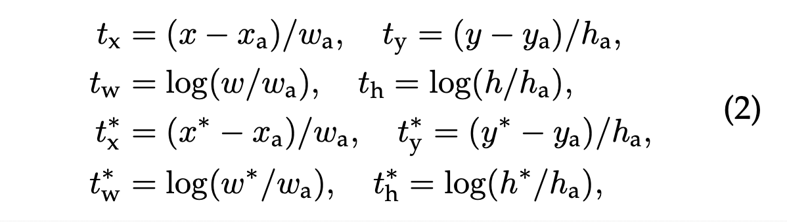

# Faster R-CNN: Towards Real-Time Object Detection with Region Proposal Networks (2016), Shaoqing Ren et al.

###### contributors: [@GitYCC](https://github.com/GitYCC)

\[[paper](https://arxiv.org/abs/1506.01497)\] \[[code](https://github.com/rbgirshick/py-faster-rcnn)\]

---

### Prerequisite

[Fast R-CNN (2015), Ross Girshick.](cv/fast_rcnn.md)

### Introduction

- When ignoring the time spent on region proposals (e.g. Selective Search), Fast R-CNN achieves near real-time rates using very deep networks.
- Region Proposal Networks (RPNs) are designed to efficiently predict region proposals with a wide range of scales and aspect ratios.
- To unify RPNs with Fast R-CNN object detection networks, we propose a training scheme that alternates between fine-tuning for the region proposal task and then fine-tuning for object detection, while keeping the proposals fixed.
- Briefly, Faster R-CNN is replacing "Selective Search" with "RPNs" on Fast R-CNN.

### Faster R-CNN

**Conv Layers**

- Zeiler and Fergus model (ZF)
  - 
  - last conv layer of ZF is `Conv5`, whose size is (6 x 6 x 256)
- VGG-16
  - 
  - last conv layer of VGG16 is `Conv13`, whose size is (14 x 14 x 512)

**Region Proposal Networks (RPNs)** 

- To generate region proposals, we slide a small network over the convolutional feature map output by the last shared convolutional layer. This small network takes as input an $n × n$ ($n=3$) spatial window of the input convolutional feature map. Each sliding window is mapped to a lower-dimensional feature (256-d for ZF and 512-d for VGG, with ReLU following).
  - ZF: conv3-256 (padding size=1), generate 6 x 6 x 256 conv feature map
  - VGG: conv3-512 (padding size=1), generate 14 x 14 x 512 conv feature map
- This feature is fed into two sibling fully-connected layers—a box-regression layer (*reg*) and a box-classification layer (*cls*). This architecture is naturally implemented with an $n×n$ convolutional layer followed by two sibling $1 × 1$ convolutional layers (for *reg* and *cls*, respectively).
  - Anchors: At each sliding-window location, we simultaneously predict multiple region proposals, where the number of maximum possible proposals for each location is denoted as $k$. So the *reg* layer has $4k$ outputs encoding the coordinates of $k$ boxes, and the *cls* layer outputs $2k$ scores that estimate probability of object or not object for each proposal.
    - For anchors, we use 3 scales with box areas of 128, 256, and 512 pixels, and 3 aspect ratios of 1:1, 1:2, and 2:1 ($k=9$)
  - *cls* layer:  conv1-18 (no padding) -> softmax on pixel
  - *reg* layer: conv1-36 (no padding) -> regression on pixel
  - 
  - 

- Some RPN proposals highly overlap with each other. To reduce redundancy, we adopt non-maximum suppression (NMS) on the proposal regions based on their *cls* scores. We fix the IoU threshold for NMS at 0.7, which leaves us about 2000 proposal regions per image.

