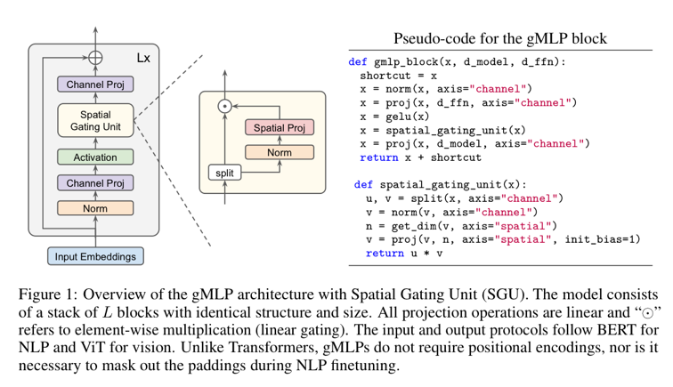

# Pay Attention to MLPs (2021), Hanxiao Liu et al.

###### contributors: [@GitYCC](https://github.com/GitYCC)

\[[paper](https://arxiv.org/abs/2105.08050)\] \[[code](https://github.com/rwightman/pytorch-image-models)\]

---

- gMLP, based on MLPs with gating
- 
- In terms of computation cost, SGU has $n^2e/2$ multiply-adds which is comparable to the $2n^2d$ of dot-product self-attention.
- Our comparisons show that self-attention is not critical for Vision Transformers, as gMLP can achieve the same accuracy.
  - 
    - survival prob (stochastic depth): for each mini-batch, randomly drop a subset of layers and bypass them with the identity function
  - 
- For BERT, our model achieves parity with Transformers on pretraining perplexity and is better on some downstream NLP tasks. On finetuning tasks where gMLP performs worse, making the gMLP model substantially larger can close the gap with Transformers.

