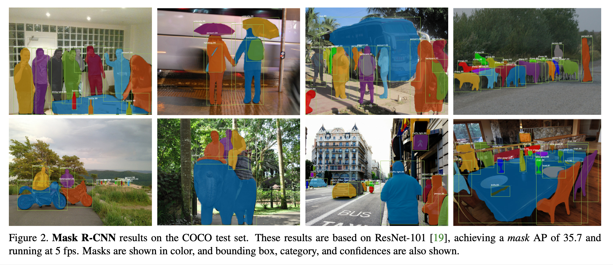
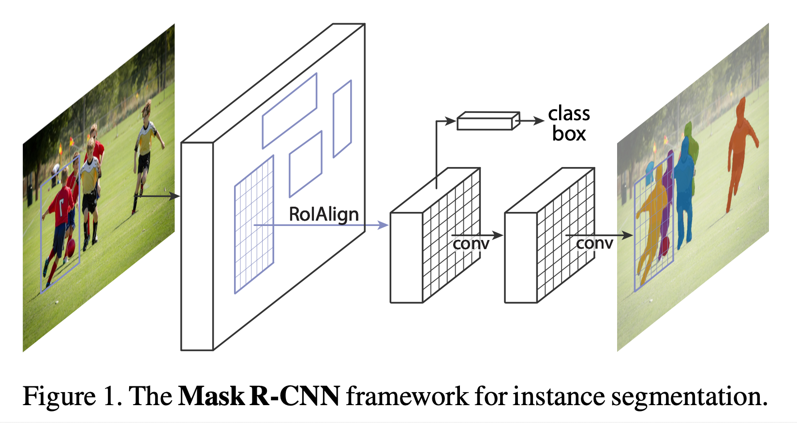
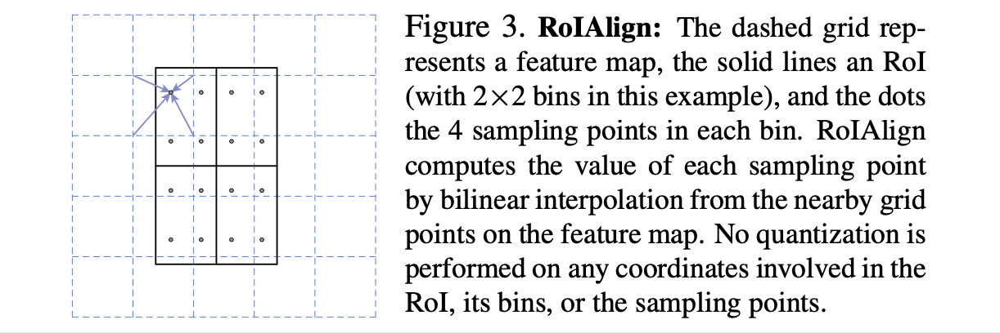
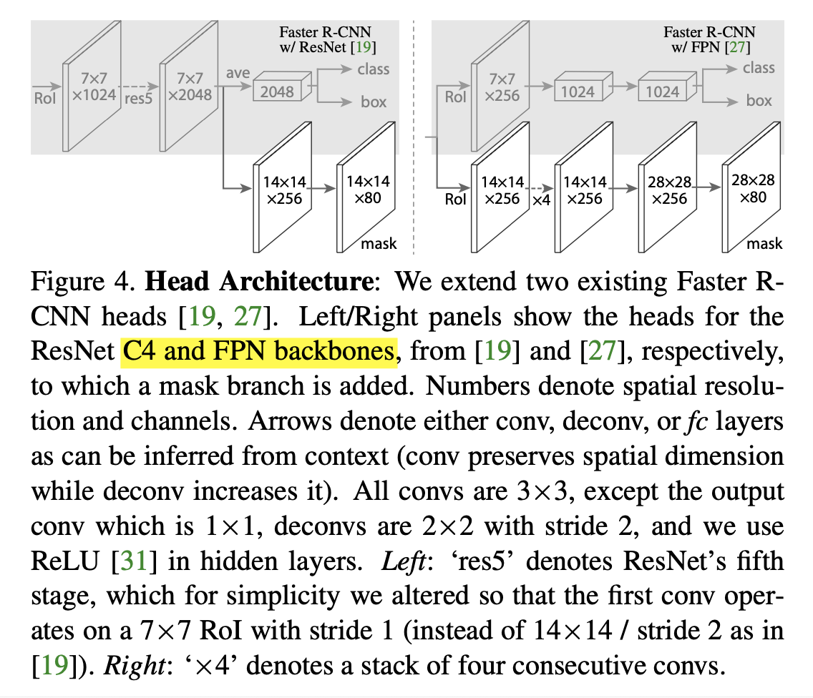

# Mask R-CNN (2018), Kaiming He et al.

###### contributors: [@GitYCC](https://github.com/GitYCC)

\[[paper](https://arxiv.org/abs/1703.06870)\] \[[code](https://github.com/facebookresearch/Detectron)\]

---

### Prerequisite

[Faster R-CNN: Towards Real-Time Object Detection with Region Proposal Networks (2016), Shaoqing Ren et al.](cv/faster_rcnn.md)

### Introduction

- We present a conceptually simple, flexible, and general framework for object instance segmentation.
- The method, called Mask R-CNN, extends Faster R-CNN by adding a branch for predicting an object mask in parallel with the existing branch for bounding box recognition.
- Change RoIPool to RoIAlign:
  - Most importantly, Faster R- CNN was not designed for pixel-to-pixel alignment between network inputs and outputs.
  - To fix the misalignment, we propose a simple, quantization-free layer, called RoIAlign, that faithfully preserves exact spatial locations.
  - Despite being a seemingly minor change, RoIAlign has a large impact: it improves mask accuracy by relative 10% to 50%, showing bigger gains under stricter localization metrics.
- We found it essential to decouple mask and class prediction: we predict a binary mask for each class independently, without competition among classes, and rely on the network’s RoI classification branch to predict the category.

### Mask R-CNN

- Mask R-CNN is conceptually simple: Faster R-CNN has two outputs for each candidate object, a class label and a bounding-box offset; to this we add a third branch that out- puts the object mask. 
- Formally, during training, we define a multi-task loss on each sampled RoI as $L = L_{cls} + L_{box} + L_{mask}$
  - To this we apply a per-pixel sigmoid, and define $L_{mask}$ as the average binary cross-entropy loss. For an RoI associated with ground-truth class $k$, $L_{mask}$ is only defined on the $k$-th mask (other mask outputs do not contribute to the loss).
  - Our definition of $L_{mask}$ allows the network to generate masks for every class without competition among classes; we rely on the dedicated classification branch to predict the class label used to select the output mask.

**RoIAlign**

- This pixel-to-pixel behavior requires our RoI features, which themselves are small feature maps, to be well aligned to faithfully preserve the explicit per-pixel spatial correspondence. This motivated us to develop the following RoIAlign layer that plays a key role in mask prediction.
- These quantizations introduce misalignments between the RoI and the extracted features. While this may not impact classification, which is robust to small translations, it has a large negative effect on predicting pixel-accurate masks.
- Our proposed change is simple: we avoid any quantization of the RoI boundaries or bins (i.e., we use $x/16$ instead of $[x/16]$). We use bi-linear interpolation to compute the exact values of the input features at four regularly sampled locations in each RoI bin, and aggregate the result (using max or average)
  - 

**Network Architecture**

- Convolutional Backbone Architecture + Head Architecture
  - Backbone Architectures: ResNet-50, ResNet-101, ResNeXt-50, ResNeXt-101
  - Head Architecture: C4 and FPN
    - C4: extracted features from the final convolutional layer of the 4-th stage
    - FPN: Feature Pyramid Network, uses a top-down architecture with lateral connections to build an in-network feature pyramid from a single-scale input
    - 
- All Network Architectures:
  - ResNet-50-C4, ResNet-101-C4, ResNeXt-50-C4, ResNeXt-101-C4
  - ResNet-50-FPN, ResNet-101-FPN, ResNeXt-50-FPN, ResNeXt-101-FPN

