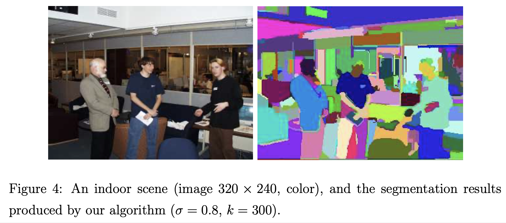

# Rich feature hierarchies for accurate object detection and semantic segmentation (2014), Ross Girshick et al.

###### contributors: [@GitYCC](https://github.com/GitYCC)

\[[paper](https://arxiv.org/abs/1311.2524)\] \[[code](https://github.com/rbgirshick/rcnn)\]

---

### Introduction

- This paper is the first to show that a CNN can lead to dramatically higher object detection performance on PASCAL VOC as compared to systems based on simpler HOG-like features.
  - [HOG (Histogram of oriented gradients)](https://en.wikipedia.org/wiki/Histogram_of_oriented_gradients)
    1. Gradient computation
    2. Orientation binning
    3. Descriptor blocks
    4. Block normalization
    5. Object recognition

### R-CNN: Regions with CNN features

**Module design**

- Region Proposals: Selective Search ([Selective Search for Object Recognition (2012), J.R.R. Uijlings et al.](http://www.huppelen.nl/publications/selectiveSearchDraft.pdf))
  - 
  - Simiarity Calculation: a combination of the below four similarities
    - colour similarity
    - texture similarity
    - size similarity (encourages small regions to merge early)
    - fill similarity (measures how well region $r_i$ and $r_j$ fit into each other)
  - Where: initial regions $R=\{r_1,...,r_n\}$ using [Efficient Graph-Based Image Segmentation](http://people.cs.uchicago.edu/~pff/papers/seg-ijcv.pdf)
    - 
- Warp Region
  - Regardless of the size or aspect ratio of the candidate region, we warp all pixels in a tight bounding box around it to the required size that is compatible with the CNN (its architecture requires inputs of a fixed 227 × 227 pixel size)
  - 
- Compute CNN features: Use [AlexNet](https://papers.nips.cc/paper/4824-imagenet-classification-with-deep-convolutional-neural-networks.pdf)
  - 
- Classify Regions: Using class-specific linear SVMs

**Test-time detection**

1. At test time, we run selective search on the test image to extract around 2000 region proposals (we use selective search’s “fast mode” in all experiments). 
2. We warp each proposal and forward propagate it through the CNN in order to compute features. 
3. Then, for each class, we score each extracted feature vector using the SVM trained for that class. Given all scored regions in an image, we apply a greedy non-maximum suppression (for each class independently) that rejects a region if it has an intersection-over- union (IoU) overlap with a higher scoring selected region larger than a learned threshold.

**Training**

- Supervised pre-training: We pre-trained the CNN on a large auxiliary dataset (ILSVRC2012 clas- sification) using image-level annotations only (bounding- box labels are not available for this data).
- Domain-specific fine-tuning:  To adapt our CNN to the new task (detection) and the new domain (warped proposal windows), we continue SGD training of the CNN parameters using only warped region proposals. (using softmax)
- Object category classifiers: Training SVMs as classifiers.
  - Why do not we just use softmax? 
    - The performance of using softmax drop from 54.2% to 50.9% mAP. 
    - This performance drop likely arises from a combination of several factors including that the definition of positive examples used in fine-tuning does not emphasize precise localization and the softmax classifier was trained on randomly sampled negative examples rather than on the subset of “hard negatives” used for SVM training. 

