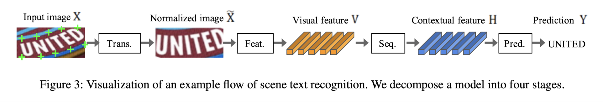
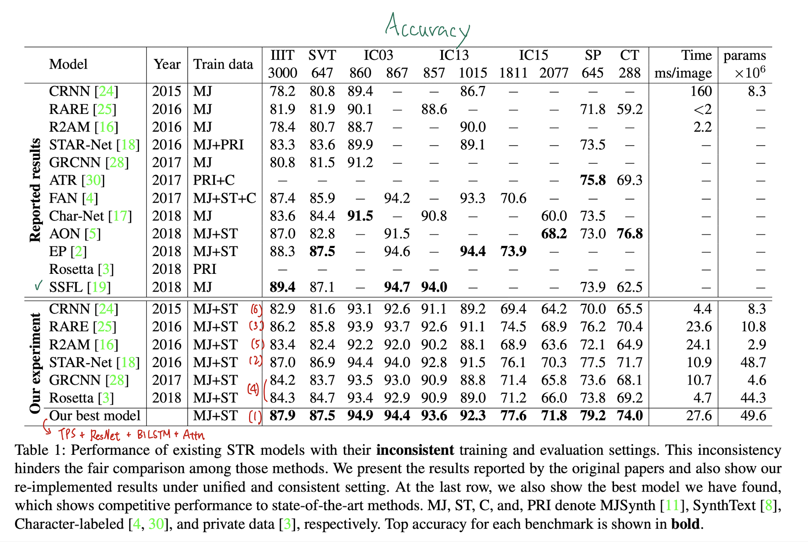
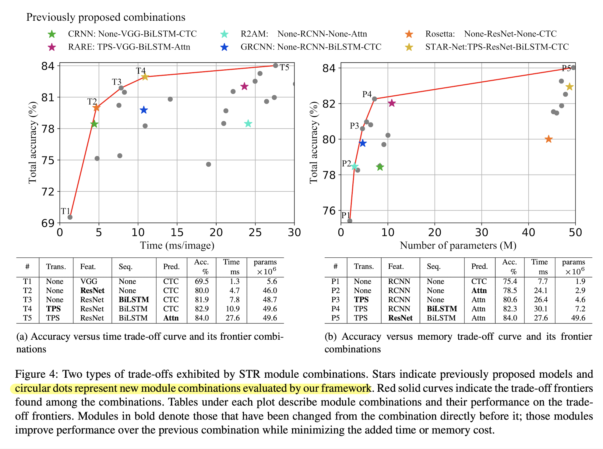
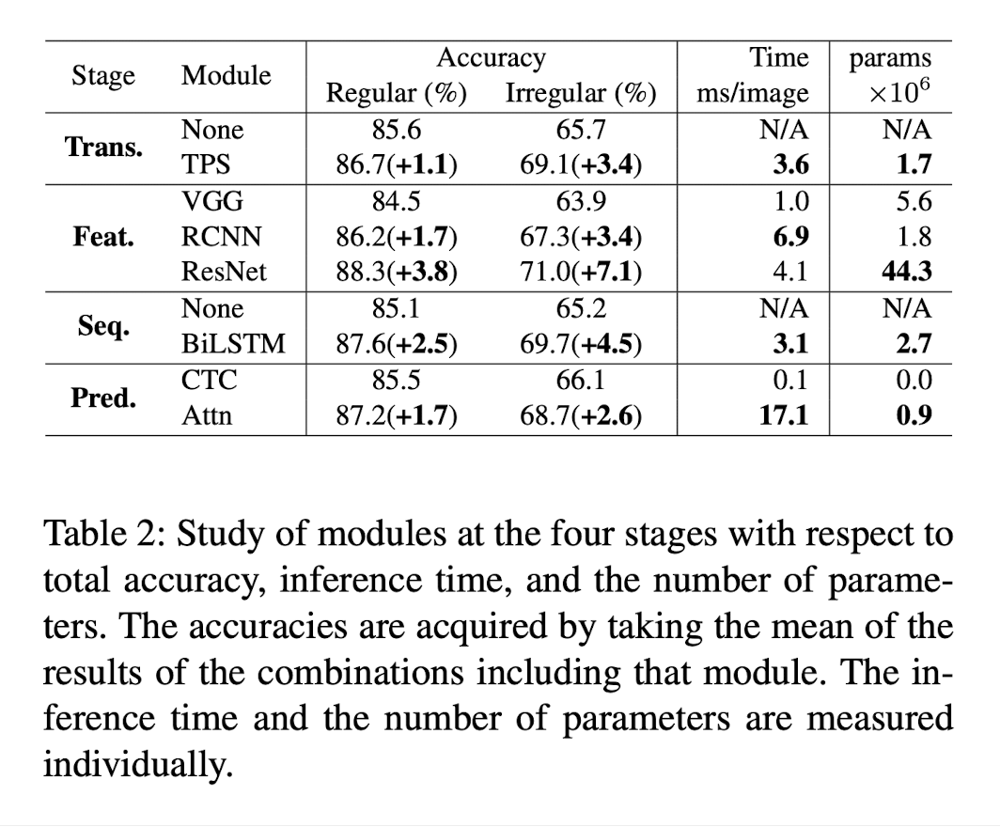
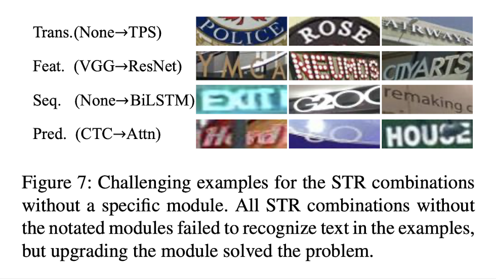

# What Is Wrong With Scene Text Recognition Model Comparisons? Dataset and Model Analysis (2019), Jeonghun Baek et al.

###### contributors: [@GitYCC](https://github.com/GitYCC)

\[[paper](https://arxiv.org/abs/1904.01906)\] \[[code](https://github.com/clovaai/deep-text-recognition-benchmark)\]

---

### Abstract

- Many new proposals for scene text recognition (STR) models have been introduced in recent years. While each claim to have pushed the boundary of the technology, a holistic and fair comparison has been largely missing in the field due to the inconsistent choices of training and evaluation datasets.
- We introduce a unified four-stage STR framework that most existing STR models fit into. Using this framework allows for the exten- sive evaluation of previously proposed STR modules and the discovery of previously unexplored module combinations.
- We analyze the module-wise contributions to performance in terms of accuracy, speed, and memory demand, under one consistent set of training and evaluation datasets.

### Dataset Matters in STR

- Synthetic datasets
  - MJSynth (MJ): 8.9 M word box images
  - SynthText (ST): 5.5 M training data
- Real-world datasets
  - regular datasets
    - IIIT5K-Words(IIIT): 2,000 images for training and 3,000 images for evaluation
    - Street View Text (SVT): 257 images for training and 647 images for evaluation
    - ICDAR2003 (IC03): 1,156 images for training and 1,110 images for evaluation
    - ICDAR2013 (IC13): 848 images for training and 1,095 images for evaluation
  - irregular datasets
    - ICDAR2015 (IC15): 4,468 images for training and 2,077 images for evaluation
    - SVT Perspective (SP): 645 images for evaluation
    - CUTE80 (CT): 288 cropped images for evaluation

- Setting
  - training datasets : [MJ](http://www.robots.ox.ac.uk/~vgg/data/text/) and [ST](http://www.robots.ox.ac.uk/~vgg/data/scenetext/)
  - validation datasets : the union of the training sets [IC13](http://rrc.cvc.uab.es/?ch=2), [IC15](http://rrc.cvc.uab.es/?ch=4), [IIIT](http://cvit.iiit.ac.in/projects/SceneTextUnderstanding/IIIT5K.html), and [SVT](http://www.iapr-tc11.org/mediawiki/index.php/The_Street_View_Text_Dataset).
  - evaluation datasets : benchmark evaluation datasets, consist of [IIIT](http://cvit.iiit.ac.in/projects/SceneTextUnderstanding/IIIT5K.html), [SVT](http://www.iapr-tc11.org/mediawiki/index.php/The_Street_View_Text_Dataset), [IC03](http://www.iapr-tc11.org/mediawiki/index.php/ICDAR_2003_Robust_Reading_Competitions), [IC13](http://rrc.cvc.uab.es/?ch=2), [IC15](http://rrc.cvc.uab.es/?ch=4), [SVTP](http://openaccess.thecvf.com/content_iccv_2013/papers/Phan_Recognizing_Text_with_2013_ICCV_paper.pdf), and [CUTE](http://cs-chan.com/downloads_CUTE80_dataset.html).

### STR Framework Analysis

- Four different consecutive stages of operations: 
  - transformation (**Trans.**): **None** or **TPS**
    - TPS: thin-plate spline transformation, a variant of the spatial transformation network (STN)
      - TPS finds multiple fiducial points (green ’+’ marks in Figure 3) at the upper and bottom enveloping points, and normalizes the character region to a predefined rectangle. 
  - feature extraction (**Feat.**): **VGG**, **RCNN** or **ResNet**
    - RCNN is a variant of CNN that can be applied recursively to adjust its receptive fields depending on the character shapes.
  - sequence modeling (**Seq.**): **None** or **BiLSTM**
  - prediction (**Pred.**): **CTC** or **Attn**
    - CTC allows for the prediction of a non-fixed number of a sequence even though a fixed number of the features are given. The key methods for CTC are to predict a character at each column ($h_i ∈ H$) and to modify the full character sequence into a non-fixed stream of characters by deleting repeated characters and blanks.
    - Attn (attention-based) automatically captures the information flow within the input sequence to predict the output sequence. It enables an STR model to learn a character-level language model representing output class dependencies.

### Experiment and Analysis

**Qualitative analysis**

- **TPS** improves on cases with curved and perspective texts
- **ResNet** improves on cases with heavy background clutter
- **BiLSTM** leads to better context modeling by adjusting the receptive field; it can ignore unrelatedly cropped characters (“I” at the end of “EXIT”, “C” at the end of “G20”).
- **Attn** including implicit character-level language modeling finds missing or occluded character, such as “a” in “Hard”, “t” in “to”, and “S” in “HOUSE”.

