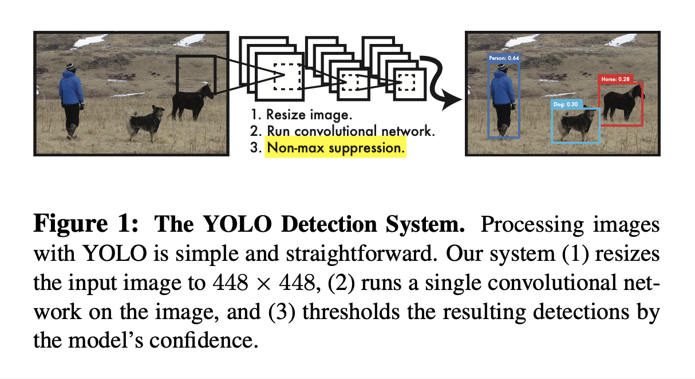
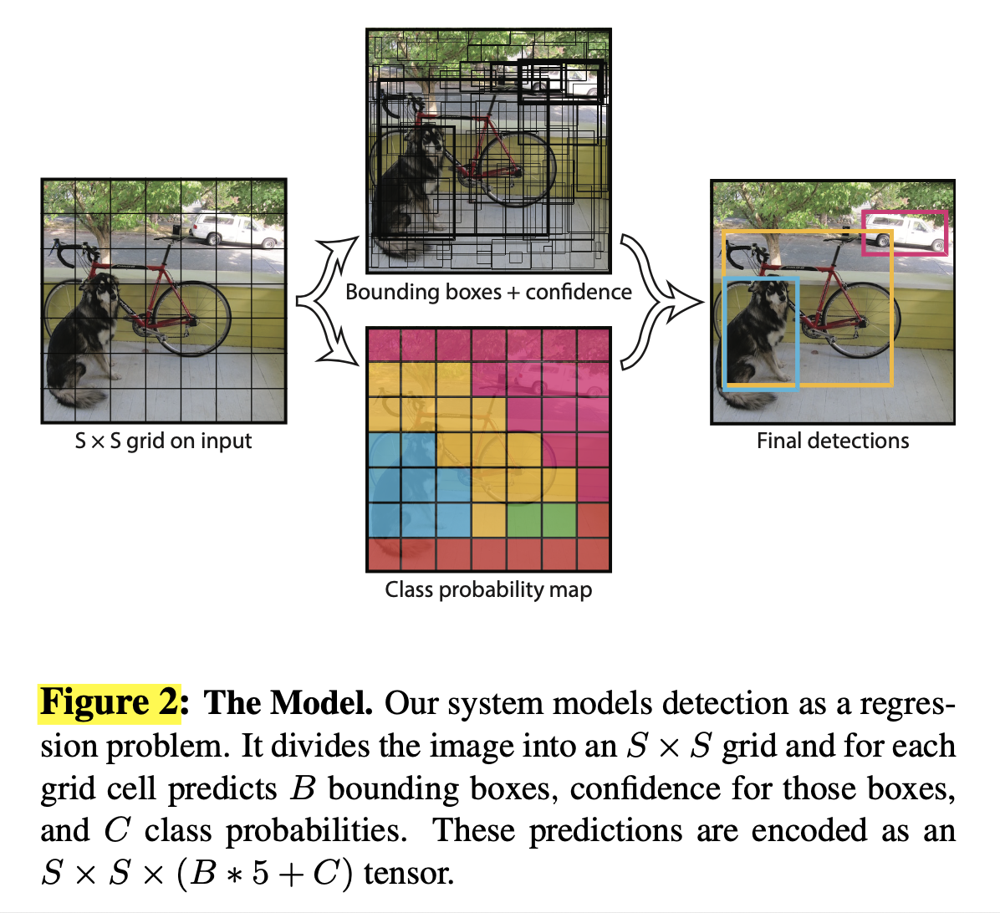
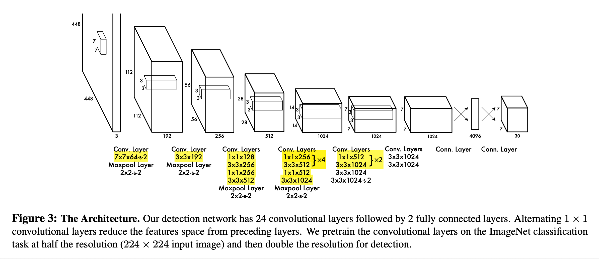
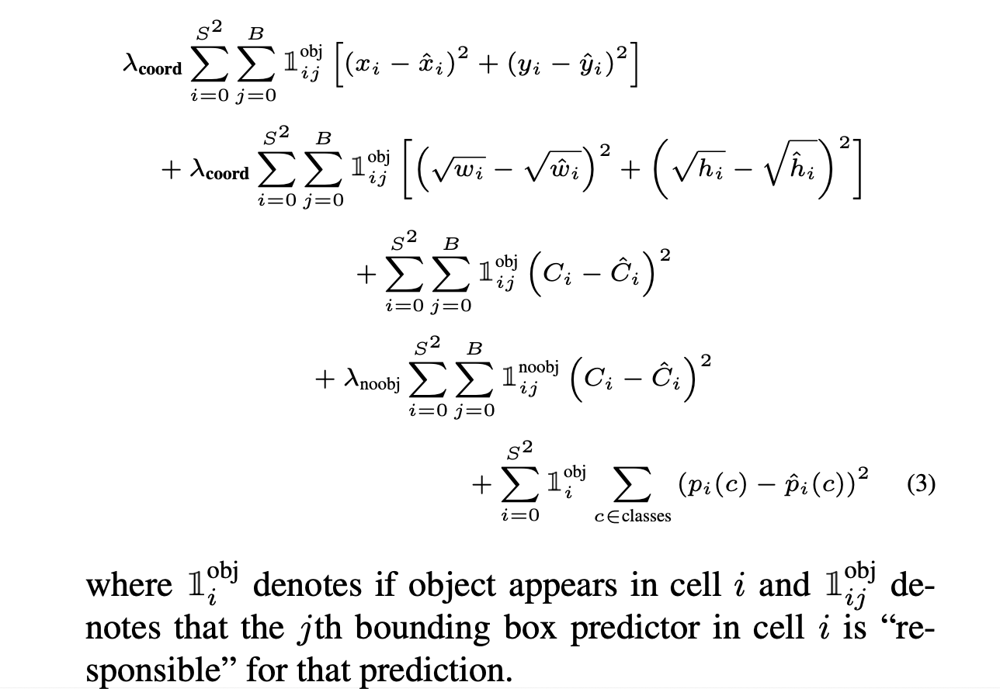

# You Only Look Once: Unified, Real-Time Object Detection (2016), Joseph Redmon et al.

###### contributors: [@GitYCC](https://github.com/GitYCC)

\[[paper](https://arxiv.org/abs/1506.02640)\] \[[code](https://pjreddie.com/darknet/yolov1/)\]

---

### Introduction

- We frame object detection as a regression problem to spatially separated bounding boxes and associated class probabilities. A single neural network predicts bounding boxes and class probabilities directly from full images in one evaluation. Using our system, you only look once (YOLO) at an image to predict what objects are present and where they are.
  - Since the whole detection pipeline is a single network, it can be optimized end-to-end directly on detection performance.
  - Our unified architecture is extremely fast. Our base YOLO model processes images in real-time at 45 frames per second.
- YOLO still lags behind state-of-the-art detection systems in accuracy. While it can quickly identify objects in images it struggles to precisely localize some objects, especially small ones, but is less likely to predict false positives on background.

### YOLO V1

- Our system divides the input image into an $S × S$ grid. If the center of an object falls into a grid cell, that grid cell is responsible for detecting that object.

- Each grid cell predicts $B$ bounding boxes and confidence scores for those boxes. Each bounding box consists of 5 predictions: $x$, $y$, $w$, $h$, and confidence.

  - These confidence scores reflect how confident the model is that the box contains an object and also how accurate it thinks the box is that it predicts.
    - Formally we define confidence as $Pr(Object) ∗ IOU_{pred}^{truth}$.
    - If no object exists in that cell, $Pr(Object)=0$
    - Otherwise we want the confidence score to equal the IOU between the predicted box and the ground truth.
  - We normalize the bounding box width $w$ and height $h$ by the image width and height so that they fall between $0$ and $1$. We parametrize the bounding box $x$ and $y$ coordinates to be offsets of a particular grid cell location so they are also bounded between $0$ and $1$.

- Each grid cell also predicts $C$ conditional class probabilities, $Pr(Class_i |Object)$. These probabilities are conditioned on the grid cell containing an object.

- At test time we multiply the conditional class probabilities and the individual box confidence predictions,
  $$
  Pr(Class_i |Object) ∗ Pr(Object) ∗ IOU_{pred}^{truth}=Pr(Class_i) ∗ IOU_{pred}^{truth}
  $$
  which gives us class-specific confidence scores for each box. These scores encode both the probability of that class appearing in the box and how well the predicted box fits the object.

  - Non-max suppression is used at test time

**Network Design**

Our network architecture is inspired by the GoogLeNet model for image classification.

**Pretraining**

- we use the first 20 convolutional layers from Figure 3 followed by a average-pooling layer and a fully connected layer. 
- on the ImageNet 2012 (input image of the ImageNet is 224 × 224)

**Training**

- We then convert the model to perform detection.
- Ren et al. show that adding both convolutional and connected layers to pretrained networks can improve performance. Following their example, we add 4 convolutional layers and 2 fully connected layers with randomly initialized weights.
- Detection often requires fine-grained visual information so we increase the input resolution of the network from 224 × 224 to 448 × 448.
  - Because stack of conv. layers is not depended on size of input images, we could keep those layers from pretrained network.
- loss
  
  - We use sum-squared error because it is easy to optimize, however it does not perfectly align with our goal of maximizing average precision.
    - It weights localization error equally with classification error which may not be ideal.
      - To remedy this, we increase the loss from bounding box coordinate predictions. ($\lambda_{coord}=5$)
    - Also, in every image many grid cells do not contain any object. This pushes the “confidence” scores of those cells towards zero, often overpowering the gradient from cells that do contain objects. This can lead to model instability, causing training to diverge early on.
      - To remedy this, we decrease the loss from confidence predictions for boxes that don’t contain objects. ( $\lambda_{noobj}=0.5$)
  - Sum-squared error also equally weights errors in large boxes and small boxes. Our error metric should reflect that small deviations in large boxes matter less than in small boxes. 
    - To partially address this we predict the square root of the bounding box width and height instead of the width and height directly.

