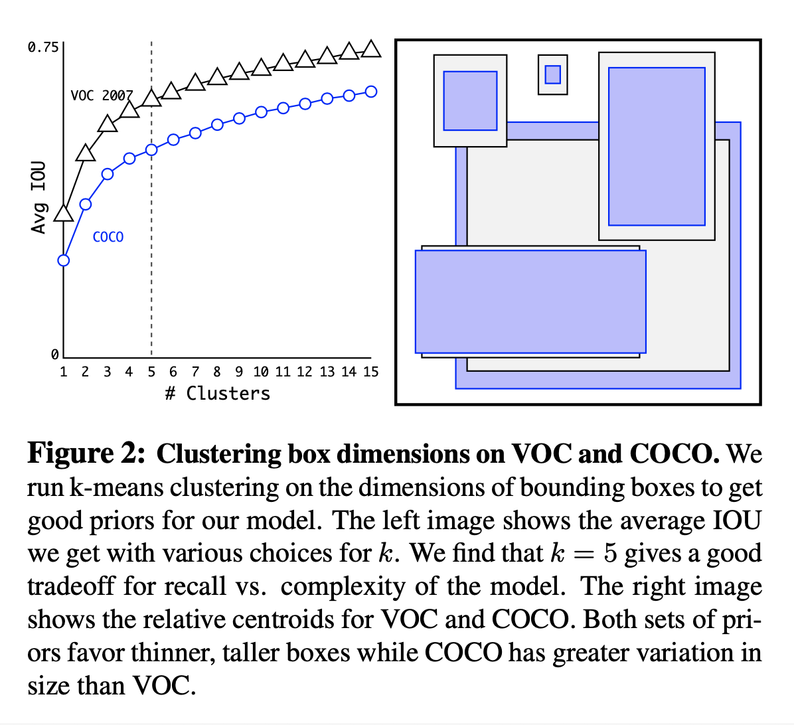
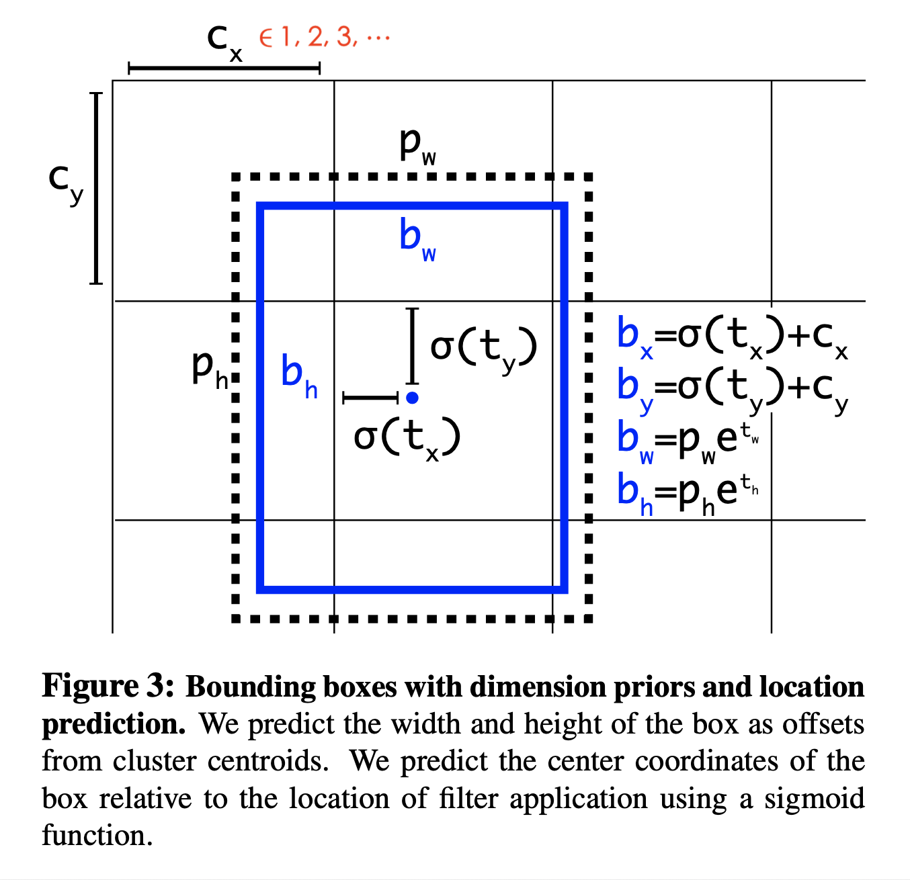
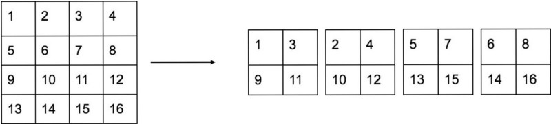
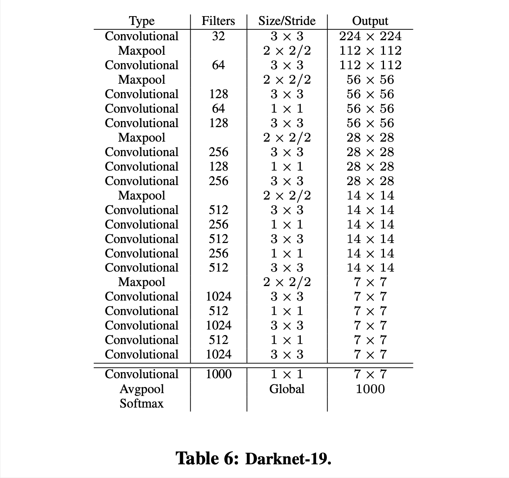
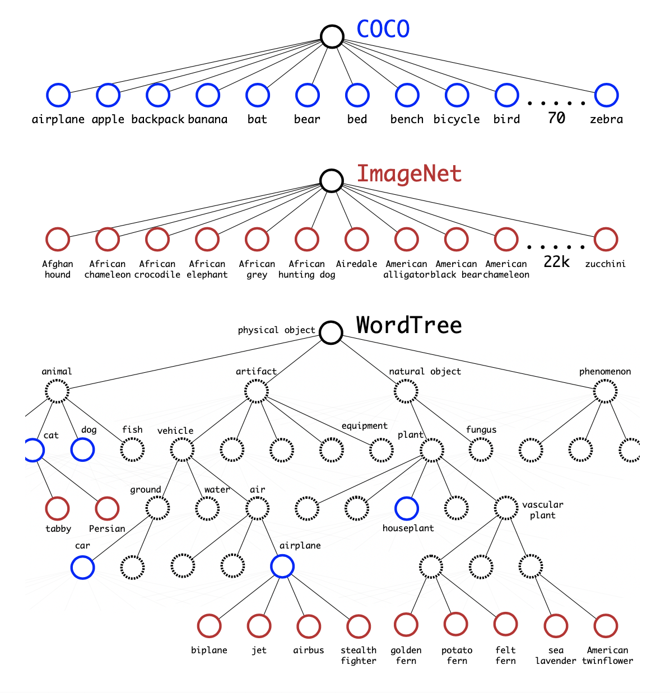
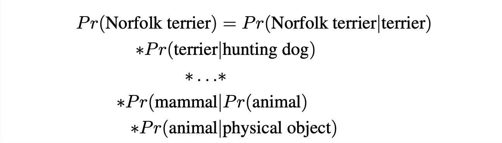
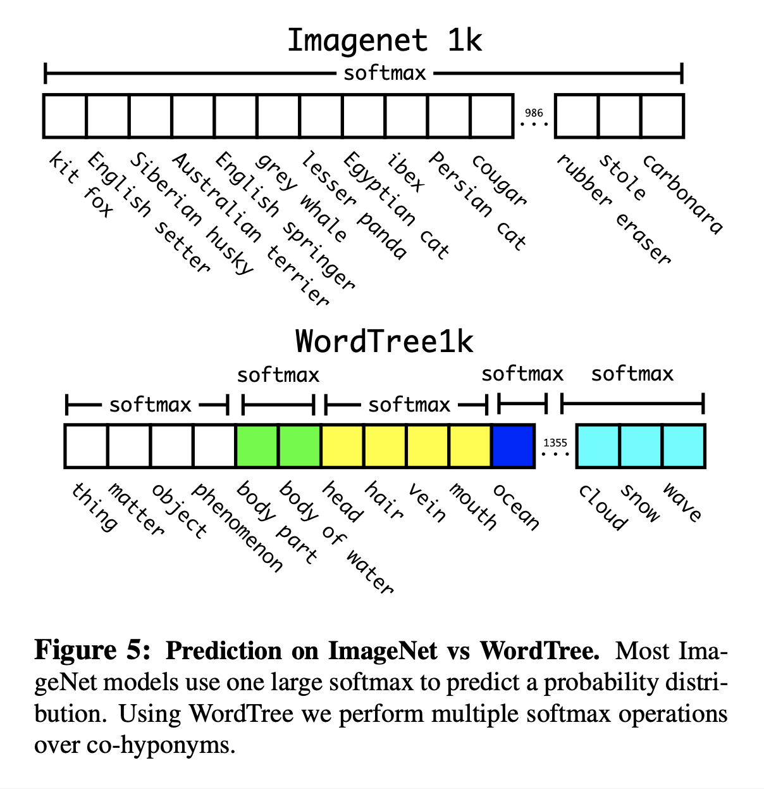

# YOLO9000: Better, Faster, Stronger (2016), Joseph Redmon et al.

###### contributors: [@GitYCC](https://github.com/GitYCC)

\[[paper](https://arxiv.org/abs/1612.08242)\] \[[code](https://pjreddie.com/darknet/yolov2/)\]

---

### Better

#### Batch Normalization

- By adding batch normalization on all of the convolutional layers in YOLO we get more than 2% improvement in mAP.

#### High Resolution Classifier

- The original YOLOv1 trains the classifier network at 224 × 224 and increases the resolution to 448 for detection. This means the network has to simultaneously switch to learning object detection and adjust to the new input resolution.
- For YOLOv2 we first fine tune the classification network at the full 448 × 448 resolution for 10 epochs on ImageNet.

#### Convolutional With Anchor Boxes

- We remove the fully connected layers from YOLOv1 and use anchor boxes (like FasterRCNN) to predict bounding boxes.
- Predicting offsets of anchors instead of coordinates simplifies the problem and makes it easier for the network to learn.

#### Dimension Clusters

- Issue: the box dimensions are hand picked
  - if we pick better priors for the network to start with we can make it easier for the network to learn to predict good detections
- Instead of choosing priors by hand, we run k-means clustering on the training set bounding boxes to automatically find good priors.

#### Direct location prediction

- In FasterRCNN, the network predicts values $t_x$ and $t_y$ and the ($x$, $y$) center coordinates are calculated as: $x=(t_x*w_a)-x_a$ and $y=(t_y*h_a)-y_a$. This formulation is unconstrained so any anchor box can end up at any point in the image, regardless of what location predicted the box.
- Instead of predicting offsets we follow the approach of YOLOv1 and predict location coordinates relative to the location of the grid cell. This bounds the ground truth to fall between 0 and 1. We use a logistic activation to constrain the network’s predictions to fall in this range.
- The network predicts 5 coordinates for each bounding box, $t_x$, $t_y$, $t_w$, $t_h$, and $t_o$.
  - $b_x =σ(t_x)+c_x$
  - $b_y =σ(t_y)+c_y$
  - $b_w =p_we^{t_w}$
  - $b_h =p_he^{t_h}$
  - $Pr(object) ∗ IOU(b,object) = σ(t_o)$

#### Fine-Grained Features

- This modified YOLO predicts detections on a 13 × 13 feature map. While this is sufficient for large objects, it may benefit from finer grained features for localizing smaller objects.
- The passthrough layer concatenates the higher resolution features with the low resolution features by stacking adjacent features into different channels instead of spatial locations, similar to the identity mappings in ResNet.
  - 

- This gives a modest 1% performance increase.

#### Multi-Scale Training

- Since our model only uses convolutional and pooling layers it can be resized on the fly. We want YOLOv2 to be robust to running on images of different sizes so we train this into the model.
- Every 10 batches our network randomly chooses a new image dimension size. Since our model downsamples by a factor of 32, we pull from the following multiples of 32: {320, 352, ..., 608}.

### Faster

#### Darknet-19

- VGG-16 is a powerful, accurate classification network but it is needlessly complex.
  - require 30.69 billion floating point operations for a forward pass at 224 × 224 resolution
- The YOLOv2 framework uses a custom network based on the GoogleNet architecture. This network is faster than VGG-16, only using 8.52 billion operations for a forward pass. However, it’s accuracy is slightly worse than VGG-16.
- Darknet-19
  - Similar to the VGG models:
    - use mostly 3 × 3 filters and double the number of channels after every pooling step 
  - Following the work on Network in Network (NIN):
    - use global average pooling to make predictions
    - 1 × 1 filters to compress the feature representation between 3 × 3 convolutions

#### Training for classification

- We train the network on the standard ImageNet 1000 class classification dataset for 160 epochs.
- As discussed above, after our initial training on images at 224 × 224 we fine tune our network at a larger size, 448.

#### Training for detection

- We modify this network for detection by removing the last convolutional layer and instead adding on three 3 × 3 convolutional layers with 1024 filters each followed by a final 1 × 1 convolutional layer with the number of outputs we need for detection. For VOC we predict 5 boxes with 5 coordinates each and 20 classes per box so 125 filters. We also add a passthrough layer from the final 3 × 3 × 512 layer to the second to last convolutional layer so that our model can use fine grain features.

### Stronger: YOLO9000

- We propose a mechanism for jointly training on classification and detection data.
- During training we mix images from both detection and classification datasets. 
  - When our network sees an image labelled for detection we can backpropagate based on the full YOLOv2 loss function. 
  - When it sees a classification image we only backpropagate loss from the classification-specific parts of the architecture.
- This approach presents a few challenges. Detection datasets have only common objects and general labels. Classification datasets have a much wider and deeper range of labels. 
  - e.g. ImageNet has more than a hundred breeds of dog, including “Norfolk terrier”, “Yorkshire terrier”, and “Bedlington terrier”
- Using a softmax assumes the classes are mutually exclusive. This presents problems for combining datasets.
  - For example you would not want to combine ImageNet and COCO using this model because the classes “Norfolk terrier” and “dog” are not mutually exclusive.

- Convert WordNet to WordTree
  - 
- Hierarchical Classification: multiple softmax operations over co-hyponyms
  - e.g. if we want to know if a picture is of a Norfolk terrier we compute:
    
  - 

#### 

