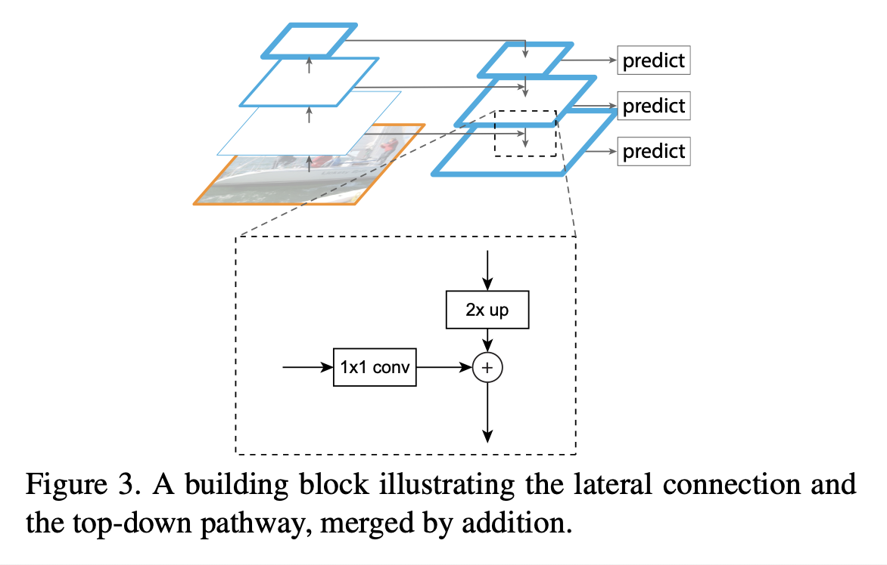
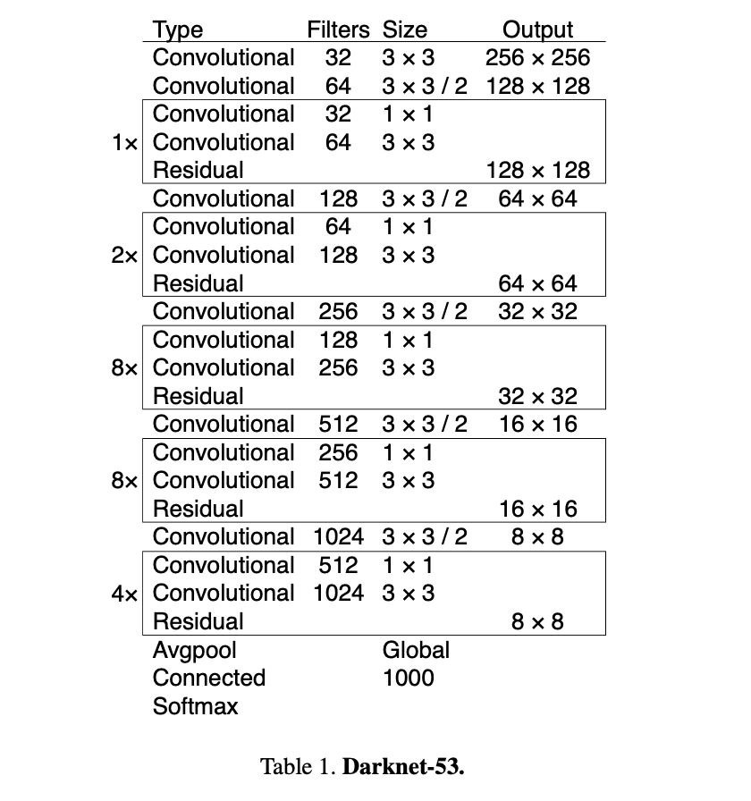
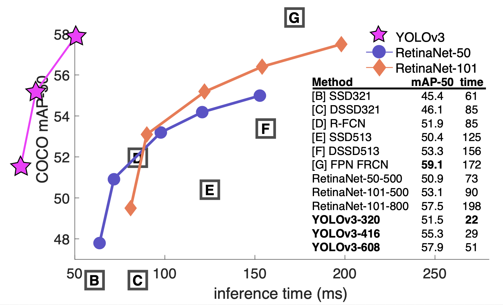

# YOLOv3: An Incremental Improvement (2018), Joseph Redmon et al.

###### contributors: [@GitYCC](https://github.com/GitYCC)

\[[paper](https://arxiv.org/abs/1804.02767)\] \[[code](https://pjreddie.com/darknet/yolo/)\]

---

### The Deal

 #### Bounding Box Prediction

- Following YOLO9000 our system predicts bounding boxes using dimension clusters as anchor boxes.
- the predictions correspond to:
  - $b_x =σ(t_x)+c_x$
  - $b_y =σ(t_y)+c_y$
  - $b_w =p_we^{t_w}$
  - $b_h =p_he^{t_h}$
- During training we use sum of squared error loss.

#### Class Prediction

- Each box predicts the classes the bounding box may contain using multilabel classification.
- We simply use independent logistic classifiers. During training we use binary cross-entropy loss for the class predictions.

#### Predictions Across Scales

- YOLOv3 predicts boxes at 3 different scales. Our system extracts features from those scales using a similar concept to feature pyramid networks (FPN).
  - 
  - (from: [Feature Pyramid Networks for Object Detection (2017)](https://arxiv.org/pdf/1612.03144.pdf))

- Non-max suppression is used for choosing boxes from 3 different scales.

#### Feature Extractor

Our new network Darknet-53 is a hybrid approach between the network used in YOLOv2, Darknet-19, and that newfangled residual network stuff. Our network uses successive 3 × 3 and 1 × 1 convolutional layers but now has some shortcut connections as well and is significantly larger.

### Evaluation

