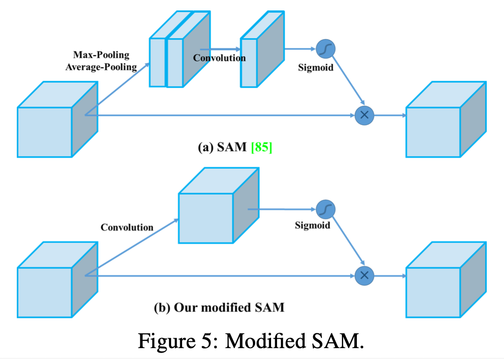

# YOLOv4: Optimal Speed and Accuracy of Object Detection (2020), A. Bochkovskiy et al.

###### contributors: [@GitYCC](https://github.com/GitYCC)

\[[paper](https://arxiv.org/abs/2004.10934)\] \[[code](https://github.com/AlexeyAB/darknet)\]

---

---

**YOLOv4 consists of:**

- **Backbone: CSPDarknet53**

- **Neck:**
  - **Additional blocks: SPP**
  - **Path-aggregation blocks: PAN**

- **Head: YOLOv3**

### SPP (Spatial Pyramid Pooling)

(from: Spatial Pyramid Pooling in Deep Convolutional Networks for Visual Recognition)

### PAN (Path Aggregation Network)

(from: [Path Aggregation Network for Instance Segmentation](https://arxiv.org/pdf/1803.01534.pdf))

We replace shortcut connection of PAN to concatenation.

- 

---

**YOLO v4 uses:**

- **Bag of Freebies (BoF) for backbone:**
  - **CutMix and Mosaic data augmentation**
  - **DropBlock regularization**
  - **Class label smoothing**

- **Bag of Specials (BoS) for backbone:**
  - **Mish activation**
  - **Cross-stage partial connections (CSP)**
  - **Multi- input weighted residual connections (MiWRC)**

- **Bag of Freebies (BoF) for detector:**
  - **CIoU-loss**
  - **CmBN**
  - **DropBlock regularization**
  - **Mosaic data augmentation**
  - **Self-Adversarial Training (SAT)**
  - **Eliminate grid sensitivity**
  - **Using multiple anchors for a single ground truth**
  - **Cosine annealing scheduler**
  - **Optimal hyper-parameters**
  - **Random training shapes**

- **Bag of Specials (BoS) for detector:**
  - **Mish activation**
  - **SPP-block**
  - **SAM-block**
  - **PAN path-aggregation block**
  - **DIoU-NMS**

### CutMix and Mosaic data augmentation

- CutMix is to cover the cropped image to rectangle region of other images, and adjusts the label according to the size of the mix area.
- Mosaic represents a new data augmentation method that mixes 4 training images, while CutMix mixes only 2 input images.

### DropBlock regularization

- As for hide-and-seek and grid mask, they randomly or evenly select multiple rectangle regions in an image and replace them to all zeros. If similar concepts are applied to feature maps, there are DropOut, DropConnect, and DropBlock methods.
- DropBlock: Dropping out activations at random is not effective in removing semantic information because nearby activations contain closely related information. Instead, dropping continuous regions can remove certain semantic information (e.g., head or feet) and consequently enforcing remaining units to learn features for classifying input image.
  - 
  - (from: [DropBlock: A regularization method for convolutional networks](https://papers.nips.cc/paper/8271-dropblock-a-regularization-method-for-convolutional-networks.pdf))

### Class label smoothing

- The label smoothing is to convert hard label into soft label for training, which can make model more robust. In order to obtain a better soft label, Islam et al. introduced the concept of knowledge distillation to design the label refinement network.
- example:
  - bad ground truth: $[0, 0, 1, 0]$
  - smoothing ground truth: $[0.02, 0.02, 0.94, 0.02]$

### Mish activation

(from: [Mish: A Self Regularized Non-Monotonic Activation Function](https://arxiv.org/pdf/1908.08681.pdf))

### Cross-stage partial connections (CSP)

(from: [CSPNet: A New Backbone that can Enhance Learning Capability of CNN](https://openaccess.thecvf.com/content_CVPRW_2020/papers/w28/Wang_CSPNet_A_New_Backbone_That_Can_Enhance_Learning_Capability_of_CVPRW_2020_paper.pdf))

### CIoU-loss

### Cross mini-Batch Normalization (CmBN)

- Cross-Iteration Batch Normalization (CBN):

  - 

    (from: [Cross-Iteration Batch Normalization](https://arxiv.org/pdf/2002.05712.pdf))

  - A well-known issue of Batch Normalization is its significantly reduced effectiveness in the case of small mini-batch sizes.  To address this problem, Cross-Iteration Batch Normalization (CBN) examples from multiple recent iterations to enhance estimation quality.

- Cross mini-Batch Normalization (CmBN):

  - Using CmBN for collecting statistics inside the entire batch, instead of collecting statistics inside a single mini-batch like CBN
    - BN and CmBN - assume a batch contains $n$ mini-batches
    - CBN - assume cross $n$ iterations

### Self-Adversarial Training (SAT)

Self-Adversarial Training (SAT) also represents a new data augmentation technique that operates in 2 forward backward stages. In the 1st stage the neural network alters the original image instead of the network weights. In this way the neural network executes an adversarial attack on itself, altering the original image to create the deception that there is no desired object on the image. In the 2nd stage, the neural network is trained to detect an object on this modified image in the normal way.

### Eliminate grid sensitivity

Eliminate grid sensitivity the equation $b_x = σ(t_x)+ c_x$, $b_y =σ(t_y)+c_y$, where $c_x$ and $c_y$ are always whole numbers, is used in YOLOv3 for evaluating the object coordinates, therefore, extremely high $t_x$ absolute values are required for the $b_x$ value approaching the $c_x$ or $c_x + 1$ values. We solve this problem through multiplying the sigmoid by a factor exceeding $1.0$, so eliminating the effect of grid on which the object is undetectable.

### Using multiple anchors for a single ground truth

using multiple anchors for a single ground truth $IoU (truth, anchor)$ > $IoU$ threshold

### Cosine annealing scheduler

altering the learning rate during sinusoid training

(from: [Bag of Freebies for Training Object Detection Neural Networks](https://arxiv.org/pdf/1902.04103.pdf))

### Optimal hyper-parameters

Genetic algorithms - using genetic algorithms for selecting the optimal hyperparameters during network training on the first 10% of time periods

### Random training shapes

Dynamic mini-batch size - automatic increase of mini-batch size during small resolution training by us- ing Random training shapes

### SAM-block (Spatial Attention Module)

- The attention module that is often used in object detection is mainly divided into channel-wise attention and point-wise attention, and the representatives of these two attention models are Squeeze-and-Excitation (SE) and Spatial Attention Module (SAM), respectively. 
- Although SE module can improve the power of ResNet50 in the ImageNet image classification task 1% top-1 accuracy at the cost of only increasing the computational effort by 2%, but on a GPU usually it will increase the inference time by about 10%, so it is more appropriate to be used in mobile devices. 
- But for SAM, it only needs to pay 0.1% extra calculation and it can improve ResNet50-SE 0.5% top-1 accuracy on the ImageNet image classification task. Best of all, it does not affect the speed of inference on the GPU at all.
- We modify SAM from spatial-wise attention to point- wise attention.

