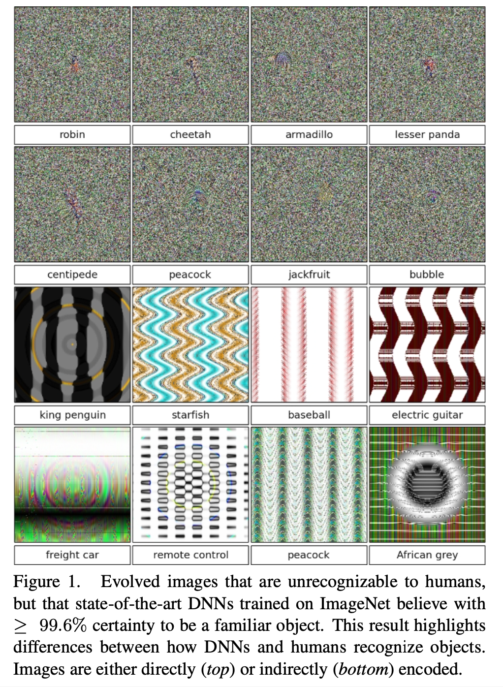
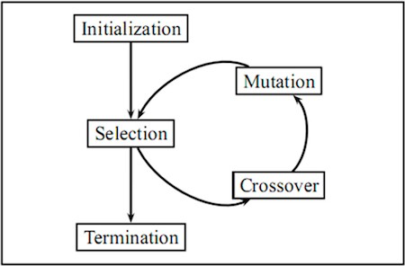
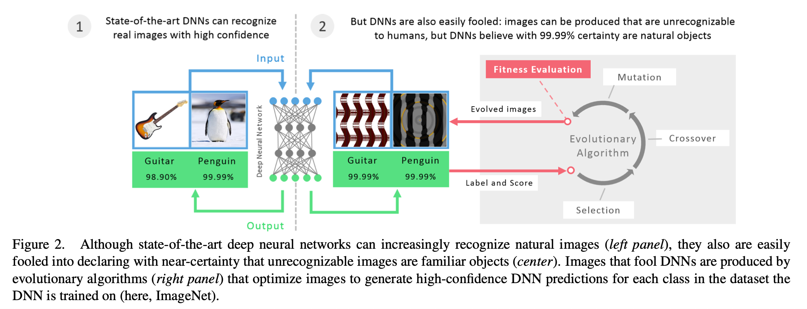
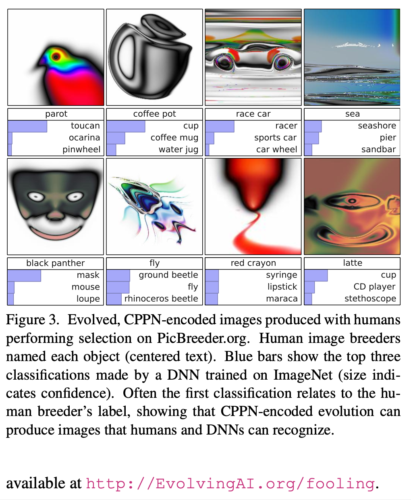
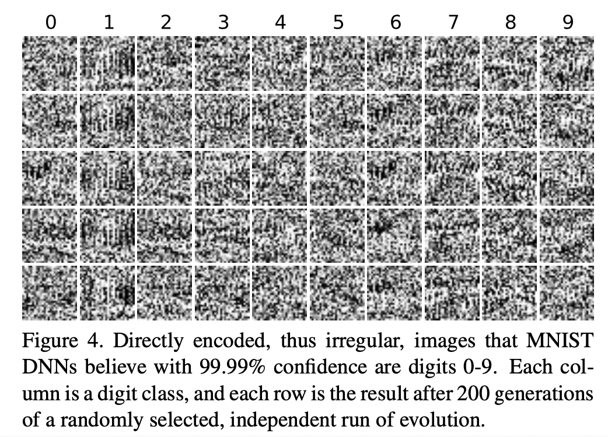
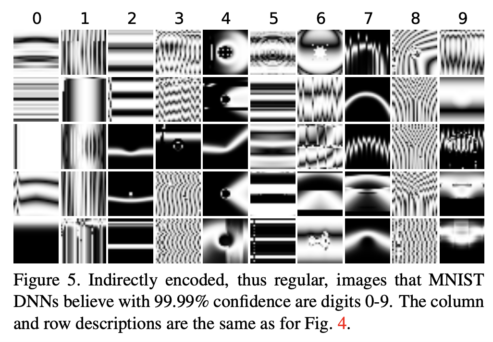
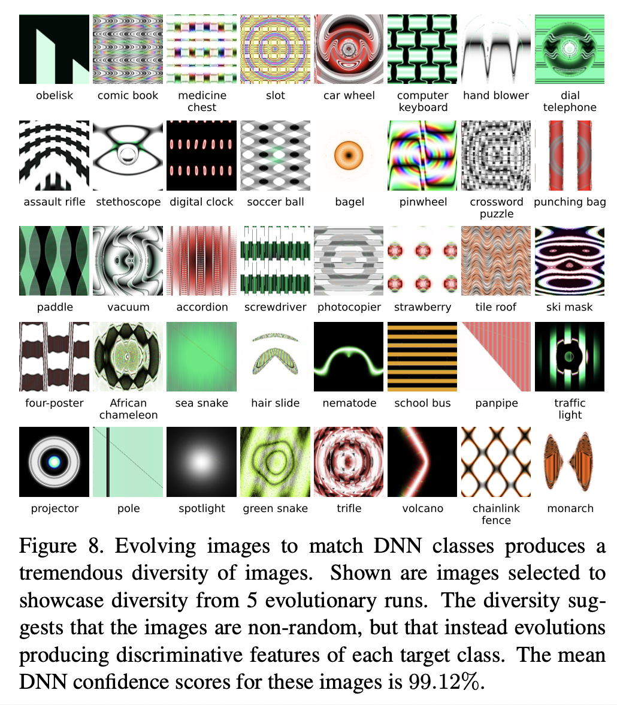

# Deep neural networks are easily fooled: High confidence predictions for unrecognizable images (2015), A. Nguyen et al.

\[[paper](http://arxiv.org/pdf/1412.1897)\] \[[code](https://github.com/Evolving-AI-Lab/fooling)\]

**TR;DR:** It is easy to produce images that are completely unrecognizable to humans, but that state-of-the- art DNNs believe to be recognizable objects with 99.99% confidence

**introduction video**

[introduction video](https://youtu.be/M2IebCN9Ht4 ':include :type=iframe width=100% height=400px')

**What differences remain between computer and human vision?**

* CV misleaded but recognizable to humans: [C. Szegedy, W. Zaremba, I. Sutskever, J. Bruna, D. Erhan, I. Goodfellow, and R. Fergus. Intriguing properties of neural networks. arXiv preprint arXiv:1312.6199, 2013.](https://arxiv.org/pdf/1312.6199.pdf) revealed that changing an image \(e.g. of a lion\) in a way imperceptible to humans can cause a DNN to label the image as something else entirely \(e.g. mislabeling a lion a library\).
* CV misleaded and unrecognizable to humans: this work

**not easy to prevent fooling DNN**

We also find that, for MNIST DNNs, it is not easy to prevent the DNNs from being fooled by retraining them with fooling images labeled as such. While retrained DNNs learn to classify the negative examples as fooling images, a new batch of fooling images can be produced that fool these new networks, even after many retraining iterations.

**deep neural network models**

* AlexNet DNN \(already-trained, provided by the Caffe software package\), called “ImageNet DNN” in this paper
  * It obtains 42.6% top-1 error rate on ImageNet.
* LeNet model \(already-trained, provided by the Caffe software package\), called “MNIST DNN” in this paper
  * This model obtains 0.94% error rate on MNIST.

**generating images with evolution**

Evolutionary algorithms \(EAs\)

* also called Genetic Algorithm
* good tutorial: [https://towardsdatascience.com/introduction-to-evolutionary-algorithms-a8594b484ac](https://towardsdatascience.com/introduction-to-evolutionary-algorithms-a8594b484ac)

MAP-Elites \(multi-dimensional archive of phenotypic elites\)

* kind of EAs
* Traditional EAs optimize solutions to perform well on one objective, or on all of a small set of objectives \(e.g. one objective means a single ImageNet class\).
* MAP-Elites enables us to simultaneously evolve a population that contains individuals that score well on many classes \(e.g. all 1000 ImageNet classes\).
* [A. Cully, J. Clune, and J.-B. Mouret. Robots that can adapt like natural animals.](https://arxiv.org/pdf/1407.3501v2.pdf%3B)

Genetic Operators: direct encoding and indirectly encoding

* direct encoding: each pixel value is initialized with uniform random noise within the \[0, 255\] range, independently mutated between pixels \(altered via the polynomial mutation operator\)
* indirectly encoding: tend to be regular because elements in the genome can affect multiple parts of the image
  * use Compositional Pattern-Producing Network \(CPPN\), which can evolve complex, regular images that re- semble natural and man-made objects
  * good tutorial: [https://towardsdatascience.com/understanding-compositional-pattern-producing-networks-810f6bef1b88](https://towardsdatascience.com/understanding-compositional-pattern-producing-networks-810f6bef1b88)

**Results**

Evolving irregular images to match MNIST

Evolving regular images to match MNIST

Evolving regular images to match ImageNet

**Reference**

* [http://www.evolvingai.org/fooling](http://www.evolvingai.org/fooling)



