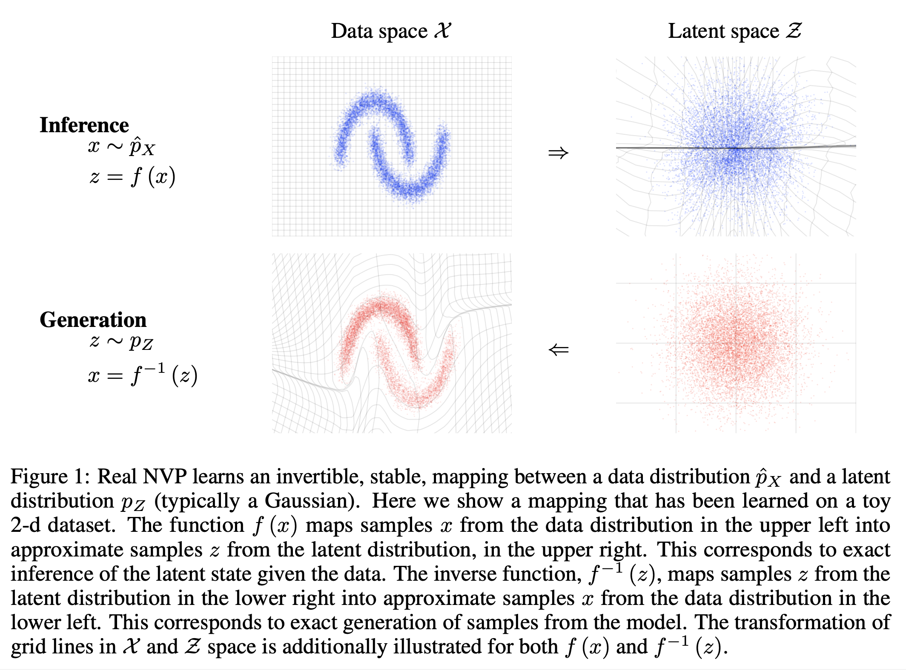
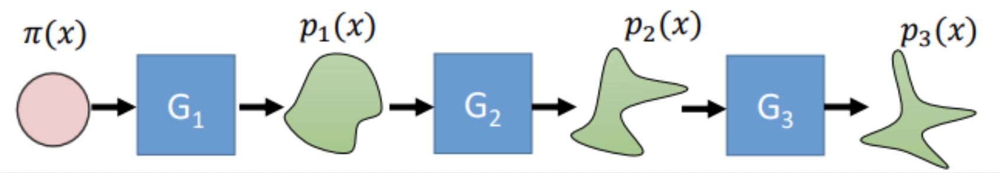
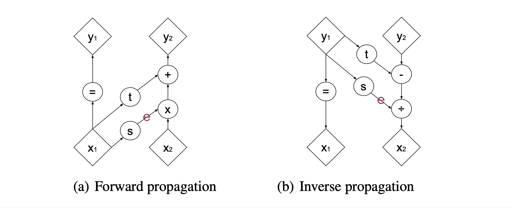
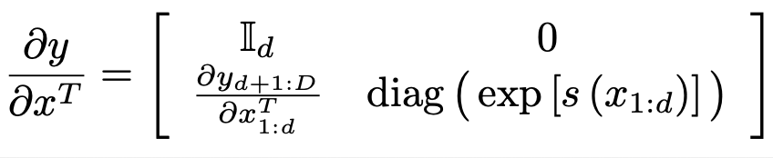
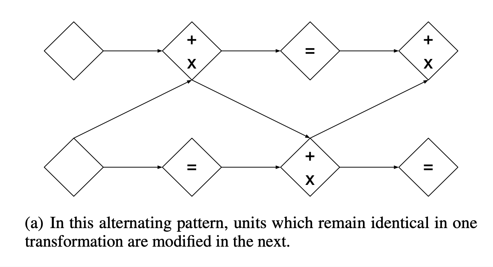
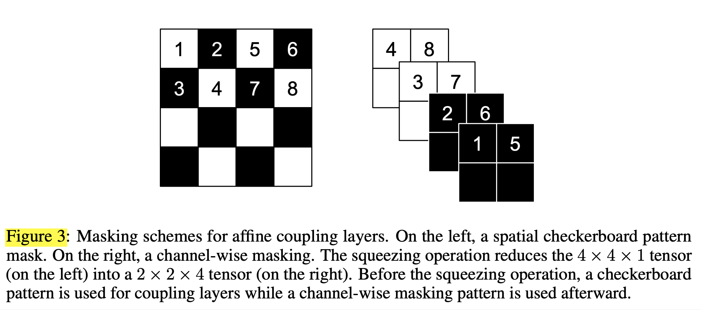
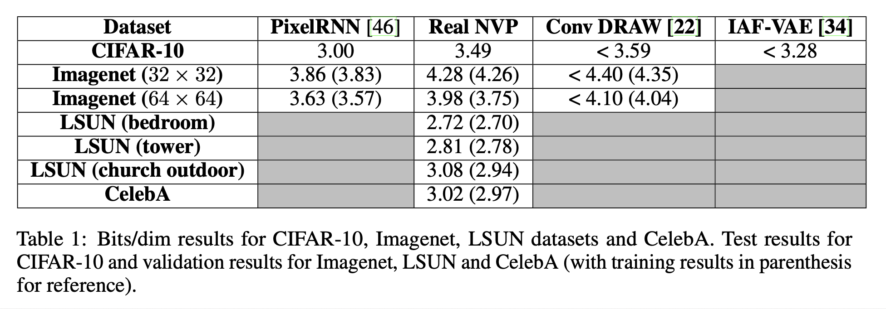
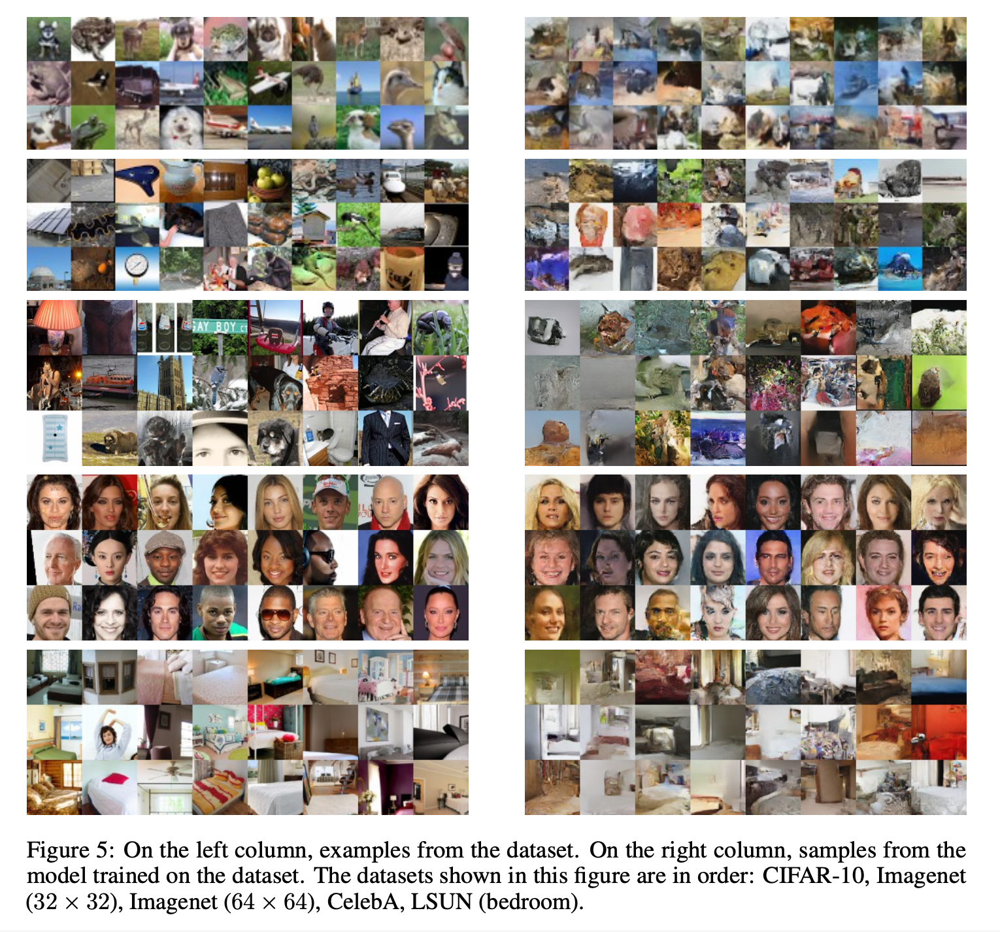

# Density Estimation Using Real NVP (2017), J. Sohl-Dickstein et al.

###### contributors: [@GitYCC](https://github.com/GitYCC)

\[[paper](https://arxiv.org/pdf/1605.08803.pdf)\] \[[tensorflow](https://github.com/tensorflow/models/tree/master/research/real_nvp)\]

---

**TR;DL**

- called "flow-base generative models"
- This paper presented a technique bridging the gap between auto-regressive models (e.g. PixelRNN), variational autoencoders (VAE), and generative adversarial networks (GAN).

| //Generative Models//  | Exact Log-likelihood Evaluation | Latent Space | Less Assumption (like: reconstruction cost) | Semantically Meaningful Latent Space | Computational Efficiency | Realistically | Stable | Reversible |
| ---------------------- | ------------------------------- | ------------ | ------------------------------------------- | ------------------------------------ | ------------------------ | ------------- | ------ | ---------- |
| Auto-regressive Models | V                               | X            |                                             | X                                    | X                        | =             | V      | X          |
| VAE                    | X                               | V            | X                                           | =                                    | V                        | =             | V      | X          |
| GANs                   | X                               | X            |                                             | X                                    | X                        | V             | X      | X          |
| RealNVP                | V                               | V            | V                                           | V                                    | V                        | =             | V      | V          |

**Related Work**
- Variational Autoencoder (VAE):
  - learns a generative network that maps gaussian latent variables $z$ to samples $x$
  - approximate inference network that maps samples $x$ to a semantically meaningful latent representation $z$, by exploiting the reparametrization trick
  - assumption: a fixed form reconstruction cost
- Auto-regressive Models (e.g. PixelRNN):
  - simplifying log-likelihood evaluation and sampling
  - the sequential nature of this model limits its computational efficiency
  - there is no natural latent representation associated with autoregressive models, and they have not yet been shown to be useful for semi-supervised learning
- Generative Adversarial Networks (GANs):
  - can train any differentiable generative network by avoiding the maximum likelihood principle altogether
  - generate sharp and realistically looking samples
  - metrics that measure the diversity in the generated samples are currently intractable
  - instability in their training process
- RealNVP:
  - Exact Log-likelihood Evaluation: Like auto-regressive models, RealNVP allows tractable and exact log-likelihood evaluation for training.
  - Latent Space: RealNVP allows however a much more flexible functional form, similar to that in the generative model of variational autoencoders. This allows for fast and exact sampling from the model distribution. 
  - Less Assumption: Like GANs, and unlike variational autoencoders, RealNVP does not require the use of a fixed form reconstruction cost, and instead defines a cost in terms of higher level features, generating sharper images.
  - Semantically Meaningful Latent Space: Unlike both variational autoencoders and GANs, our technique is able to learn a semantically meaningful latent space which is as high dimensional as the input space.

**Model Design**

- Training such a generative network $g$ that maps latent variable $z ∼ p_Z$ to a sample $x ∼ p_X$ does not in theory require a discriminator network as in GANs, or approximate inference as in variational autoencoders. 

- Indeed, if $g$ is bijective, it can be trained through maximum likelihood using the change of variable formula:
  $$
  p_X(x)=p_Z(z)\mid det(\frac{\partial g(z)}{\partial z^T}) \mid^{-1}
  $$

  - required: computational complexity of Jacobian determinant $det(\frac{\partial g(z)}{\partial z^T})$ is not too large

- Given an observed data variable $x ∈ X$, assume a simple prior probability distribution $p_Z$ on a latent variable $z ∈ Z$ and initialize learnable function $f : X → Z$ (with $g = f^{−1}$), the objective is to max. log likelihood from prior probability distribution $p_Z$ to samples $p_X$
  $$
  min.\ -log(p_X(x))=min.\ -log(p_Z(f(x)))-log(\mid det(\frac{\partial f(x)}{\partial x^T}) \mid)
  $$

  - We could regard above formulate as the loss to update $f(x)$
  - steps:
    - Training
      - convert samples by $z=f(x)$ to get latent representives
      - use a simple prior probability distribution $p_Z$ (an isotropic unit norm Gaussian) to determine loss
      - back-prop to update $f(x)$
    - Generation:
      - given a random point on latent space $z_i$
      - generate a sample $x_i=f^{-1}(z_i)$
  - required:
    - computational complexity of Jacobian determinant $det(\frac{\partial g(z)}{\partial z^T})$ is not too large
    - $f(x)$ is invertible 

- If we have multiple transformation steps:
  
  - 
  
  - $$
    min.\ -log(p_X(x))=min.\ -log(p_Z(z))-\sum_{h=1}^{K}log(\mid det(\frac{\partial f_h(x_h)}{\partial x_h^T}) \mid)
    $$
  
- Coupling layers

  - 

  - $$
    y_{1:d}=x_{1:d}
    $$

  - $$
    y_{d+1:D} = x_{d+1:D} ⊙ exp[s(x_{1:d})]􏰁 + t(x_{1:d})
    $$

  - invertible

    - $$
      x_{1:d}=y_{1:d}
      $$

    - $$
      x_{d+1:D} = 􏰀y_{d+1:D} − t(y_{1:d})􏰁 ⊙ exp [−s(y_{1:d})]􏰁
      $$

  - Jacobian determine

    - 
    - math tip: the determinant of a triangular matrix can be efficiently computed as the product of its diagonal terms
    - efficiently compute its determinant as $exp[\sum_js(x_{1:d})_j]$
    - Since computing the Jacobian determinant of the coupling layer operation does not involve computing the Jacobian of $s$ or $t$, those functions can be arbitrarily complex. We will make them deep convolutional neural networks (e.g. deep residual networks with batch normalization and weight normalization).

- Combining coupling layers

  - Although coupling layers can be powerful, their forward transformation leaves some components unchanged. This difficulty can be overcome by composing coupling layers in an alternating pattern, such that the components that are left unchanged in one coupling layer are updated in the next.
  - 
  - 
    - squeezing operation: transforms an $s × s × c$ tensor into an $2s × 2s × 4c$ tensor, effectively trading spatial size for number of channels.

**Results**

We show in bellow Table 1 that the number of bits per dimension, while not improving over the Pixel RNN baseline, is competitive with other generative methods.

