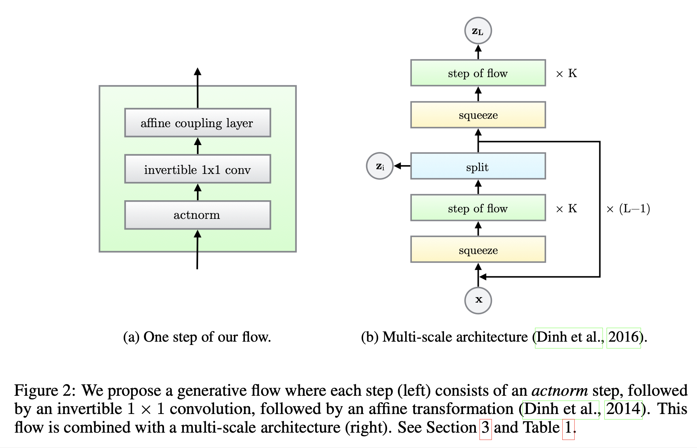
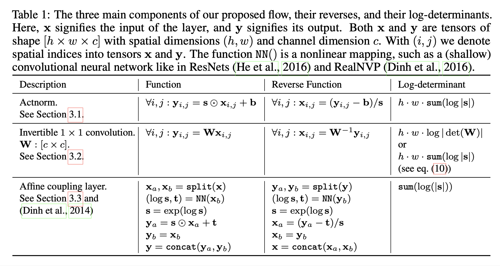
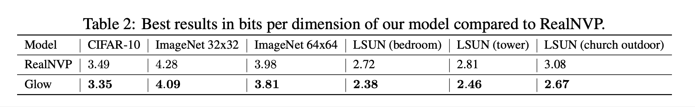
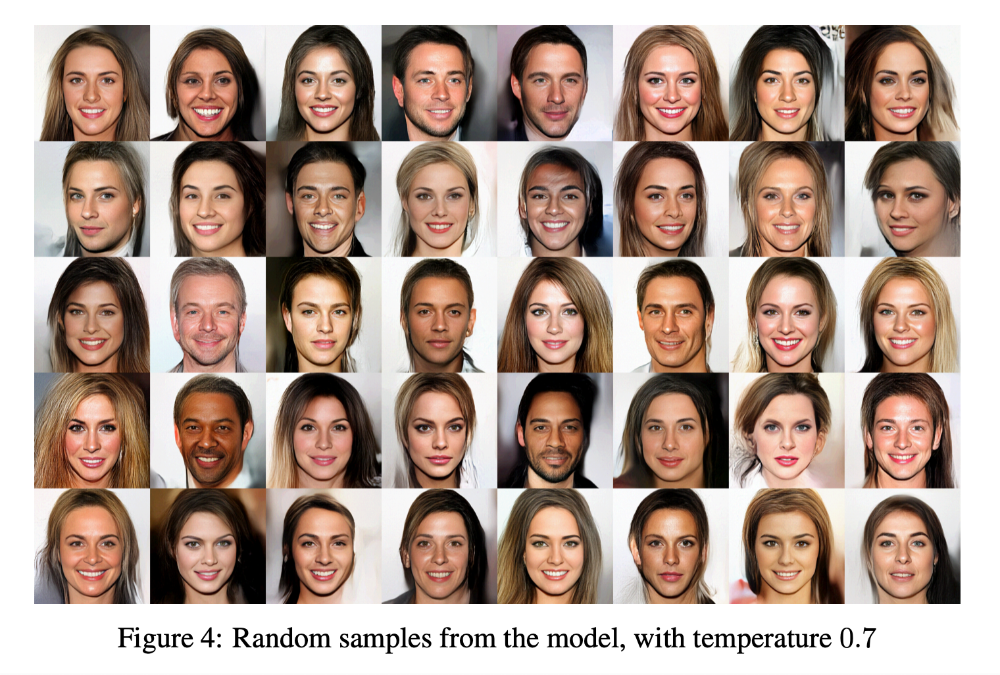
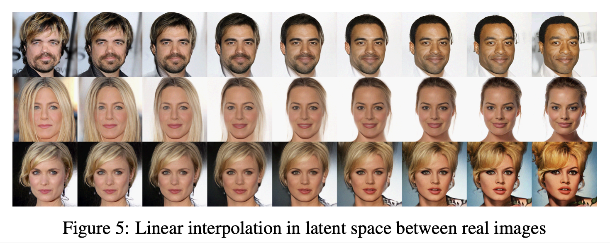
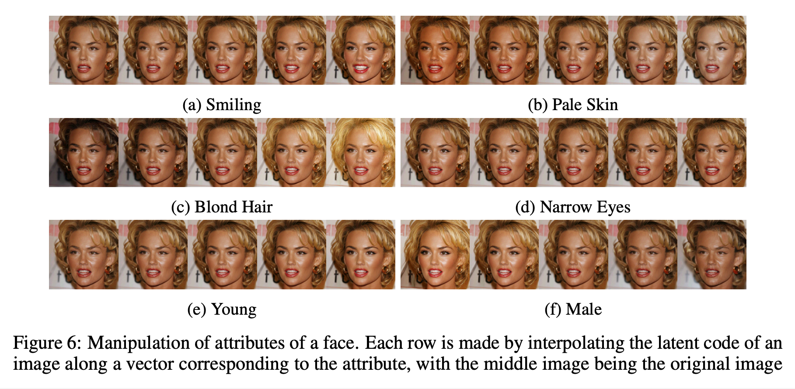
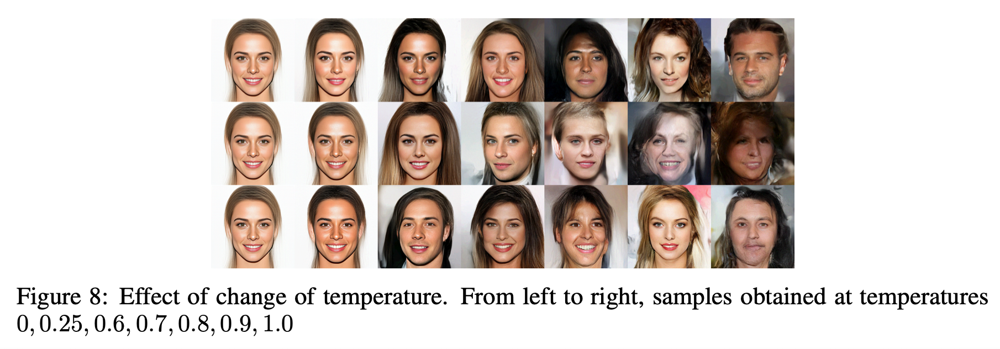

# Glow: Generative Flow with Invertible 1×1 Convolutions (2018), D. P. Kingma et al.

###### contributors: [@GitYCC](https://github.com/GitYCC)

\[[paper](https://papers.nips.cc/paper/8224-glow-generative-flow-with-invertible-1x1-convolutions.pdf)\] \[[tensorflow](https://github.com/openai/glow)\] \[[pytorch](https://github.com/chaiyujin/glow-pytorch)\]

---

**prerequisite**

- [Density Estimation Using Real NVP (2017), J. Sohl-Dickstein et al.](generative/density-estimation-using-real-nvp.md)

**model design**



**model design: one step of our flow**



- activation normalization
  - Initialize the bias and scale with a given minibatch, so that the output per-channel have zero mean and unit variance for that.
  - After initialization, `bias` and `logs` will be trained as parameters.

```python
class ActNorm2d(nn.Module):

    def __init__(self, num_features, scale=1.):
        super().__init__()
        # register mean and scale
        size = [1, num_features, 1, 1]
        self.register_parameter("bias", nn.Parameter(torch.zeros(*size)))
        self.register_parameter("logs", nn.Parameter(torch.zeros(*size)))
        self.num_features = num_features
        self.scale = float(scale)
        self.inited = False

    def _initialize_parameters(self, input):
        self._check_input_dim(input)
        if not self.training:
            return
        assert input.device == self.bias.device
        with torch.no_grad():
          	# per channel
            bias = thops.mean(input.clone(), dim=[0, 2, 3], keepdim=True) * -1.0
            vars = thops.mean((input.clone() + bias) ** 2, dim=[0, 2, 3], keepdim=True)
            logs = torch.log(self.scale/(torch.sqrt(vars)+1e-6))
            self.bias.data.copy_(bias.data)
            self.logs.data.copy_(logs.data)
            self.inited = True

    def forward(self, input, logdet=None, reverse=False):
      	# input: [n, c, w, h]
        if not self.inited:
            self._initialize_parameters(input)

        if not reverse:
            input = self._center(input, reverse)
            input, logdet = self._scale(input, logdet, reverse)
        else:
            input, logdet = self._scale(input, logdet, reverse)
            input = self._center(input, reverse)
        return input, logdet

    def _center(self, input, reverse=False):
        if not reverse:
            return input + self.bias
        else:
            return input - self.bias

    def _scale(self, input, logdet=None, reverse=False):
        logs = self.logs
        if not reverse:
            input = input * torch.exp(logs)
        else:
            input = input * torch.exp(-logs)

        if logdet is not None:
          	pixels = int(input.size(2) * input.size(3))
            dlogdet = pixels * thops.sum(logs)
            if reverse:
                dlogdet *= -1
            logdet = logdet + dlogdet
        return input, logdet

(...)
```

- invertible 1 × 1 convolution
  - convolution along the channel dimension
  - log-determinant: $h\cdot w\cdot log|det(W)|$
    - The cost of computing or differentiating $det(W)$ is $O(c^3)$
  - How to reduce the cost of computing? LU Decomposition
    - LU decomposition: $W=PL(U+diag(s))$
      - $P$: permutation matrix (which remains fixed)
      - $L$: lower triangular matrix (to be optimized)
      - $U$: upper triangular matrix with zeros on the diagonal (to be optimized)
      - $s$: a vector (to be optimized)
    - then, $log|det(W)|=sum(log|s|)$
      - cost of computing can be reduced from $O(c^3)$ to $O(c)$

```python
class InvertibleConv1x1(nn.Module):
    def __init__(self, num_channels, LU_decomposed=False):
        super().__init__()
        self._LU_decomposed = LU_decomposed
        self.num_channels = num_channels

        w_shape = [num_channels, num_channels]
        w_init, _ = np.linalg.qr(np.random.randn(*w_shape))
        w_init = w_init.astype(np.float32)
        if not self._LU_decomposed:
            # Sample a random orthogonal matrix:
            self.register_parameter("weight", nn.Parameter(torch.Tensor(w_init)))
        else:
            np_p, np_l, np_u = scipy.linalg.lu(w_init)
            np_s = np.diag(np_u)
            np_sign_s = np.sign(np_s)
            np_log_s = np.log(np.abs(np_s))
            np_u = np.triu(np_u, k=1)
            l_mask = np.tril(np.ones(w_shape, dtype=np.float32), -1)
            eye = np.eye(*w_shape, dtype=np.float32)

            self.register_buffer('p', torch.Tensor(np_p.astype(np.float32)))
            self.register_buffer('sign_s', torch.Tensor(np_sign_s.astype(np.float32)))

            # to be optimized
            self.l = nn.Parameter(torch.Tensor(np_l.astype(np.float32)))
            self.log_s = nn.Parameter(torch.Tensor(np_log_s.astype(np.float32)))
            self.u = nn.Parameter(torch.Tensor(np_u.astype(np.float32)))

            self.l_mask = torch.Tensor(l_mask)
            self.eye = torch.Tensor(eye)

    def get_weight(self, input, reverse):
        c = self.num_channels
        if not self._LU_decomposed:
            pixels = int(input.size(2) * input.size(3))
            # return of torch.slogdet: A namedtuple (sign, logabsdet) containing the sign of the determinant, and the log value of the absolute determinant.
            dlogdet = torch.slogdet(self.weight)[1] * pixels  # h · w · log(abs(|W|))
            if not reverse:
                weight = self.weight.view(c, c, 1, 1)
            else:
                weight = torch.inverse(self.weight.double()).float() \
                              .view(c, c, 1, 1)
            return weight, dlogdet
        else:
            self.p = self.p.to(input.device)
            self.sign_s = self.sign_s.to(input.device)
            self.l_mask = self.l_mask.to(input.device)
            self.eye = self.eye.to(input.device)

            l = self.l * self.l_mask + self.eye
            u = self.u * self.l_mask.transpose(0, 1).contiguous() + torch.diag(self.sign_s * torch.exp(self.log_s))
            dlogdet = thops.sum(self.log_s) * thops.pixels(input)
            if not reverse:
                w = torch.matmul(self.p, torch.matmul(l, u))
            else:
                l = torch.inverse(l.double()).float()
                u = torch.inverse(u.double()).float()
                w = torch.matmul(u, torch.matmul(l, self.p.inverse()))
            return w.view(c, c, 1, 1), dlogdet

    def forward(self, input, logdet=None, reverse=False):
        """
        log-det = log|abs(|W|)| * pixels
        """
        weight, dlogdet = self.get_weight(input, reverse)
        if not reverse:
            z = F.conv2d(input, weight)
            if logdet is not None:
                logdet = logdet + dlogdet
            return z, logdet
        else:
            z = F.conv2d(input, weight)
            if logdet is not None:
                logdet = logdet - dlogdet
            return z, logdet
```

- affine coupling layers
  - based on the design from [Density Estimation Using Real NVP (2017), J. Sohl-Dickstein et al.](density-estimation-using-real-nvp.md), called "affine coupling layer"
  - An "additive coupling layer" is a special case with $s = 1$ and a log-determinant of $0$.
  - additional changes
    - zero initialization: We initialize the last convolution of each $NN()$ with zeros (then $log(s)=0\Rightarrow s=1$ and $t=0$), such that each affine coupling layer initially performs an identity function; we found that this helps training very deep networks.
    - split and concatenation: splits along the channel dimension
    - permutation: our invertible 1x1 convolution is a generalization of such permutations, so it do not need extra permutation operation

**model design: multi-scale architecture**

```python
class SqueezeLayer(nn.Module):
    def __init__(self, factor):
        super().__init__()
        self.factor = factor

    def forward(self, input, logdet=None, reverse=False):
        if not reverse:
            output = self._squeeze2d(input, self.factor)
            return output, logdet
        else:
            output = self._unsqueeze2d(input, self.factor)
            return output, logdet

    def _squeeze2d(input, factor=2):
        B, C, H, W = input.size()
        x = input.view(B, C, H // factor, factor, W // factor, factor)
        x = x.permute(0, 1, 3, 5, 2, 4).contiguous()
        x = x.view(B, C * factor * factor, H // factor, W // factor)
        return x
      
    def _unsqueeze2d(input, factor=2):
        factor2 = factor ** 2
        B, C, H, W = input.size()
        x = input.view(B, C // factor2, factor, factor, H, W)
        x = x.permute(0, 1, 4, 2, 5, 3).contiguous()
        x = x.view(B, C // (factor2), H * factor, W * factor)
        return x
```


```python
class Split2d(nn.Module):
    def __init__(self, num_channels):
        super().__init__()
        self.conv = Conv2dZeros(num_channels // 2, num_channels)

    def split2d_prior(self, z):
        h = self.conv(z)
        return thops.split_feature(h, "cross")

    def forward(self, input, logdet=0., reverse=False, eps_std=None):
        if not reverse:
            z1, z2 = thops.split_feature(input, "split")
            mean, logs = self.split2d_prior(z1)
            logdet = GaussianDiag.logp(mean, logs, z2) + logdet
            return z1, logdet
        else:
            z1 = input
            mean, logs = self.split2d_prior(z1)
            z2 = GaussianDiag.sample(mean, logs, eps_std)
            z = thops.cat_feature(z1, z2)
            return z, logdet
```


```python
class FlowNet(nn.Module):
    def __init__(self, image_shape, hidden_channels, K, L,
                 actnorm_scale=1.0,
                 flow_permutation="invconv",
                 flow_coupling="additive",
                 LU_decomposed=False):
        """
                             K                                      K
        --> [Squeeze] -> [FlowStep] -> [Split] -> [Squeeze] -> [FlowStep]
               ^                           v
               |          (L - 1)          |
               + --------------------------+
        """
        super().__init__()
        self.layers = nn.ModuleList()
        self.output_shapes = []
        self.K = K
        self.L = L
        H, W, C = image_shape
        assert C == 1 or C == 3, ("image_shape should be HWC, like (64, 64, 3)"
                                  "C == 1 or C == 3")
        for i in range(L):
            # 1. Squeeze
            C, H, W = C * 4, H // 2, W // 2
            self.layers.append(modules.SqueezeLayer(factor=2))
            self.output_shapes.append([-1, C, H, W])
            # 2. K FlowStep
            for _ in range(K):
                self.layers.append(
                    FlowStep(in_channels=C,
                             hidden_channels=hidden_channels,
                             actnorm_scale=actnorm_scale,
                             flow_permutation=flow_permutation,
                             flow_coupling=flow_coupling,
                             LU_decomposed=LU_decomposed))
                self.output_shapes.append(
                    [-1, C, H, W])
            # 3. Split2d
            if i < L - 1:
                self.layers.append(modules.Split2d(num_channels=C))
                self.output_shapes.append([-1, C // 2, H, W])
                C = C // 2

    def forward(self, input, logdet=0., reverse=False, eps_std=None):
        if not reverse:
            return self.encode(input, logdet)
        else:
            return self.decode(input, eps_std)

    def encode(self, z, logdet=0.0):
        for layer, shape in zip(self.layers, self.output_shapes):
            z, logdet = layer(z, logdet, reverse=False)
        return z, logdet

    def decode(self, z, eps_std=None):
        for layer in reversed(self.layers):
            if isinstance(layer, modules.Split2d):
                z, logdet = layer(z, logdet=0, reverse=True, eps_std=eps_std)
            else:
                z, logdet = layer(z, logdet=0, reverse=True)
        return z
```

**Quantitative Experiments**



**Qualitative Experiments**

- Figure 4 shows the random samples obtained from our model.
  - 
- Synthesis and Interpolation: We take a pair of real images, encode them with the encoder, and linearly interpolate between the latents to obtain samples. The results in Figure 5 show that the image manifold of the generator distribution is extremely smooth and almost all intermediate samples look like realistic faces. 
  - 

- Semantic Manipulation: Each image has a binary label corresponding to presence or absence of attributes like smiling, blond hair, young, etc. We then calculate the average latent vector $z_{pos}$ for images with the attribute and $z_{neg}$ for images without, and then use the difference $(z_{pos} − z_{neg})$ as a direction for manipulating.
  - 

- Effect of Temperature
  - 
  - we choose a temperature of 0.7 as a sweet spot for diversity and quality of samples