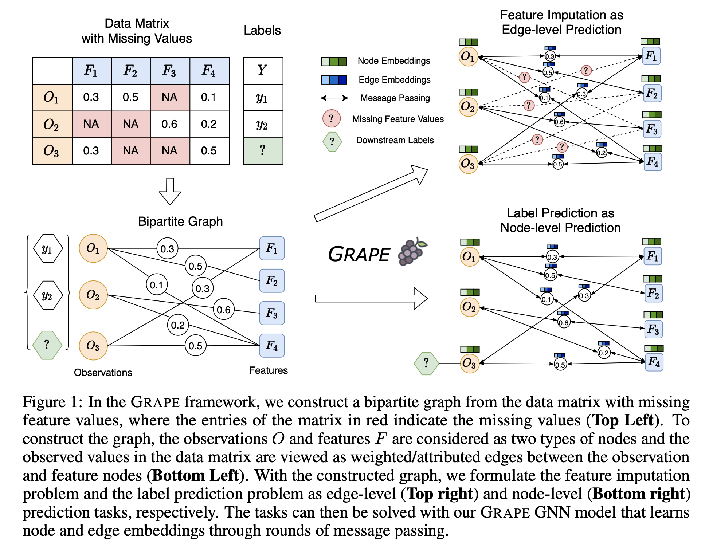
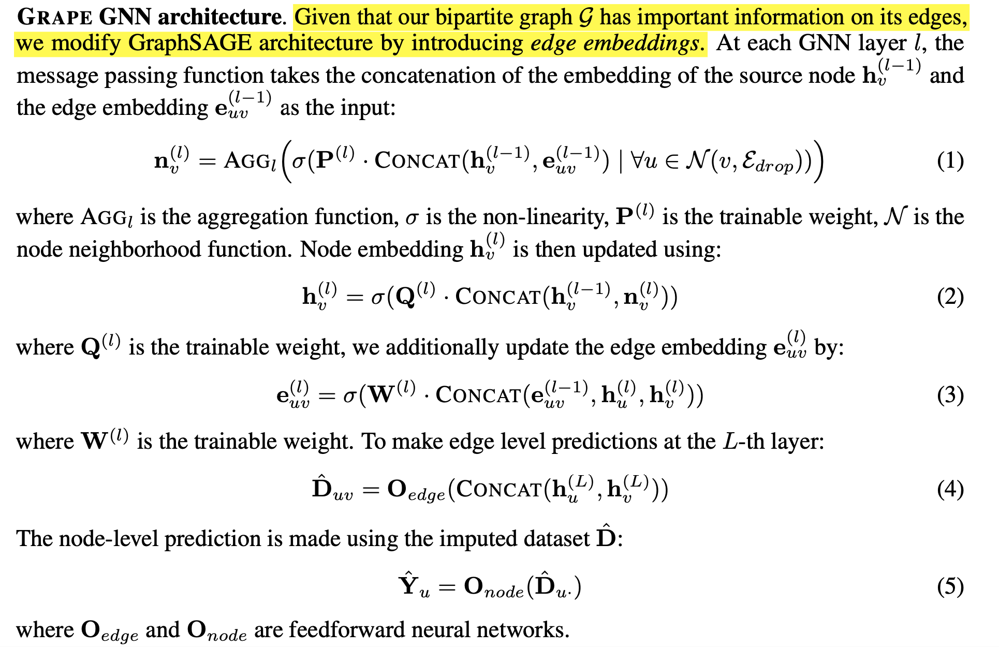
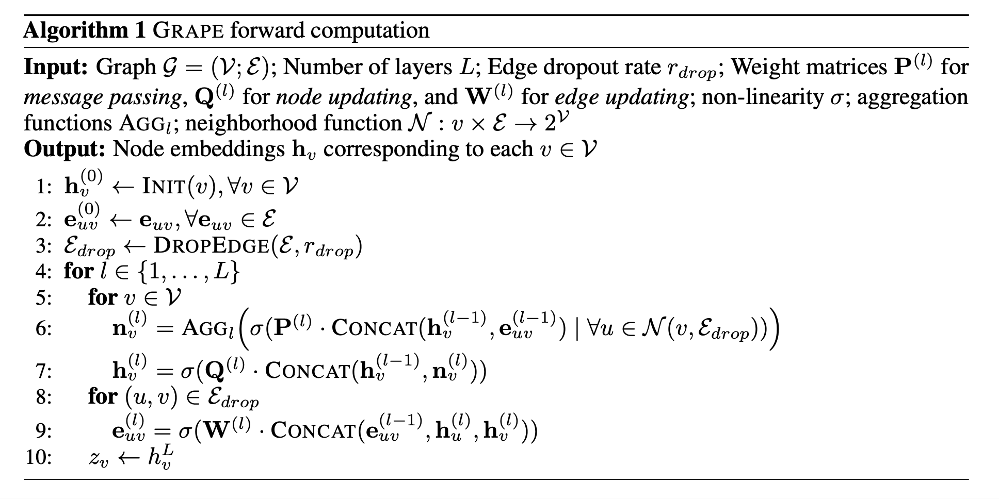
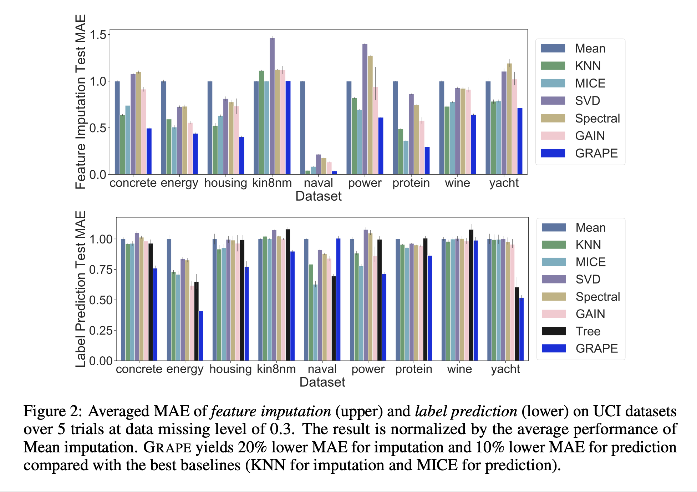

# Handling Missing Data with Graph Representation Learning (2020), Jiaxuan You et al.

###### contributors: [@GitYCC](https://github.com/GitYCC)

\[[paper](https://arxiv.org/pdf/2010.16418.pdf)\] \[[code](https://github.com/maxiaoba/GRAPE)\]

---

### Abstract

- Machine learning with missing data has been approached in two different ways:
  - feature imputation where missing feature values are estimated based on observed values
  - label prediction where downstream labels are learned directly from incomplete data
- Here we propose GRAPE, a graph-based framework for feature imputation as well as label prediction.
- Under the GRAPE framework, the feature imputation is formulated as an edge-level prediction task and the label prediction as a node-level prediction task.

### Introduction

- shortcoming of statistical methods for feature imputation:
  - (1) they tend to make strong assumptions about the data distribution
  - (2) they lack the flexibility for handling mixed data types that include both continuous and categorical variables
  - (3) matrix completion based approaches cannot generalize to unseen samples and require retraining when the model encounters new data samples
- traditional label prediction rely on heuristics and tend to have scalability issues
  - In tree-based method, surrogate splitting does not scale well, because each time an original splitting variable is missing for some observation it needs to rank all other variables as surrogate candidates and select the best alternative.
- Our key innovation is to formulate the problem using a graph representation, where we construct a bipartite graph with observations and features as two types of nodes, and the observed feature values as attributed edges between the observation and feature nodes (Figure 1). Under this graph representation, the feature imputation can then be naturally formulated as an edge-level prediction task, and the label prediction as a node-level prediction task.
- three innovations in its design:
  - (1) since the edges in the graph are constructed based on the data matrix and have rich attribute information, we introduce edge embeddings during message passing and incorporate both discrete and continuous edge features in the message computation
  - (2) we design augmented node features to initialize observation and feature nodes, which provides greater representation power and maintains inductive learning capabilities
  - (3) to overcome the common issue of overfitting in the missing data problem, we employ an edge dropout technique that greatly boosts the performance of GRAPE

### The GRAPE Framework

- We consider two tasks:
  - (1) feature imputation, where the goal is to predict the missing feature values $D_{ij}$ at $M_{ij} = 0$
    - The $j$-th feature of the $i$-th data point is denoted as $D_{ij}$ 
    - certain feature values are missing, denoted as a mask matrix $M ∈ \{0, 1\}_{n×m}$ where the value of $D_{ij}$ can be observed only if $M_{ij} = 1$
  - (2) label prediction, where the goal is to predict test labels $Y_i$ at $V_i = 0$
    - $V ∈ \{0, 1\}_n$ the train/test partition, where $Y_i$ can be observed at training test only if $V_i = 1$
- Missing Data Problem as a Graph Prediction Task
  - Feature matrix as a bipartite graph
  - Feature imputation as edge-level prediction
    - When imputing discrete attributes, we use cross entropy loss. When imputing continuous values, we use MSE loss.
  - Label prediction as node-level prediction
- Learning with GRAPE
  - 
- Augmented node features for bipartite message passing
  - We propose to use $m$-dimensional one-hot node features for each node in $V_F (m=|V_F|)$, while using $m$-dimensional constant vectors as node feature for data nodes in $V_D$. We make data nodes and feature nodes to have the same feature dimension for the ease of implementation.
  - 
- Improved model generalization with edge dropout
  - 
  - At test time, we feed the full graph $G$ to GRAPE. 

### Experiments

