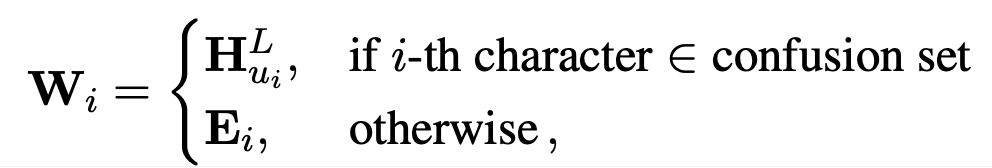
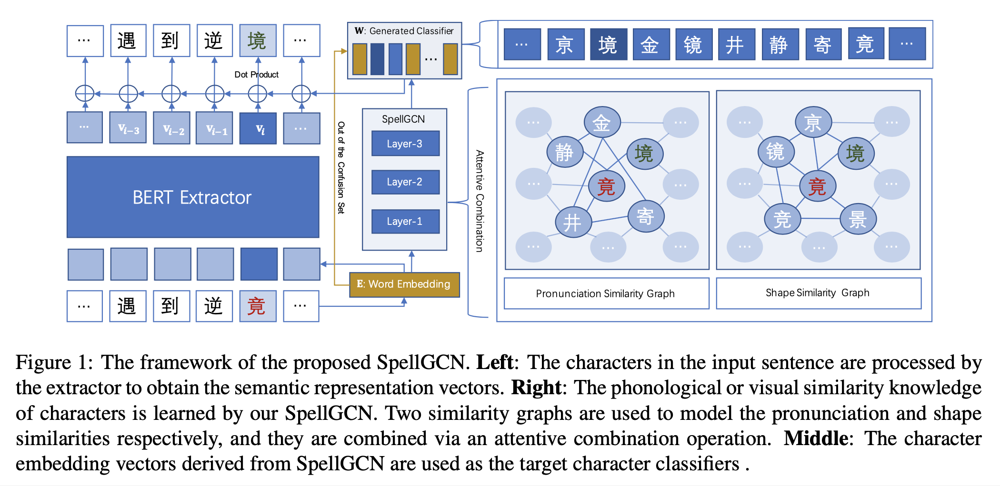
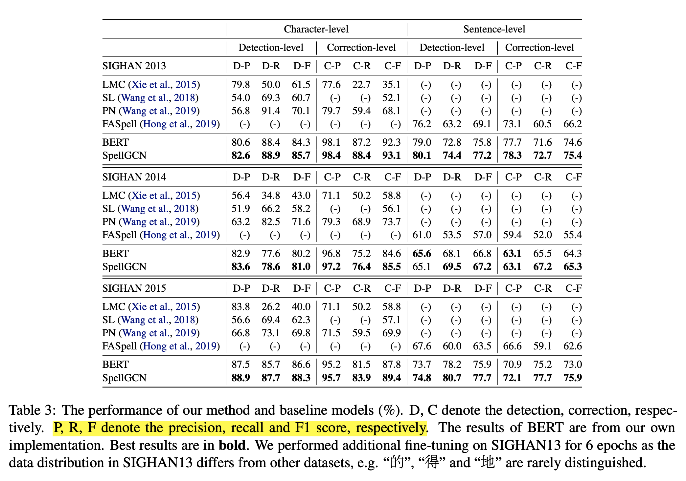

# SpellGCN: Incorporating Phonological and Visual Similarities into Language Models for Chinese Spelling Check (2020), Xingyi Cheng et al.

###### contributors: [@GitYCC](https://github.com/GitYCC)

\[[paper](https://arxiv.org/pdf/2004.14166.pdf)\] \[[code](https://github.com/ACL2020SpellGCN/SpellGCN)\]

---

- Chinese Spelling Check (CSC) is a task to detect and correct spelling errors in Chinese natural language. 

- Existing methods have made attempts to incorporate the similarity knowledge between Chinese characters. However, they take the similarity knowledge as either an external input resource or just heuristic rules. 

- This paper proposes to incorporate phonological and visual similarity knowledge into language models for CSC via a specialized graph convolutional network (SpellGCN). The model builds a graph over the characters, and SpellGCN is learned to map this graph into a set of inter-dependent character classifiers. These classifiers are applied to the representations extracted by another network, such as BERT, enabling the whole network to be end-to-end trainable.

- Two similarity graphs are constructed for the pronunciation and shape relationship correspondingly.

  - binary adjacent matrix
  - pronunciation similarities graphs $\bold{A}^p$ and shape similarities graphs $\bold{A}^s$

- Graph Convolution Operation:

  - GCN layers without activation function between layers
  - $f(\bold{A},\bold{H}^l)=\hat{\bold{A}}\bold{H}^l\bold{W}^l_g$
    - where: $\bold{W}^l_g \in \R^{D\times D}$ is a trainable matrix and  $\hat{\bold{A}} \in \R^{N\times N}$ is the normalized version of the adjacent matrix $\bold{A}$

- Attentive Graph Combination Operation:

  - To combine the pronunciation and shape similarity graphs, the attention mechanism (Bahdanau et al., 2015) is adopted. SpellGCN could learn using between pronunciation or shape similarity.

  - $\bold{C}^l_i=\sum_{k \in \{s,p\}}\alpha_{i,k}^l f_k(\bold{A}^k,\bold{H}^l)_i$

    - where: $\bold{C}^l \in \R^{N\times D}$ is the i-th row of convolved representation of graph k, $\alpha_{i,k}^l$ is a scalar for i-th character denoting the weight of graph k. The weight $\alpha_{i,k}^l$ is computed by
      $$
      \alpha_{i,k}=\frac{exp(\bold{w}_a f_k(\bold{A}^k,\bold{H}^l)_i / \beta)}{\sum_{k'} exp(\bold{w}_a f_{k'}(\bold{A}^{k'},\bold{H}^l)_i / \beta}
      $$

      - where: $\bold{w}_a\in \R^D$ is a learnable vector shared across the layers and $β$ is a hyper-parameter which controls the smoothness of attention weights.

- Accumulated Output:

  - After graph convolution and attentive combination operations, we obtain a representation $\bold{C}^l$ for l-th layer. To maintain the original semantic of the extractor, all outputs of previous layers are accumulated as the output:
    $$
    \bold{H}^{l+1}=\bold{C}^l+\sum_{i=0}^{l}\bold{H}^{i}
    $$

- Character Representation by Extractor: BERT

  - vocabulary embedding $\bold{E}$
  - output representation vectors $\bold{V}$

- SpellGCN as Character Classifier:

  - $p(\hat{y}_i|\bold{X}) = softmax(\bold{W}\bold{v}_i)$  (dot product and softmax)
  - 

- Prediction Inference:

  - Some previous work (Yu and Li, 2014; Liu et al., 2013) used two models for these sub-tasks separately. In this work, we simply use the character with the highest probability $arg max_{\hat{y}_i} p(\hat{y}_i|\bold{X})$ as the prediction for the correction task.

- Evaluation
  - 
  - LMC (Xie et al., 2015): This method utilizes the confusion set to replace the characters and then evaluates the modified sentence via a N-gram Language Model.
  - SL (Wang et al., 2018): Sequence Labeling model is adopted for detection
  - PN (Wang et al., 2019): Pointer Network
  - FASpell (Hong et al., 2019): This model utilizes a specialized candidate selection method based on the similarity metric. This metric is measured using some empirical methods, e.g., edit distance, rather than a pre-defined confusion set.

