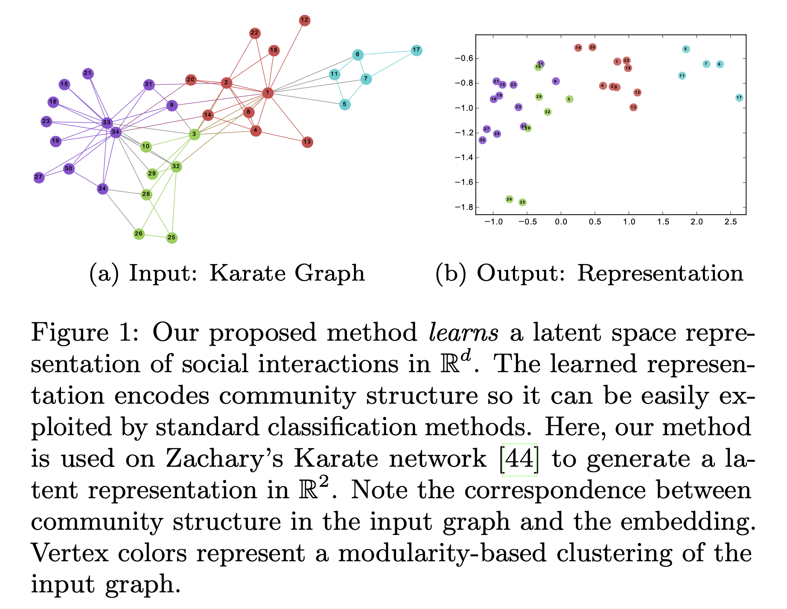
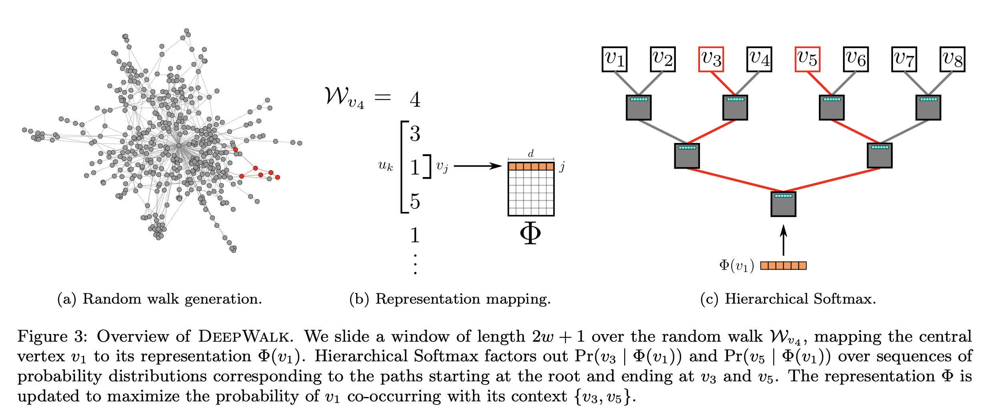
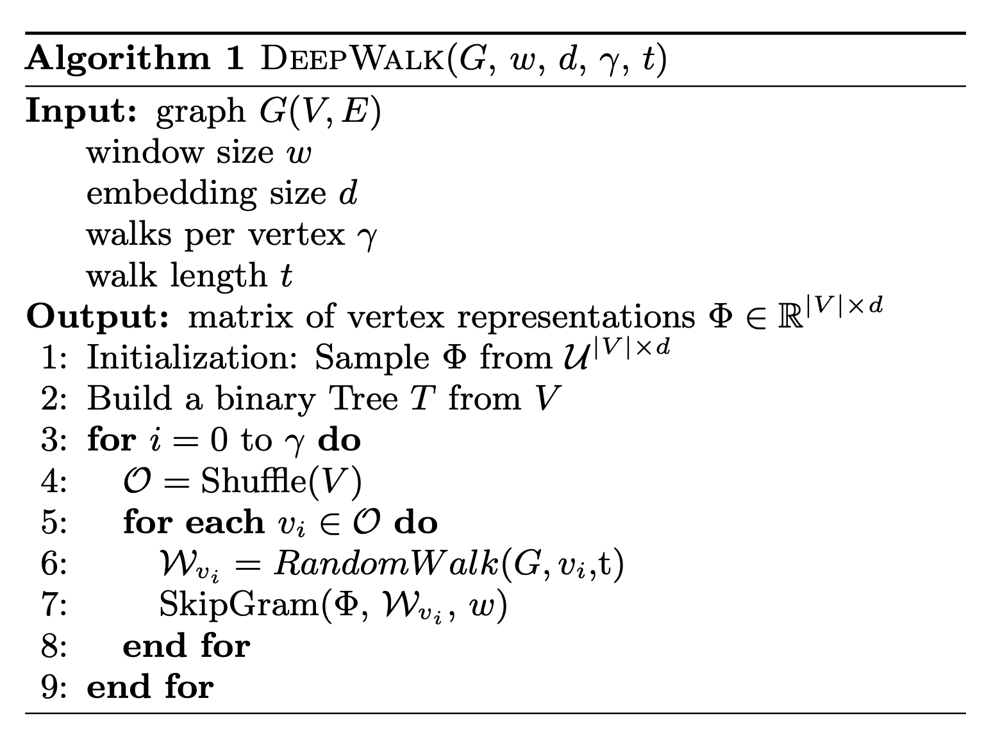
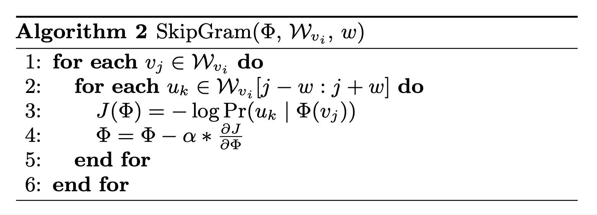
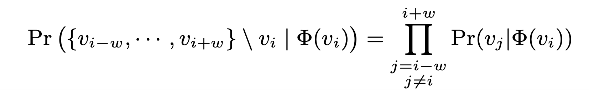
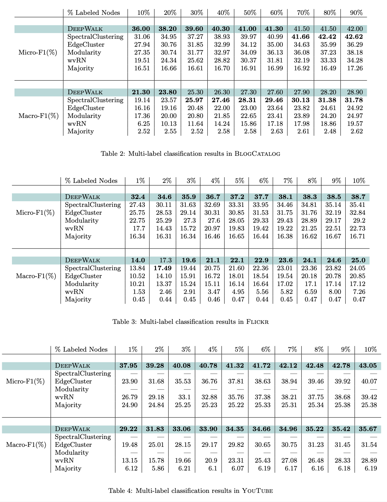

# DeepWalk: Online Learning of Social Representations (2014), B. Perozzi et al.

###### contributors: [@GitYCC](https://github.com/GitYCC)

\[[paper](https://dl.acm.org/doi/10.1145/2623330.2623732)\] \[[code](https://github.com/phanein/deepwalk)\]

---

**object**

Given related graph, create embeddings of nodes to assist label classification

- Instead of mixing the label space as part of the feature space, we propose an unsupervised method which learns features that capture the graph structure independent of the labels’ distribution.

**design**

The algorithm consists of two main components; first a random walk generator, and second, an update procedure.

- benefit of random walk
  1. local exploration is easy to parallelize. Several random walkers (in different threads, processes, or machines) can simultaneously explore different parts of the same graph.
  2. relying on information obtained from short random walks make it possible to accommodate small changes in the graph structure without the need for global recomputation. We can iteratively update the learned model with new random walks from the changed region in time sub-linear to the entire graph.

- Hierarchical Softmax
  - line 2: Build a binary Tree T from V
  - detail in [Efficient estimation of word representations in vector space (2013), T. Mikolov et al.](../nlp/efficient-estimation-of-word-representations-in-vector-space.md)

- SkipGram:
  - 

**result**

