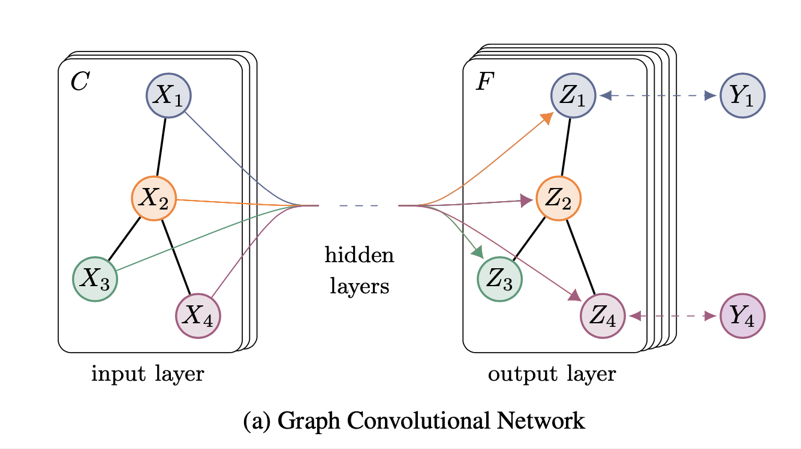

# Semi-supervised Classification with Graph Convolutional Networks (2017), Thomas N. Kipf et al.

###### contributors: [@GitYCC](https://github.com/GitYCC)

\[[paper](https://arxiv.org/pdf/1609.02907)\]

---

### Introduction

- In this work, we encode the graph structure directly using a neural network model $f(X,A)$ and train on a supervised target $L_0$ for all nodes with labels, thereby avoiding explicit graph-based regularization in the loss function. Conditioning $f(·)$ on the adjacency matrix of the graph will allow the model to distribute gradient information from the supervised loss $L_0$ and will enable it to learn representations of nodes both with and without labels.

### Fast Approximate Convolutions on Graphs

- normalized graph Laplacian $L=I-D^{-\frac{1}{2}}AD^{-\frac{1}{2}}$

  - $L$ is symmetric matrix: $L=U\Lambda U^T$ (where: $U$ is the matrix of eignevectors, $\Lambda$ is a diagonal matrix of its eigenvalues)
  - $U^TU=I$
  - graph Fourier transform: $U^Tx$
  - graph Fourier inverse transform: $Uy$

- Spectral Graph Convolutions: 

  - $g_\theta ⋆x=Ug_\theta(\Lambda)U^Tx$

  - problem1: above convolution is not localized

    - $Lx=U\Lambda U^T$ -> one step localized
    - $L^2x=U\Lambda^2 U^T$ -> two steps localized
    - $L^kx=U\Lambda^k U^T$ -> k steps localized
    - we need some constraints on $g_\theta(\Lambda)$ to be localized

  - problem2: multiplication with the eigenvector matrix $U$ is computationally expensive, $O(N^2)$

    - solution: truncate $U$ with $K$ eigenvectors
      $$
      Ug_\theta(\Lambda)U^Tx=
      \begin{pmatrix}
      | & | &  & | \\
      u_0 & u_1 & \cdots & u_N  \\
      | & | &  & |
      \end{pmatrix}
      g_\theta(
      \begin{pmatrix}
      \lambda_1 & 0 & &  \\
      0 & \lambda_1 & &  \\
       &  &  \ddots & \\
       & & & \lambda_N
      \end{pmatrix}
      )
      \begin{pmatrix}
      - & u_0 & -  \\
      - & u_1 & -  \\
       & \vdots & \\
       - & u_N & - 
      \end{pmatrix}
      x
      $$

      $$
      \approx
      \begin{pmatrix}
      | & | &  & | \\
      u_0 & u_1 & \cdots & u_K  \\
      | & | &  & |
      \end{pmatrix}
      g_\theta(
      \begin{pmatrix}
      \lambda_1 & 0 & &  \\
      0 & \lambda_1 & &  \\
       &  &  \ddots & \\
       & & & \lambda_K
      \end{pmatrix}
      )
      \begin{pmatrix}
      - & u_0 & -  \\
      - & u_1 & -  \\
       & \vdots & \\
       - & u_K & - 
      \end{pmatrix}
      x
      $$

  - problem3: But still computing the eigendecomposition of $L$ in the first place might be prohibitively expensive for large graphs

- use Chebyshev polynomial to constraints on $g_\theta(\Lambda)$

  - Chebyshev polynomial: $x\in [-1,1],\ T_0(x)=1,\ T_1(x)=x,\ T_k(x)=2xT_{k-1}(x)-T_{k-2}(x)$
  - localized constraint on $g_\theta(\Lambda)$
    - $\tilde{\Lambda}=\frac{2\Lambda}{\lambda_{max}}-I$ , where: $\tilde{\lambda}\in[-1,1]$
    - $g_{\theta'}(\tilde{\Lambda})=\sum_{k=0}^{K}\theta_k'T_k(\tilde\Lambda)$
      - K=1: $T_0(\tilde{\Lambda})=I$, $T_1(\tilde{\Lambda})=\tilde{\Lambda}$
      - K=2: $T_0(\tilde{\Lambda})=I$, $T_1(\tilde{\Lambda})=\tilde{\Lambda}$, $T_2(\tilde{\Lambda})=2\tilde{\Lambda}^2-I$ 
      - localized !!! (problem 1 solved)
    - $Ug_{\theta'}(\tilde{\Lambda})U^T=U\sum_{k=0}^{K}\theta_k'T_k(\tilde\Lambda)U^T=\sum_{k=0}^{K}\theta_k'T_k(U\tilde\Lambda U^T)=\sum_{k=0}^{K}\theta_k'T_k(\tilde L)$
      - we could iteratively obtain $T_k(\tilde L)$, we do not need to compute the eigendecomposition of $L$ (problem 2 and problem 3 solved)
      - where: $\tilde L=\frac{2}{\lambda_{max}}L-I$

- layer-wise linear model

  - assume $K=1$, $\lambda_{max}\approx2$
    - $g_\theta ⋆x=g_{\theta'}(L)x=\theta_0'x+\theta_1'(L-I)x$
  - be beneficial to constran the number of parameters further to address overfitting: $\theta=\theta_0'=-\theta_1'$
    - $g_\theta ⋆x=\theta(I+D^{-\frac{1}{2}}AD^{-\frac{1}{2}})x$
  - Note that $I+D^{-\frac{1}{2}}AD^{-\frac{1}{2}}$ now has eigenvalues in the range [0, 2]. Repeated application of this operator can therefore lead to numerical instabilities and exploding/vanishing gradients when used in a deep neural network model. To alleviate this problem, we introduce the following renormalization trick: $I+D^{-\frac{1}{2}}AD^{-\frac{1}{2}}$ -> $\tilde D^{-\frac{1}{2}}\tilde A\tilde D^{-\frac{1}{2}}$
    - $g_\theta ⋆x=\theta(\tilde D^{-\frac{1}{2}}\tilde A\tilde D^{-\frac{1}{2}})x$
    - $\tilde A=A+I$ and $\tilde D_{ii}=\sum_j\tilde A_{ij}$

- graph convolutional network: 

  - hidden layer: $Z=\hat{A}X\Theta$
    - where: $\hat{A}=\tilde D^{-\frac{1}{2}}\tilde A\tilde D^{-\frac{1}{2}}$
  - example: $Y=softmax(\hat{A}Relu(\hat{A}X\Theta^{(0)})\Theta^{(1)})$
    - 

