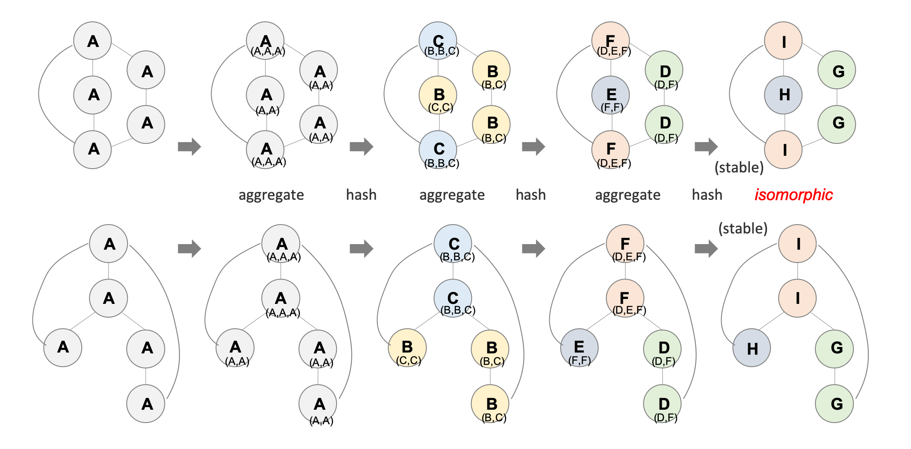
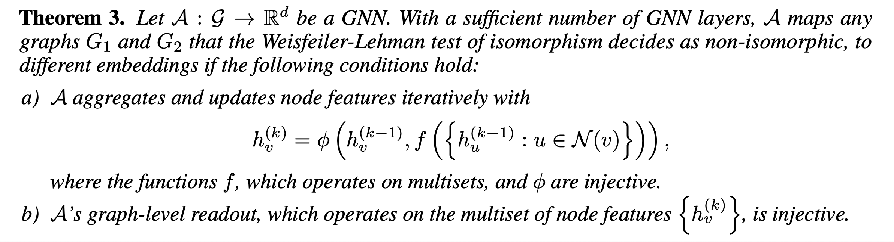
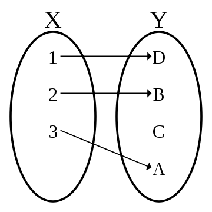
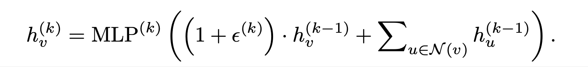
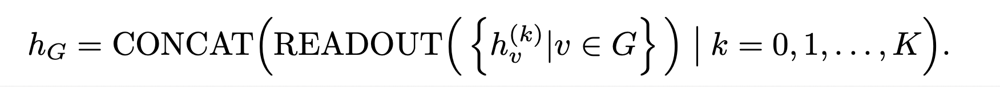
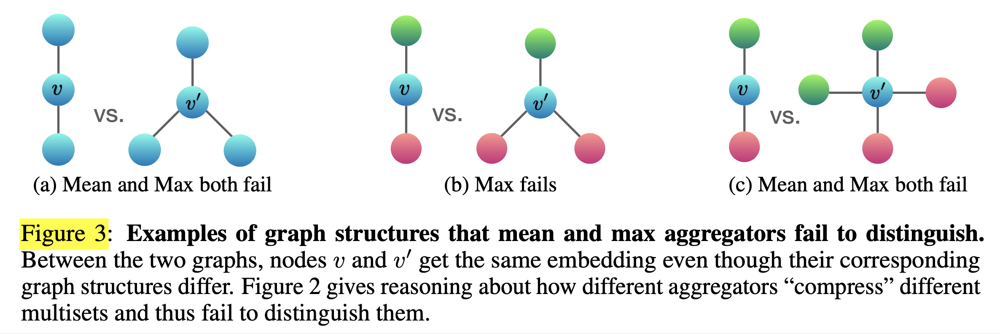

# How Powerful Are Graph Neural Networks? (2018), K. Xu et al.

###### contributors: [@GitYCC](https://github.com/GitYCC)

\[[paper](https://arxiv.org/abs/1706.02216)\] \[[pytorch](https://pytorch-geometric.readthedocs.io/en/latest/modules/nn.html#torch_geometric.nn.conv.GINConv)\]

---

### Abstract

- We then develop a simple architecture that is provably the most expressive among the class of GNNs and is as powerful as the Weisfeiler-Lehman graph isomorphism test. We empirically validate our theoretical findings on a number of graph classification benchmarks, and demonstrate that our model achieves state-of-the-art performance.

### Introduction

- Many GNN variants with different neighborhood aggregation and graph-level pooling schemes have been proposed. However, the design of new GNNs is mostly based on empirical intuition, heuristics, and experimental trial-and- error. There is little theoretical understanding of the properties and limitations of GNNs, and formal analysis of GNNs’ representational capacity is limited.
- Our framework is inspired by the close connection between GNNs and the Weisfeiler-Lehman (WL) graph isomorphism test, a powerful test known to distinguish a broad class of graphs.
- We identify graph structures that cannot be distinguished by popular GNN variants, such as GCN and GraphSAGE, and we precisely characterize the kinds of graph structures such GNN-based models can capture.
- We develop a simple neural architecture, Graph Isomorphism Network (GIN), and show that its discriminative/representational power is equal to the power of the WL test.

### Preliminaries

- Weisfeiler-Lehman test
  - The graph isomorphism problem asks whether two graphs are topologically identical. This is a challenging problem: no polynomial-time algorithm is known for it yet.
  - The WL test iteratively (1) aggregates the labels of nodes and their neighborhoods, and (2) hashes the aggregated labels into unique new labels. The algorithm decides that two graphs are non-isomorphic if at some iteration the labels of the nodes between the two graphs differ.
  - 

### Building Powerful Graph Neural Networks

- 
  - If the neighbor aggregation and graph-level readout functions are **injective**, then the resulting GNN is as powerful as the WL test.
  - 
  - GNN satisfying the criteria in Theorem 3 generalizes the WL test by learning to embed the subtrees to low-dimensional space. This enables GNNs to not only discriminate different structures, but also to learn to map similar graph structures to similar embeddings and capture dependencies between graph structures. Capturing structural similarity of the node labels is shown to be helpful for generalization particularly when the co-occurrence of subtrees is sparse across different graphs or there are noisy edges and node features.
- Grpah Isomorphism Network (GIN)
  - 
  - 
  - the neighbor aggregation and graph-level readout functions of GIN are **injective**
  - 1-Layer Perceptrons are not Sufficient
- GCN and GraphSAGE do not satisfy the conditions in Theorem 3
  - 
  - The mean aggregator may perform well if, for the task, the statistical and distributional information in the graph is more important than the exact structure. Moreover, when node features are diverse and rarely repeat, the mean aggregator is as powerful as the sum aggregator. This may explain why, despite the limitations identified in Section 5.2, GNNs with mean aggregators are effective for node classification tasks, such as classifying article subjects and community detection, where node features are rich and the distribution of the neighborhood features provides a strong signal for the task.

