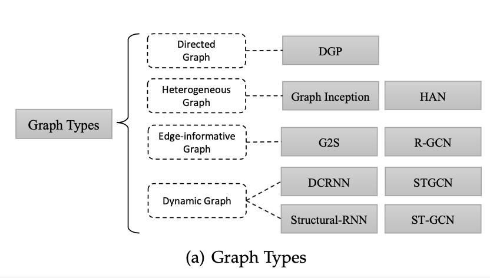
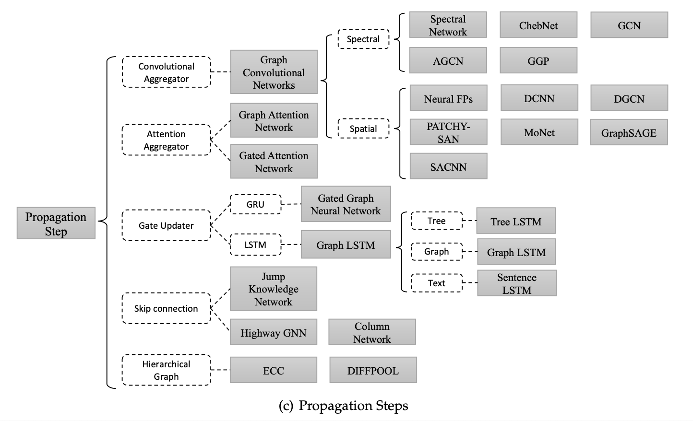
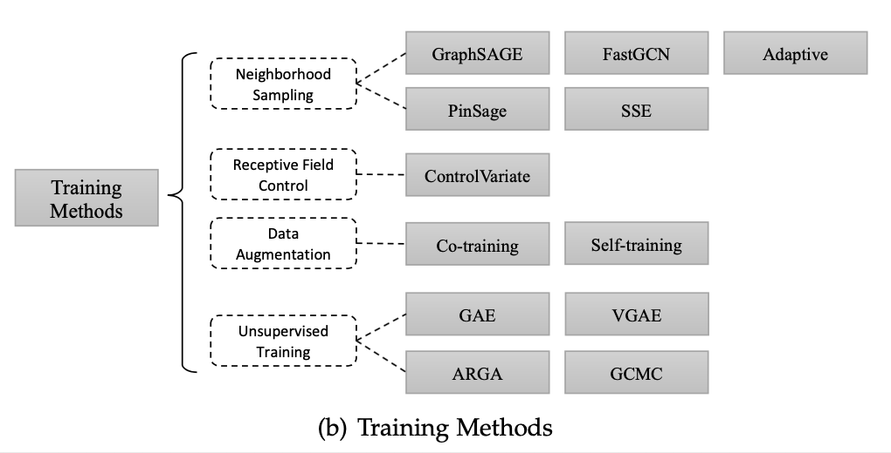
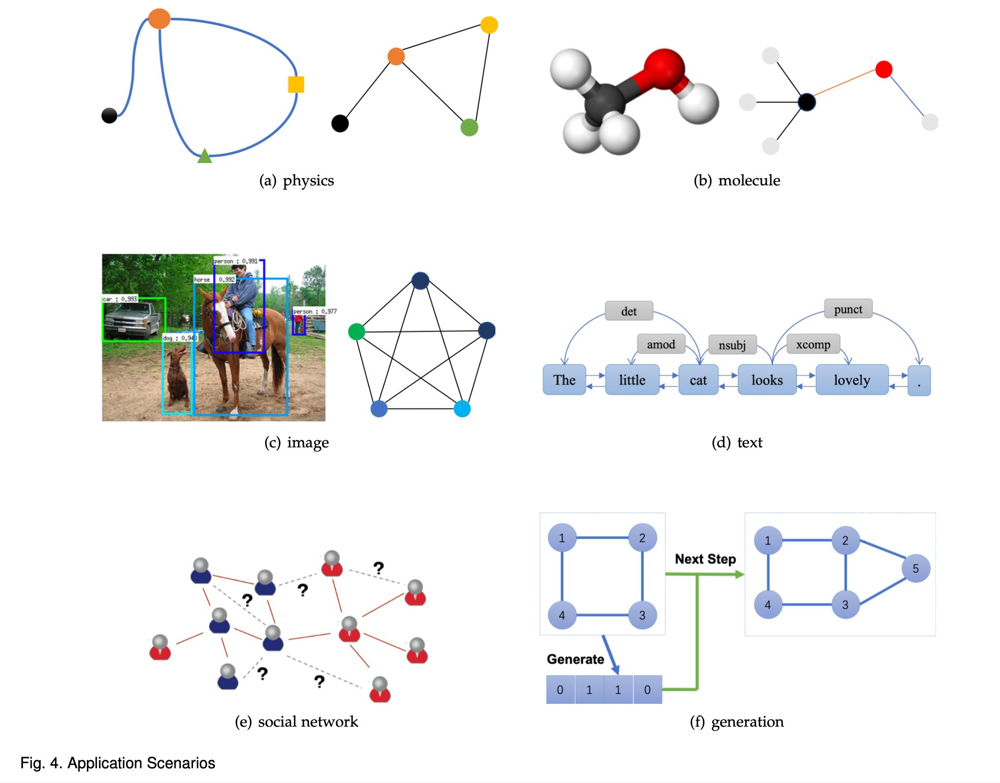
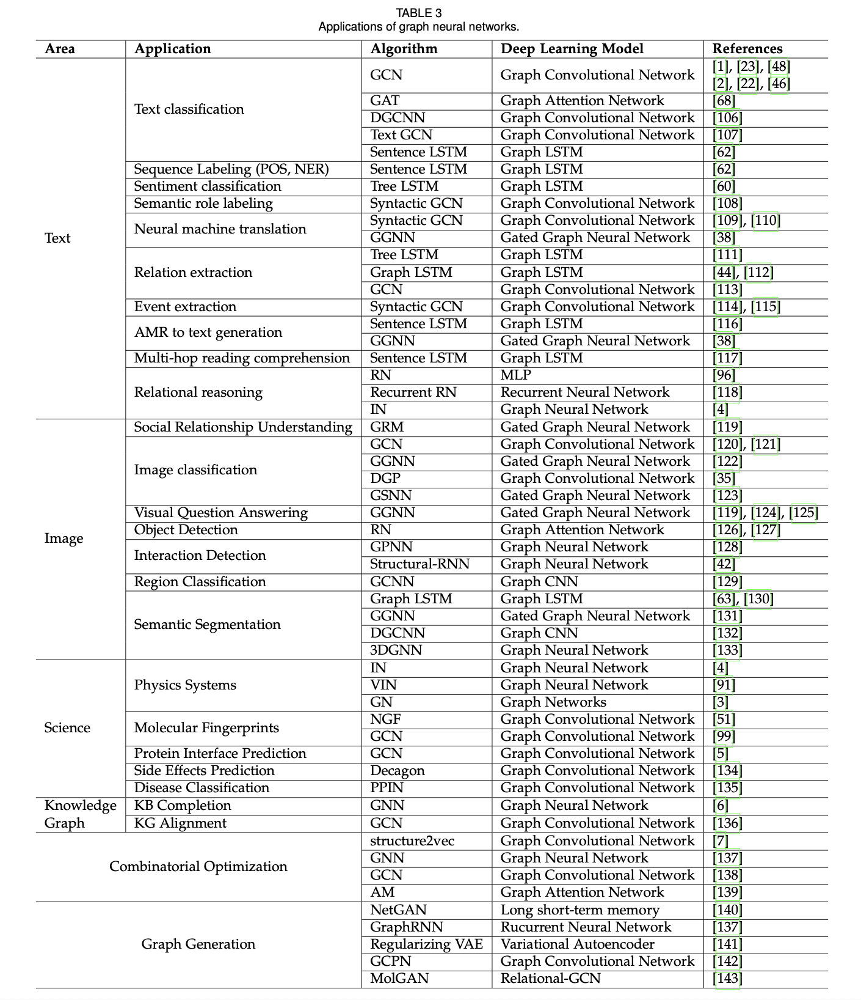

# Graph Neural Networks: A Review of Methods and Applications (2018), Jie Zhou, Ganqu Cui, Zhengyan Zhang, Cheng Yang, Zhiyuan Liu, Maosong Sun. 

###### contributors: [@GitYCC](https://github.com/GitYCC)

\[[paper](https://arxiv.org/pdf/1812.08434.pdf)\]

---

**Abstract**

- Lots of learning tasks require dealing with graph data which contains rich relation information among elements. Modeling physics system, learning molecular fingerprints, predicting protein interface, and classifying diseases require a model to learn from graph inputs. In other domains such as learning from non-structural data like texts and images, reasoning on extracted structures, like the dependency tree of sentences and the scene graph of images, is an important research topic which also needs graph reasoning models. 
- Graph neural networks (GNNs) are connectionist models that capture the dependence of graphs via message passing between the nodes of graphs. Unlike standard neural networks, graph neural networks retain a state that can represent information from its neighborhood with arbitrary depth. 
- Although the primitive GNNs have been found difficult to train for a fixed point, recent advances in network architectures, optimization techniques, and parallel computation have enabled successful learning with them. 
- In recent years, systems based on variants of graph neural networks such as graph convolutional network (GCN), graph attention network (GAT), gated graph neural network (GGNN) have demonstrated ground-breaking performance on many tasks mentioned above. In this survey, we provide a detailed review over existing graph neural network models, systematically categorize the applications, and propose four open problems for future research.

**Introduction**

- Graphs are a kind of data structure which models a set of objects (nodes) and their relationships (edges). 
  - social networks
  - physical systems
  - protein-protein interaction networks
  - knowledge graphs
- The first motivation of GNNs roots in convolutional neural networks (CNNs)
  - the keys of CNNs:
    - local connection
    - shared weights
    - the use of multi-layer
  - However, CNNs can only operate on regular Euclidean data like images (2D grid) and text (1D sequence) while these data structures can be regarded as instances of graphs. Therefore, it is straightforward to think of finding the generalization of CNNs to graphs.
- The other motivation comes from *graph embedding*, which learns to represent graph nodes, edges or sub-graphs in low-dimensional vectors.
  - Applies SkipGram model on the generated random walks: DeepWalk, node2vec, LINE and TADW
  - However, above methods suffer two severe drawbacks
    1. no parameters are shared between nodes in the encoder, which leads to computationally inefficiency
    2. the direct embedding methods lack the ability of generalization, which means they cannot deal with dynamic graphs or generalize to new graphs
- Based on CNNs and graph embedding, graph neural networks (GNNs) are proposed to collectively aggregate information from graph structure.
- Why graph neural networks are worth investigating?
  1. The standard neural networks like CNNs and RNNs cannot handle the graph input
     - CNNs and RNNs need a specific order. To present a graph completely, we should traverse all the possible orders as the input of the model like CNNs and RNNs, which is very redundant when computing. 
     - To solve this problem, GNNs propagate on each node respectively, ignoring the input order of nodes. In other words, the output of GNNs is invariant for the input order of nodes.
  2. An edge in a graph represents the information of dependency between two nodes.
     - In the standard neural networks, the dependency information is just regarded as the feature of nodes.
     - GNNs can do propagation guided by the graph structure instead of using it as part of features. Generally, GNNs update the hidden state of nodes by a weighted sum of the states of their neighborhood.
  3. Reasoning is a very important research topic for high-level artificial intelligence and the reasoning process in human brain is almost based on the graph which is extracted from daily experience.

**Graph Neural Networks**

- The target of GNN is to learn a state embedding $\bold{h}_v \in \real^s$ which contains the information of neighborhood for each node.
- $\bold{h}_v$ is an $s$-dimension vector of node $v$ and can be used to produce an output $\bold{o}_v$ such as the node label.

$$
\bold{h}_v=f(\bold{x}_v,\bold{x}_{co[v]},\bold{h}_{ne[v]},\bold{x}_{ne[v]})
$$

$$
\bold{o}_v=g(\bold{h}_{v},\bold{x}_v)
$$

$$
loss=\sum_{i=node_1}^{node_p}(\bold{t}_i-\bold{o}_i)
$$

where: $\bold{x}_v$: features of $v$ ; $\bold{x}_{co[v]}$: the features of edges connected to $v$ ; $\bold{h}_{ne[v]}$: state embedding of the nodes in the neighborhood of $v$ ; $\bold{x}_{ne[v]}$: the features of the nodes in the neighborhood of $v$ ; $f$ be a parametric function, called local transition function; $g$ be the local output function that describes how the output is produced;

- $\bold{h}_v$ is related its neighborhood's state $\bold{h}_{ne[v]}$ --> iterative process

- $f$ and $g$ can be interpreted as the feedforward neural networks.

- stacking all:
  $$
  \bold{H}=F(\bold{H},\bold{X})
  $$

  $$
  \bold{O}=G(\bold{H},\bold{X}_N)
  $$

  where: $\bold{H}$: all the states ; $\bold{O}$: all the outputs ; $\bold{X}$: all the features ; $\bold{X}_N$: all the node features

- Using Banach’s fixed point theorem, update the hidden states of nodes iteratively for the fixed point.

- limitations
  1. It is inefficient to update the hidden states of nodes iteratively for the fixed point. 
     - If relaxing the assumption of the fixed point, we can design a multi-layer GNN to get a stable representation of node and its neighborhood. 
  2. GNN uses the same parameters in the iteration while most popular neural networks use different parameters in different layers, which serve as a hierarchical feature extraction method.
  3. There are also some informative features on the edges which cannot be effectively modeled in the original GNN.
  4. It is unsuitable to use the fixed points if we focus on the representation of nodes instead of graphs because the distribution of representation in the fixed point will be much smooth in value and less informative for distinguishing each node.

**Variants of Graph Types**

- Directed Graphs
- Heterogeneous Graphs: there are several kinds of nodes
- Edge-Informative Graphs: each edge has additional information like the weight or the type of the edge
- Dynamic Graphs: has static graph structure and dy- namic input signals

**Variants of Propagation Types**

- Convolution

  - Spectral Methods: The convolution operation is defined in the Fourier domain by computing the eigendecomposition of the graph Laplacian. The operation can be defined as the multiplication of a signal $x\in \real^{N}$ (a scalar for each node) with a filter $g_θ =diag(θ)$ parameterized by $θ\in \real^N$ :
    $$
    g_θ ⋆ x = Ug_θ(Λ)U^T x
    $$
    where $U$ is the matrix of eigenvectors of the normalized graph Laplacian $L=I_N−D^{-1/2}AD^{-1/2}=UΛU^T$ ($D$ is the degree matrix and $A$ is the adjacency matrix of the graph), with a diagonal matrix of its eigenvalues $Λ$.

    - ChebNet: suggests that $g_θ(Λ)$ can be approximated by a truncated expansion in terms of Chebyshev polynomials $T_k(x)$ up to $K$th order
    - GCN: limits the layer-wise convolution operation to $K = 1$ to alleviate the problem of overfitting on local neighborhood structures for graphs with very wide node degree distributions. 
    - AGCN: learns a “residual” graph Laplacian and add it to the original Laplacian matrix.

  - Spatial Methods: define convolutions directly on the graph, operating on spatially close neighbors. The major challenge of non-spectral approaches is defining the convolution operation with differently sized neighborhoods and maintaining the local invariance of CNNs.

    - Neural FPs: uses different weight matrices for nodes with different degrees
    - DCNN: proposed the diffusion-convolutional neural networks. Transition matrices are used to define the neighborhood for nodes
    - DGCN: proposed the dual graph convolutional network to jointly consider the local consistency and global consistency on graphs. It uses two convolutional networks to capture the local/global consistency and adopts an unsupervised loss to ensemble them.
    - GraphSAGE: a general inductive framework. The framework generates embeddings by sampling and aggregating features from a node’s local neighborhood.

- Gate: There are several works attempting to use the gate mechanism like GRU or LSTM in the propagation step to diminish the restrictions in the former GNN models and improve the long-term propagation of information across the graph structure.

- Attention: incorporates the attention mechanism into the propagation step. It computes the hidden states of each node by attending over its neighbors, following a self-attention strategy.

- Skip connection: Many applications unroll or stack the graph neural network layer aiming to achieve better results as more layers (i.e k layers) make each node aggregate more information from neighbors k hops away. However, it has been observed in many experiments that deeper models could not improve the performance and deeper models could even perform worse. This is mainly because more layers could also propagate the noisy information from an exponentially increasing number of expanded neighborhood members. A straightforward method to address the problem, the residual network, could be found from the computer vision community.

- Hierarchical Pooling: In the area of computer vision, a convolutional layer is usually followed by a pooling layer to get more general features. Similar to these pooling layers, a lot of work focuses on designing hierarchical pooling layers on graphs. Complicated and large-scale graphs usually carry rich hierarchical structures which are of great impor- tance for node-level and graph-level classification tasks.

**Variants of Training Methods**

- Neighborhood Sampling: GraphSAGE uses neighbor sampling to alleviate receptive field expansion. PinSage chooses the top T nodes with the highest normalized visit counts. FastGCN directly samples the receptive field for each layer. 
- Receptive Field Control: ControlVariate limits the receptive field in the 1- hop neighborhood, but use the historical hidden state as an affordable approximation.
- Data Augmentation: GCN requires many additional labeled data for validation and also suffers from the localized nature of the convolutional filter. To solve the limitations, Co-Training GCN and Self-Training GCN to enlarge the training dataset.
- Unsupervised Training: Graph auto-encoders (GAE) aim at representing nodes into low-dimensional vectors by an unsupervised training manner. Variational graph auto-encoder (VGAE) trains the GAE model in a variational manner. Adversarially Regularized Graph Auto-encoder (ARGA) employs generative adversarial networks (GANs) to regularize a GCN-based graph auto-encoder to follow a prior distribution.

**General Frameworks**

Apart from different variants of graph neural networks, sev- eral general frameworks are proposed aiming to integrate different models into one single framework.

**Applications**

- Structural Scenarios
  - Physics
    - Takes objects and relations as input, reasons about their interactions, and applies the effects and physical dynamics to predict new states.
  - Chemistry and Biology
    - Molecular Fingerprints: feature vectors that represent moleculars, is a core step in computer-aided drug design
    - Protein Interface Prediction
  - Knowledge graph
    - utilizes GNNs to solve the out-of-knowledge-base (OOKB) entity problem in knowledge base completion (KBC).
- Non-structural Scenarios
  - Image Classification: zero-shot and few-shot learning become more and more popular in the field of image classification, because most models can achieve similar performance with enough data. Knowledge graphs can be used as extra information to guide zero-short recognition classification
  - Visual Reasoning: Computer-vision systems usually need to perform reasoning by incorporating both spatial and semantic information. So it is natural to generate graphs for reasoning tasks.
  - Semantic Segmentation: regions in images are often not grid-like and need non-local information, which leads to the failure of traditional CNN. Several works utilized graph-structured data to handle it.
  - Text classification: 
    - The classical GCN models and GAT model are applied to solve the problem, but they only use the structural information between the documents and they don’t use much text information.
    - graph-CNN based deep learning model to first convert texts to graph-of-words proposed
  - Sequence labeling: As each node in GNNs has its hidden state, we can utilize the hidden state to address the sequence labeling problem if we consider every word in the sentence as a node.
  - Neural machine translation: The neural machine trans- lation task is usually considered as a sequence-to-sequence task, like the Transformer. In fact, the Transformer assumes a fully connected graph structure between linguistic entities.
- Generative Models: Generative models for real-world graphs has drawn significant attention for its important applications including modeling social interactions, discovering new chemical structures, and constructing knowledge graphs.
- Combinatorial Optimization: Combinatorial optimization problems over graphs are set of NP-hard problems which attract much attention from scientists of all fields. Some specific problems like travel- ing salesman problem (TSP) and minimum spanning trees (MST) have got various heuristic solutions. Recently, using a deep neural network for solving such problems has been a hotspot, and some of the solutions further leverage graph neural network because of their graph structure.

