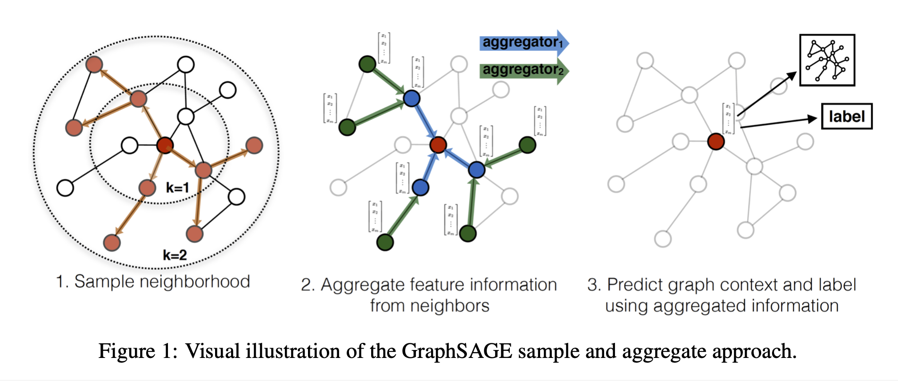
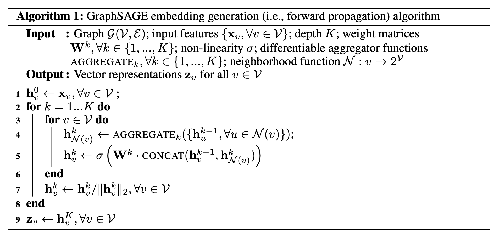
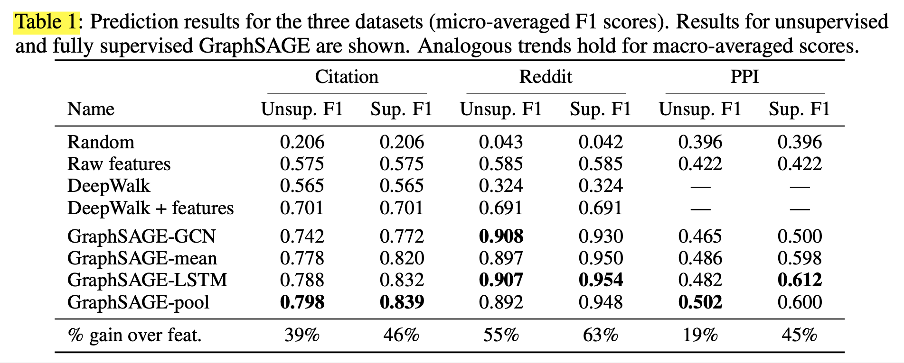

# Inductive Representation Learning on Large Graphs (2018), William L. Hamilton et al.

###### contributors: [@GitYCC](https://github.com/GitYCC)

\[[paper](https://arxiv.org/abs/1706.02216)\] \[[pytorch](https://pytorch-geometric.readthedocs.io/en/latest/modules/nn.html#torch_geometric.nn.conv.SAGEConv)\]

---

### Introduction

- Transductive v.s. Inductive
  - Most existing approaches require that all nodes in the graph are present during training of the embeddings; these previous approaches are inherently transductive and do not naturally generalize to unseen nodes.
  - Here we present GraphSAGE, a general inductive framework that leverages node feature information (e.g., text attributes) to efficiently generate node embeddings for previously unseen data.
  - Instead of training individual embeddings for each node, we learn a function that generates embeddings by sampling and aggregating features from a node’s local neighborhood.
    - 
  - many real-world applications require embeddings to be quickly generated for unseen nodes, or entirely new (sub)graphs
- In this work we both extend GCNs to the task of inductive unsupervised learning and propose a framework that generalizes the GCN approach to use trainable aggregation functions (beyond simple convolutions).
- SAGE: SAmple and aggreGatE
- OK on both with and without node features
  - While we focus on feature-rich graphs (e.g., citation data with text attributes, biological data with functional/molecular markers), our approach can also make use of structural features that are present in all graphs (e.g., node degrees). Thus, our algorithm can also be applied to graphs without node features.
- OK on both supervised and unsupervised learning

### Related work

- Factorization-based embedding approaches
- Supervised learning over graphs
- Graph convolutional networks

### Proposed method: GraphSAGE

- Unsupervised Loss

  - The graph-based loss function encourages nearby nodes to have similar representations, while enforcing that the representations of disparate nodes are highly distinct:
    $$
    J_G(z_u) = −log􏰊\ σ(z^⊤_u z_v)􏰋−Q·E_{v_n∼P_n(v)} log􏰊σ(−z^⊤_u z_{v_n})􏰋
    $$
    where $v$ is a node that co-occurs near $u$ on fixed-length random walk, $σ$ is the sigmoid function, $P_n$ is a negative sampling distribution, and $Q$ defines the number of negative samples. 

  - Importantly, unlike previous embedding approaches, the representations $z_u$ that we feed into this loss function are generated from the features contained within a node’s local neighborhood, rather than training a unique embedding for each node (via an embedding look-up).

- Aggregator Architectures

  - Mean aggregator
    - The mean aggregator is nearly equivalent to the convolutional propagation rule used in the transductive GCN framework.
    - It's symmetric:  Ideally, an aggregator function would be symmetric (i.e., invariant to permutations of its inputs) while still being trainable and maintaining high representational capacity.
    - $h_v^k ← σ(W · MEAN(\{h_v^{k−1}\} ∪ \{h_u^{k−1}, ∀u ∈ \mathcal{N} (v)\})$
  - LSTM aggregator
    - not inherently symmetric
  - Pooling aggregator
    - $AGGREGATE_k^{pool} = max(\{σ(􏰊W_{pool}h^k_{u_i} + b􏰋) , ∀u_i ∈ \mathcal{N} (v)\})$

### Experiments

- compare against four baselines:
  - a random classifer
  - a logistic regression feature-based classifier (that ignores graph structure)
  - the DeepWalk algorithm as a representative factorization-based approach
  - a concatenation of the raw features and DeepWalk embeddings
- four variants of GraphSAGE
  - Since, the “convolutional” variant of GraphSAGE is an extended, inductive version of Kipf et al’s semi-supervised GCN, we term this variant GraphSAGE-GCN.
  - GraphSAGE-mean
  - GraphSAGE-LSTM
  - GraphSAGE-pool

- benchmark tasks
  - classifying academic papers into different subjects using the Web of Science citation dataset
    - For features, we used node degrees and processed the paper abstracts according Arora et al.’s sentence embedding approach, with 300-dimensional word vectors trained using the GenSim word2vec implementation.
  - classifying Reddit posts as belonging to different communities
    - we use off-the-shelf 300-dimensional GloVe CommonCrawl word vectors
    - for each post, we concatenated (i) the average embedding of the post title, (ii) the average embedding of all the post’s comments (iii) the post’s score, and (iv) the number of comments made on the post.
  - classifying protein functions across various biological protein-protein interaction (PPI) graphs

