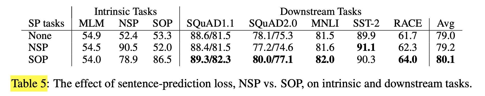
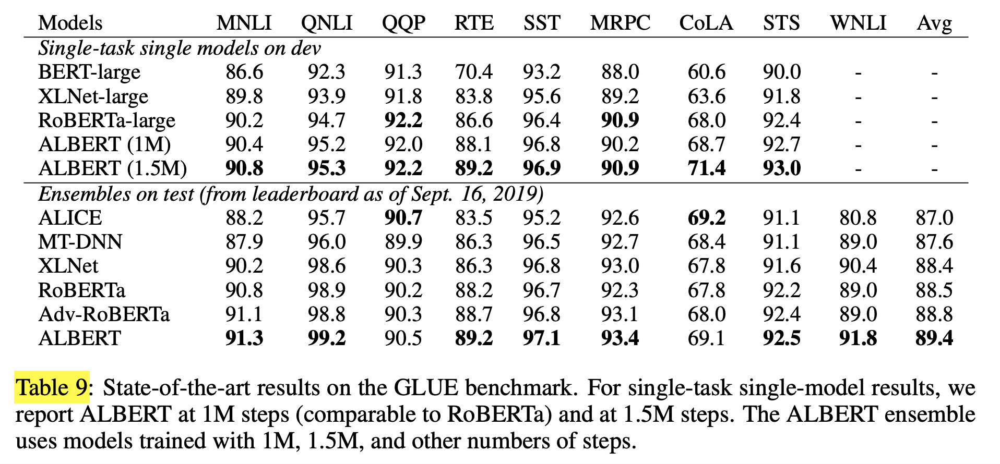

# ALBERT: A Lite BERT for Self-Supervised Learning of Language Representations (2020), Zhenzhong Lan et al.

###### contributors: [@GitYCC](https://github.com/GitYCC)

\[[paper](https://arxiv.org/pdf/1909.11942.pdf)\] \[[pytorch](https://github.com/huggingface/transformers/blob/master/src/transformers/models/albert/modeling_albert.py)\]

---

### Prerequisite

**BERT: Pre-training of Deep Bidirectional Transformers for Language Understanding** (2019), Jacob Devlin et al. \[➤ [summary](nlp/bert.md)\]

### Introduction

- ALBERT incorporates two parameter reduction techniques that lift the major obstacles in scaling pre-trained models.
  - The first one is a factorized embedding parameterization. By decomposing the large vocabulary embedding matrix into two small matrices, we separate the size of the hidden layers from the size of vocabulary embedding. This separation makes it easier to grow the hidden size without significantly increasing the parameter size of the vocabulary embeddings.
  - The second technique is cross-layer parameter sharing. This technique prevents the parameter from growing with the depth of the network.
- To further improve the performance of ALBERT, we also introduce a self-supervised loss for sentence-order prediction (SOP). SOP primary focuses on inter-sentence coherence and is designed to address the ineffectiveness (Yang et al., 2019; Liu et al., 2019) of the next sentence prediction (NSP) loss proposed in the original BERT.
- As a result of these design decisions, we are able to scale up to much larger ALBERT configurations that still have fewer parameters than BERT-large but achieve significantly better performance. We establish new state-of-the-art results on the well-known GLUE, SQuAD, and RACE benchmarks for natural language understanding.

### The Elements of ALBERT

- Notation: the vocabulary embedding size as $E$, the number of encoder layers as $L$, and the hidden size as $H$

**Factorized embedding parameterization**

- From a modeling perspective, WordPiece embeddings are meant to learn context-independent representations, whereas hidden-layer embeddings are meant to learn context-dependent representations. As experiments with context length indicate (Liu et al., 2019), the power of BERT-like representations comes from the use of context to provide the signal for learning such context-dependent representations. As such, untying the WordPiece embedding size $E$ from the hidden layer size $H$ allows us to make a more efficient usage of the total model parameters as informed by modeling needs, which dictate that $H ≫ E$.
- If $E ≡ H$, then increasing $H$ increases the size of the embedding matrix, which has size $V ×E$. This can easily result in a model with billions of parameters, most of which are only updated sparsely during training.
- Instead of projecting the one-hot vectors directly into the hidden space of size $H$, we first project them into a lower dimensional embedding space of size $E$, and then project it to the hidden space. By using this decomposition, we reduce the embedding parameters from $O(V × H)$ to $O(V × E + E × H)$. This parameter reduction is significant when $H ≫ E$.

**Cross-layer parameter sharing**

- For ALBERT, we propose cross-layer parameter sharing. 
- There are multiple ways to share parameters, e.g., only sharing feed-forward network (FFN) parameters across layers, or only sharing attention parameters. The default decision for ALBERT is to share all parameters across layers.

**Inter-sentence coherence loss**

- Subsequent studies (Yang et al., 2019; Liu et al., 2019) found NSP’s impact unreliable and decided to eliminate it, a decision supported by an improvement in downstream task performance across several tasks.
- We conjecture that the main reason behind NSP’s ineffectiveness is its lack of difficulty as a task, as compared to MLM. As formulated, NSP conflates topic prediction and coherence prediction in a single task. However, topic prediction is easier to learn compared to coherence prediction, and also overlaps more with what is learned using the MLM loss.
- Sentence-order Prediction (SOP)
  - The SOP loss uses as positive examples the same technique as BERT (two consecutive segments from the same document), and as negative examples the same two consecutive segments but with their order swapped.

**n-gram masking**

- We generate masked inputs for the MLM targets using n-gram masking (Joshi et al., 2019), with the length of each n-gram mask selected randomly. The probability for the length $n$ is given by
  $$
  p(n)=\frac{1/n}{\sum_{k=1}^{N}1/k}
  $$
  We set the maximum length of n-gram (i.e., $n$) to be 3.

### Experiments

- We compare head-to-head three experimental conditions for the additional inter-sentence loss: none (XLNet- and RoBERTa-style), NSP (BERT-style), and SOP (ALBERT-style)

- There is empirical (Szegedy et al., 2017) and theoretical (Li et al., 2019) evidence showing that a combination of batch normalization and dropout in Convolutional Neural Networks may have harmful results. To the best of our knowledge, we are the first to show that dropout can hurt performance in large Transformer-based models.

