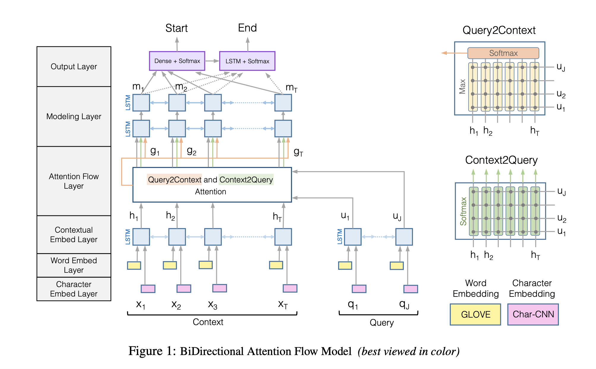

# Bi-Directional Attention Flow for Machine Comprehension (2017), Minjoon Seo et al.

###### contributors: [@GitYCC](https://github.com/GitYCC)

\[[paper](https://arxiv.org/abs/1611.01603)\] \[[tensorflow](https://github.com/allenai/bi-att-flow)\] 

---

### Introduction

- Our attention mechanism offers following improvements to the previously popular attention paradigms
  - First, our attention layer is not used to summarize the context paragraph into a fixed-size vector. Instead, the attention is computed for every time step, and the attended vector at each time step, along with the representations from previous layers, is allowed to flow through to the subsequent modeling layer. This reduces the information loss caused by early summarization.
  - Second, we use a memory-less attention mechanism.
  - Third, we use attention mechanisms in both directions, query-to-context and context-to-query, which provide complimentary information to each other.

### Model

- (applied to both the query and context) Character Embedding Layer
  - maps each word to a vector space using character-level CNNs
- (applied to both the query and context) Word Embedding Layer
  - maps each word to a vector space using a pre-trained word embedding model (GloVe)
  - The concatenation of the character and word embedding vectors is passed to a two-layer Highway Network
- (applied to both the query and context) Contextual Embedding Layer
  - utilizes contextual cues from surrounding words to refine the embedding of the words
  - We place an LSTM in both directions, and concatenate the outputs of the two LSTMs.
- Attention Flow Layer
  - couples the query and context vectors and produces a set of query-aware feature vectors for each word in the context
  - Similarity Matrix $S_{tj}=\alpha(H_{:t},U_{:j})\in \real$
    - context part: $H_{:t}$ is t-th column vector of $H$
    - query part: $U_{:j}$ is j-th column vector of $U$
    - $\alpha$ is a trainable scalar function that encodes the similarity between its two input vectors, we choose: $\alpha(h,u)=w_{(S)}^T[h;u;h\circ u]$  
      -  $w_{(S)}\in \real^{6d}$ is a trainable weight vector
      - $\circ$ is elementwise multiplication
      - $[;]$ is vector concatenation across row
  - Context-to-query (C2Q) Attention
    - signifies which query words are most relevant to each context word
    - $\tilde{U}_{:t}=\sum_j a_{tj}U_{:j}\in \real^{2d}$  where: $\tilde{U}\in \real^{2d\times T}$
      - $a_{t}=softmax(S_{t:})\in \real^J$
  - Query-to-context (Q2C) Attention
    - signifies which context words have the closest similarity to one of the query words and are hence critical for answering the query
    - $\tilde{H}=\begin{bmatrix} \tilde{h}, \tilde{h}, \cdots,\tilde{h} \end{bmatrix}\in \real^{2d\times T}$
      - $\tilde{h}=\sum_t b_{t}H_{:t}\in \real^{2d}$ 
      - $b=softmax(max_{col}(S))\in \real^{T}$
      - $\tilde{h}$ indicates the weighted sum of the most important words in the context with respect to the query.
  - Combined together to yield $G$
    - $G_{:t}=\beta(H_{:t},\tilde{U}_{:t},\tilde{H}_{:t})\in \real^{d_{G}}$
    - $\beta$ function can be an arbitrary trainable neural network, but simple concatenation as following still shows good performance in our experiments: $\beta(h,\tilde{u},\tilde{h})=[h;\tilde{u};h\circ \tilde{u};h\circ \tilde{h}]\in \real^{8d\times T}$
- Modeling Layer $M\in \real^{2d\times T}$
  - employs a Recurrent Neural Network to scan the context
- Output Layer
  - provides an answer to the query
  - $p^{start}=softmax(w^T_{(p^{start})}[G;M^{start}])$ and $p^{end}=softmax(w^T_{(p^{end})}[G;M^{end}])$
  - training: $L(\theta)=-\frac{1}{N}\sum_i log(p^{start}_{y_i^{start}})+log(p^{end}_{y_i^{end}})$
  - testing: The answer span $(k,l)$ where $k≤l$ with the maximum value of $p^{start}_kp^{end}_l$ is chosen, which can be computed in linear time with dynamic programming.

