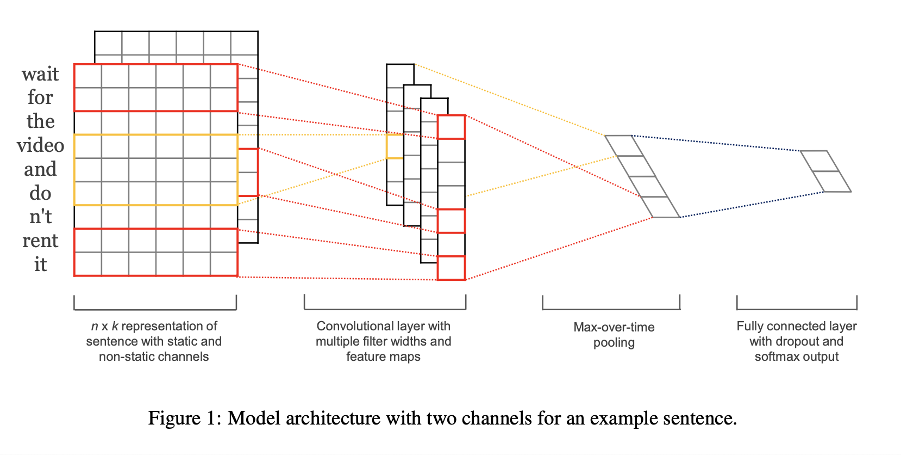
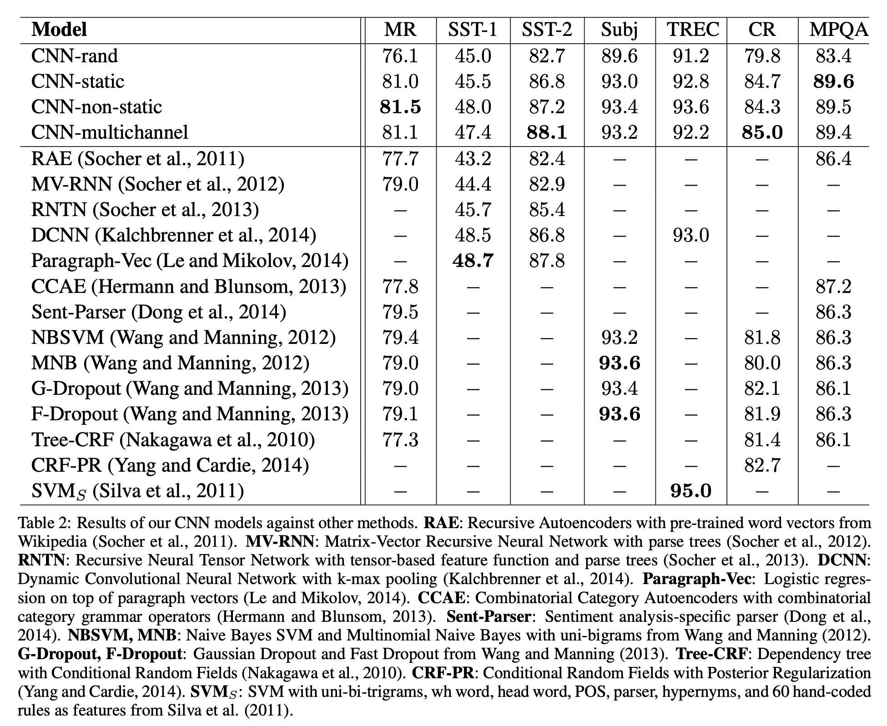
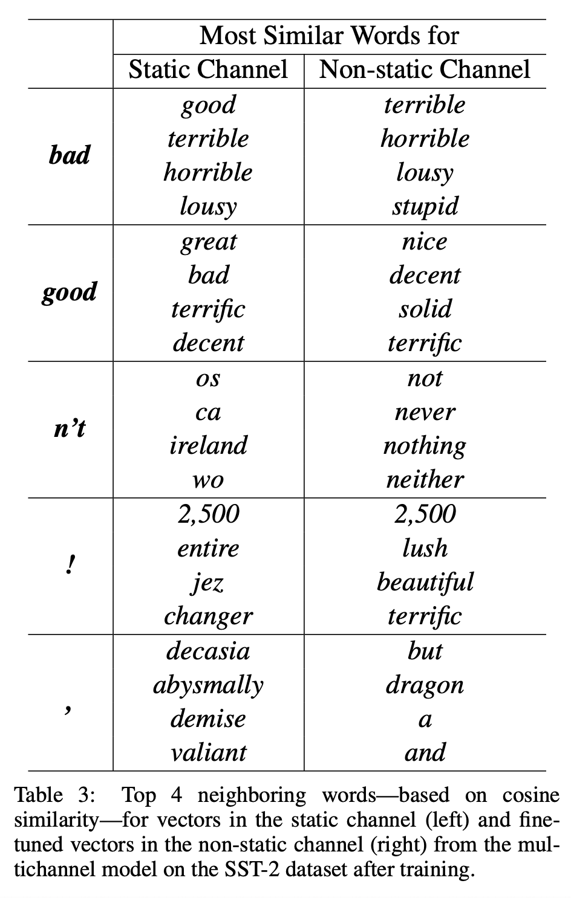

# Convolutional Neural Networks for Sentence Classification (2014), Yoon Kim.

###### contributors: [@GitYCC](https://github.com/GitYCC)

\[[paper](https://arxiv.org/abs/1408.5882)\]

---

### Model

- step by step
  - word vectors: use `word2vec` 
  - we train a simple CNN with one layer of convolution on top of word vectors
  - apply a max-over-time pooling operation over the feature map and take the maximum value
  - fully connected layer with dropout and softmax output
- constraint on l2-norms of the weight vectors: escaling w to have $||w||_2 = s$ whenever $||w||_2 > s$ after a gradient descent step
- Model Variations
  - CNN-rand: Our baseline model where all words are randomly initialized and then modified during training.
  - CNN-static: pre-trained vectors from `word2vec` and fixed the word vectors
  - CNN-non-static: Same as above but the pre- trained vectors are fine-tuned for each task.
  - CNN-multichannel: A model with two sets of word vectors. One channel is for static word vectors, another channel is for non-static word vectors. Hence the model is able to fine-tune one set of vectors while keeping the other static. Both channels are initialized with `word2vec`.

### Result

- These results suggest that the pre-trained vectors are good, ‘universal’ feature extractors and can be utilized across datasets. Fine-tuning the pre-trained vectors for each task gives still further improvements (CNN-non-static).
- Multichannel vs. Single Channel Models:
  - The multichannel model work better than the single channel model
  - prevent overfitting:  by ensuring that the learned vectors do not deviate too far from the original values 

- problem: `word2vec` is presented for (almost) syntactically equivalent, but not expressing sentiment
- vectors in the non-static channel can solve this problem shown as above picture