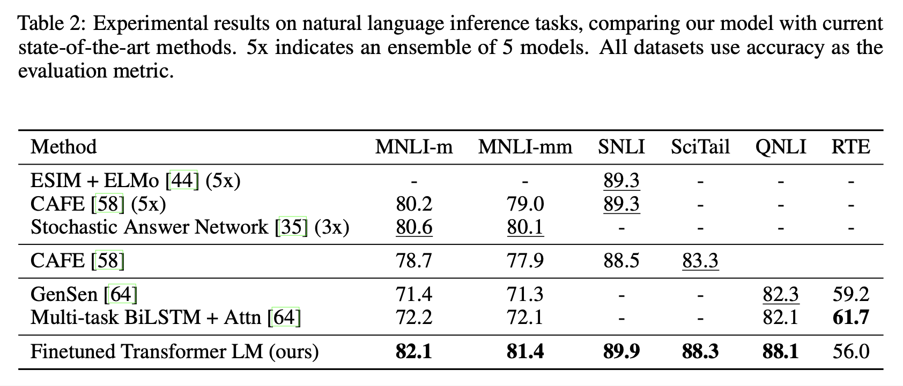

# Improving Language Understanding by Generative Pre-Training (2018), Alec Radford et al.

###### contributors: [@GitYCC](https://github.com/GitYCC)

\[[paper](https://s3-us-west-2.amazonaws.com/openai-assets/research-covers/language-unsupervised/language_understanding_paper.pdf)\] \[[pytorch](https://github.com/huggingface/transformers/blob/master/src/transformers/models/openai/modeling_openai.py)\]

---

(from: **BERT: Pre-training of Deep Bidirectional Transformers for Language Understanding** (2019), Jacob Devlin et al. \[➤ [summary](nlp/bert.md)\])

- Architecture: Language Model + Transformer Layer

- Two Stage:

  - Unsupervised pre-training

    - Given an unsupervised corpus of tokens $\mathcal{U} = {u_1, . . . , u_n}$, we use a standard language modeling objective to maximize the following likelihood:
      $$
      L_1(\mathcal{U})=\sum_i logP(u_i|u_{i-k},...,u_{i-1};Θ)
      $$
      where $k$ is the size of the context window, and the conditional probability $P$ is modeled using a neural network with parameters $Θ$. These parameters are trained using stochastic gradient descent.

    - We use a multi-layer Transformer. This model applies a multi-headed self-attention operation over the input context tokens followed by position-wise feedforward layers to produce an output distribution over target tokens:
      $$
      h_0=UW_e+W_p \\
      h_l=\text{transformer-block}(h_{l-1}) \\
      P(u)=\text{softmax}(h_nW_e^T)
      $$
      where $U = (u_{−k},..., u_{−1})$ is the context vector of tokens, $n$ is the number of layers, $W_e$ is the token embedding matrix, and $W_p$ is the position embedding matrix.

  - Supervised fine-tuning

    - The inputs are passed through our pre-trained model to obtain the final transformer block’s activation $h^m_l$ , which is then fed into an added linear output layer with parameters $W_y$ to predict $y$:
      $$
      P(y|x^1,...,x^m)=\text{softmax}(h_l^mW_y)
      $$
      This gives us the following objective to maximize:
      $$
      L_2(\mathcal{C})=\sum_{(x,y)}logP(y|x^1,...,x^m)
      $$

    - We additionally found that including language modeling as an auxiliary objective to the fine-tuning helped learning by (a) improving generalization of the supervised model, and (b) accelerating convergence.
      $$
      L_3(\mathcal{C})=L_2(\mathcal{C})+\lambda L_1(\mathcal{C})
      $$

- Task-specific input transformations:

  - 
  - special tokens: a start token `<s>`, an end token `<e>` and a delimiter token `<$>`
  - (note): For similarity tasks, there is no inherent ordering of the two sentences being compared. To reflect this, we modify the input sequence to contain both possible sentence orderings.

- Experiments

  - 
  - 
  - 

