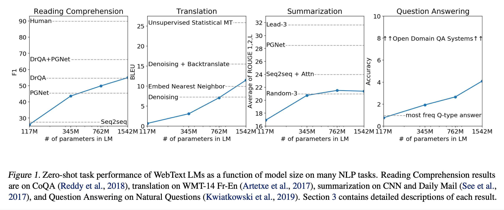
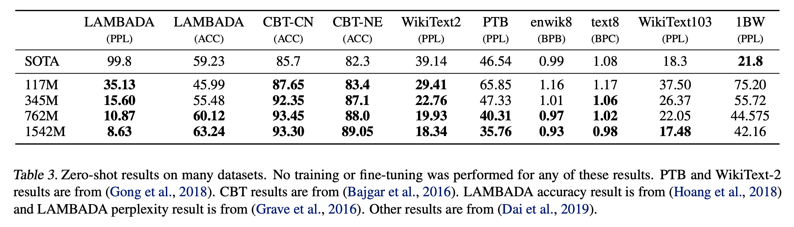
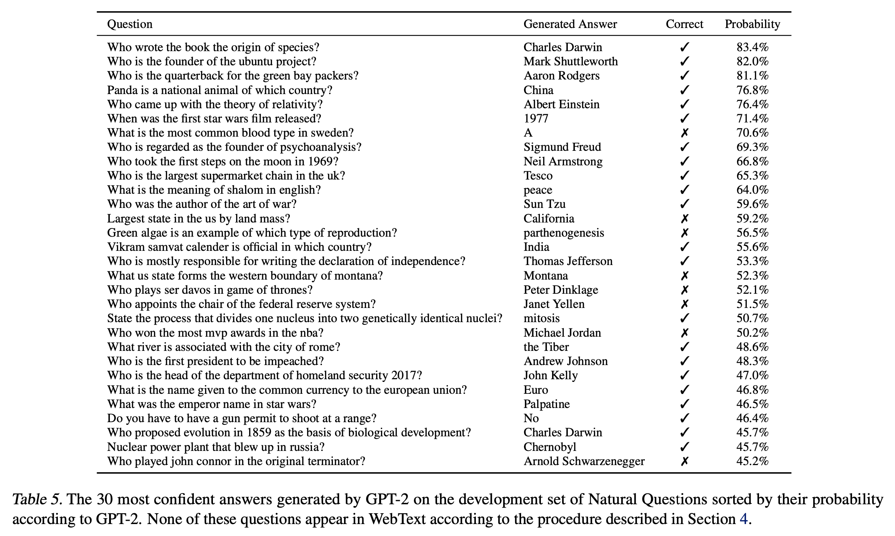

# Language Models are Unsupervised Multitask Learners (2019), Alec Radford et al.

###### contributors: [@GitYCC](https://github.com/GitYCC)

\[[paper](https://cdn.openai.com/better-language-models/language_models_are_unsupervised_multitask_learners.pdf)\] \[[pytorch](https://github.com/huggingface/transformers/blob/master/src/transformers/models/gpt2/modeling_gpt2.py)\]

---

- Prerequisite: **Improving Language Understanding by Generative Pre-Training** (2018), Alec Radford et al. \[➤ [summary](nlp/GPT.md)\]

- TL;DR: We demonstrate that language models begin to learn down-stream tasks without any explicit supervision (zero-shot) when trained on a new dataset of millions of webpages called WebText. 
- Key Concept: Language Models are Unsupervised Multitask Learners
  - unsupervised language models: $p(s_{n−k}, ..., s_n|s_1, ..., s_{n−k−1})$
  - supervised down-stream tasks: $p(\text{output}|\text{input}, \text{task})$
  - Since the supervised objective is the the same as the unsupervised objective but only evaluated on a subset of the sequence, the global minimum of the unsupervised objective is also the global minimum of the supervised objective.
- Training Dataset: WebText
  - Our approach motivates building as large and diverse a dataset as possible in order to collect natural language demonstrations of tasks in as varied of domains and contexts as possible.
  - We removed all Wikipedia documents from WebText since it is a common data source for other datasets and could complicate analysis due to overlapping training data with test evaluation tasks.
- Input Representation: Byte Pair Encoding (BPE)
  - BPE is a practical middle ground between character and word level language modeling which effectively interpolates between word level inputs for frequent symbol sequences and character level inputs for infrequent symbol sequences.

**Experiments:**





- Children’s Book Test (CBT)

  - to examine the performance of LMs on different cat- egories of words: named entities, nouns, verbs, and prepositions
  - Rather than reporting perplexity as an evaluation metric, CBT reports accuracy on an automatically constructed cloze test where the task is to predict which of 10 possible choices for an omitted word is correct.

- LAMBADA

  - tests the ability of systems to model long-range dependencies in text
  - The task is to predict the final word of sentences which require at least 50 tokens of context for a human to successfully predict.

- Winograd Schema Challenge

  - to measure the capability of a system to perform commonsense reasoning by measuring its ability to resolve ambiguities in text

- Reading Comprehension

  - example:

    ```
    The 2008 Summer Olympics torch relay was run from March 24 until August 8, 2008, prior to the 2008 Summer Olympics, with the theme of “one world, one dream”. Plans for the relay were announced on April 26, 2007, in Beijing, China. The relay, also called by the organizers as the “Journey of Harmony”, lasted 129 days and carried the torch 137,000 km (85,000 mi) – the longest distance of any Olympic torch relay since the tradition was started ahead of the 1936 Summer Olympics. After being lit at the birthplace of the Olympic Games in Olympia, Greece on March 24, the torch traveled to the Panathinaiko Stadium in Athens, and then to Beijing, arriving on March 31. From Beijing, the torch was following a route passing through six continents. The torch has visited cities along the Silk Road, symbolizing ancient links between China and the rest of the world. The relay also included an ascent with the flame to the top of Mount Everest on the border of Nepal and Tibet, China from the Chinese side, which was closed specially for the event.
    Q: What was the length of the race?
    A: 137,000 km
    Q: Was it larger than previous ones?
    A: No
    Q: Where did the race begin?
    A: Olympia, Greece
    Q: Where did they go after?
    A: Athens
    Q: How many days was the race?
    A: seven
    Q: Did they visit any notable landmarks?
    A: Panathinaiko Stadium
    Q: And did they climb any mountains?
    A:
    ```

- Summarization

  - example:

    ```
    Theodore McCarrick is the most senior Catholic figure to be dismissed from the priesthood in modern times. US Church officials said allegations he had sexually assaulted a teenager five decades ago were credible. Mr McCarrick, 88, had previously resigned but said he had "no recollection" of the alleged abuse. "No bishop, no matter how influential, is above the law of the Church," Cardinal Daniel DiNardo, president of the United States Conference of Catholic Bishops said in a statement. "For all those McCarrick abused, I pray this judgment will be one small step, among many, toward healing." The alleged abuses may have taken place too long ago for criminal charges to be filed because of the statute of limitations. Mr McCarrick was the archbishop of Washington DC from 2001 to 2006. Since his resignation last year from the College of Cardinals, he has been living in seclusion in a monastery in Kansas. He was the first person to resign as a cardinal since 1927. He is among hundreds of members of the clergy accused of sexually abusing children over several decades and his dismissal comes days before the Vatican hosts a summit on preventing child abuse. The Vatican said Pope Francis had ruled Mr McCarrick\'s expulsion from the clergy as definitive, and would not allow any further appeals against the decision.  
    TL;DR:
    ```

- Translation

  - example:

    ```
    Good morning. = Buenos días.
    I am lost. Where is the restroom? = Estoy perdido. ¿Dónde está el baño?
    How much does it cost? = ¿Cuánto cuesta?
    How do you say maybe in Spanish? = ¿Cómo se dice maybe en Español?
    Would you speak slower, please. = Por favor, habla mas despacio.
    Where is the book store? = ¿Dónde está la librería?
    At last a feminist comedian who makes jokes about men. = Por fin un cómico feminista que hace chistes sobre hombres.
     
    How old are you? = 
    ```

- Question Answering

  - example:

    ```
    Q: What's it like to hold the hand of someone you love? 
    A: Interlinked. 
    Q: Do they teach you how to feel finger to finger? 
    A: Interlinked. 
    Q: Do you long for having your heart interlinked? 
    A: 
    ```

  - 

