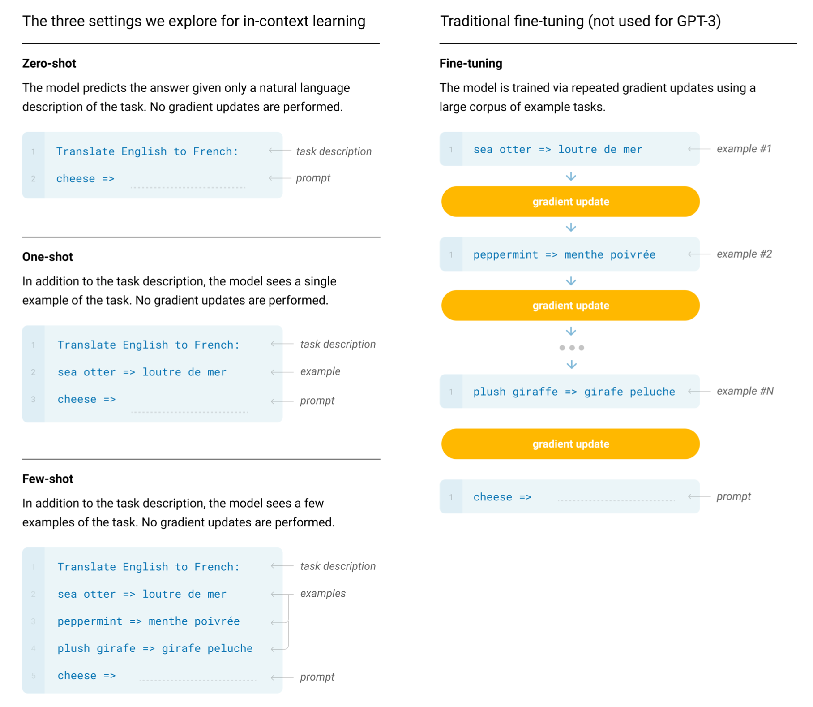
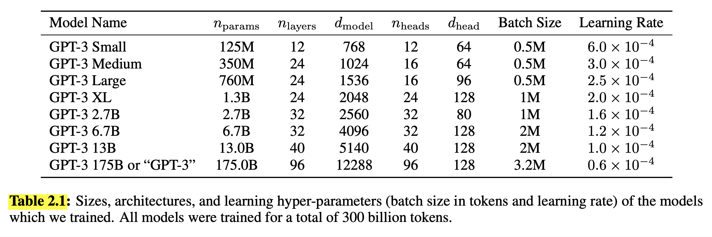
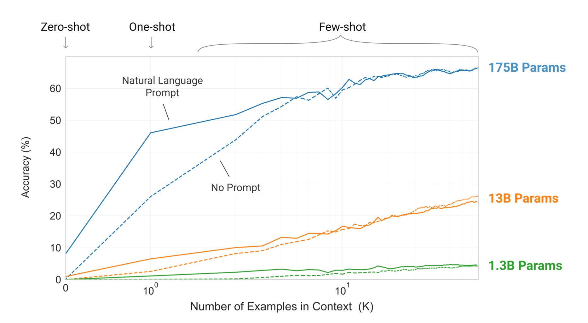
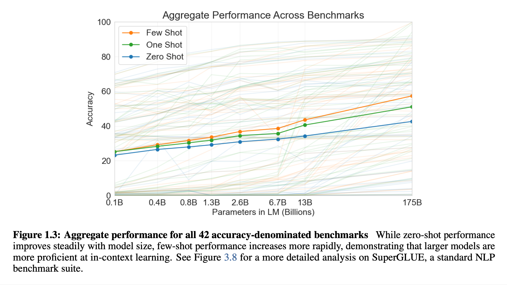

# Language Models are Few-Shot Learners (2020), Tom B. Brown et al.

###### contributors: [@GitYCC](https://github.com/GitYCC)

\[[paper](https://arxiv.org/pdf/2005.14165.pdf)\] 

---

- Prerequisite: **Language Models are Unsupervised Multitask Learners** (2019), Alec Radford et al. \[➤ [summary](nlp/GPT2.md)\]
- TL;DR: We train GPT-3, an autoregressive language model with 175 billion parameters, 10x more than any previous non-sparse language model, and test its performance in the few-shot setting. For all tasks, GPT-3 is applied without any gradient updates or fine-tuning, with tasks and few-shot demonstrations specified purely via text interaction with the model. GPT-3 achieves strong performance on many NLP datasets, including translation, question-answering, and cloze tasks, as well as several tasks that require on-the-fly reasoning or domain adaptation, such as unscrambling words, using a novel word in a sentence, or performing 3-digit arithmetic.
- We evaluate GPT-3 under 3 conditions: 
  - (a) “few-shot learning”, or in-context learning where we allow as many demonstrations as will fit into the model’s context window (typically 10 to 100)
  - (b) “one-shot learning”, where we allow only one demonstration
  - (c) “zero-shot” learning, where no demonstrations are allowed and only an instruction in natural language is given to the model. GPT-3 could also in principle be evaluated in the traditional fine-tuning setting, but we leave this to future work.
  - In this work we do not fine-tune GPT-3 because our focus is on task-agnostic performance, but GPT-3 can be fine-tuned in principle and this is a promising direction for future work.
  - 
- The large data from internet is potential contamination of downstream tasks by having their test or development sets inadvertently seen during pre-training. To reduce such contamination, we searched for and attempted to remove any overlaps with the development and test sets of all benchmarks studied in this paper.

---

Comparison:

|      | Data Size | Layers | Parameters |
| ---- | --------- | ------ | ---------- |
| GPT  | 5GB       | 12     | 0.117B     |
| GPT2 | 40GB      | 48     | 1.542B     |
| GPT3 | 540GB     | 96     | 175B       |

- Prompt: with a natural language task description

---

**Limitations of GPT3**

- GPT-3 samples still sometimes repeat themselves semantically at the document level, start to lose coherence over sufficiently long passages, contradict themselves, and occasionally contain non-sequitur sentences or paragraphs.
- We have noticed informally that GPT-3 seems to have special difficulty with “common sense physics”. Specifically GPT-3 has difficulty with questions of the type “If I put cheese into the fridge, will it melt?”. 
- Making a bidirectional model at the scale of GPT-3, and/or trying to make bidirectional models work with few- or zero-shot learning, is a promising direction for future research, and could help achieve the “best of both worlds”.
- GPT3 still sees much more text during pre-training than a human sees in the their lifetime. Improving pre-training sample efficiency is an important direction for future work, and might come from grounding in the physical world to provide additional information, or from algorithmic improvements.

