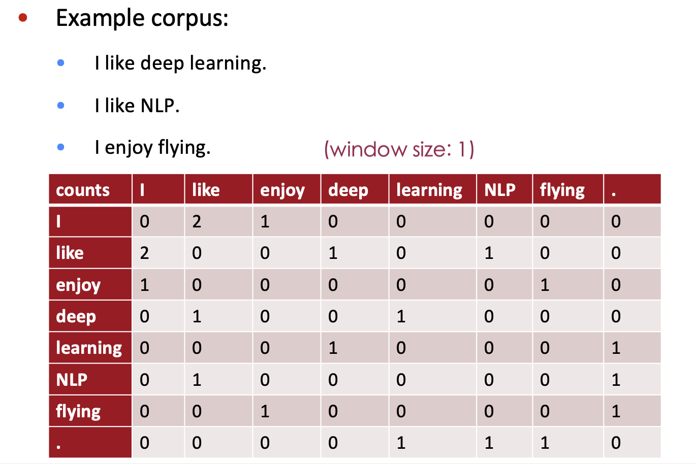
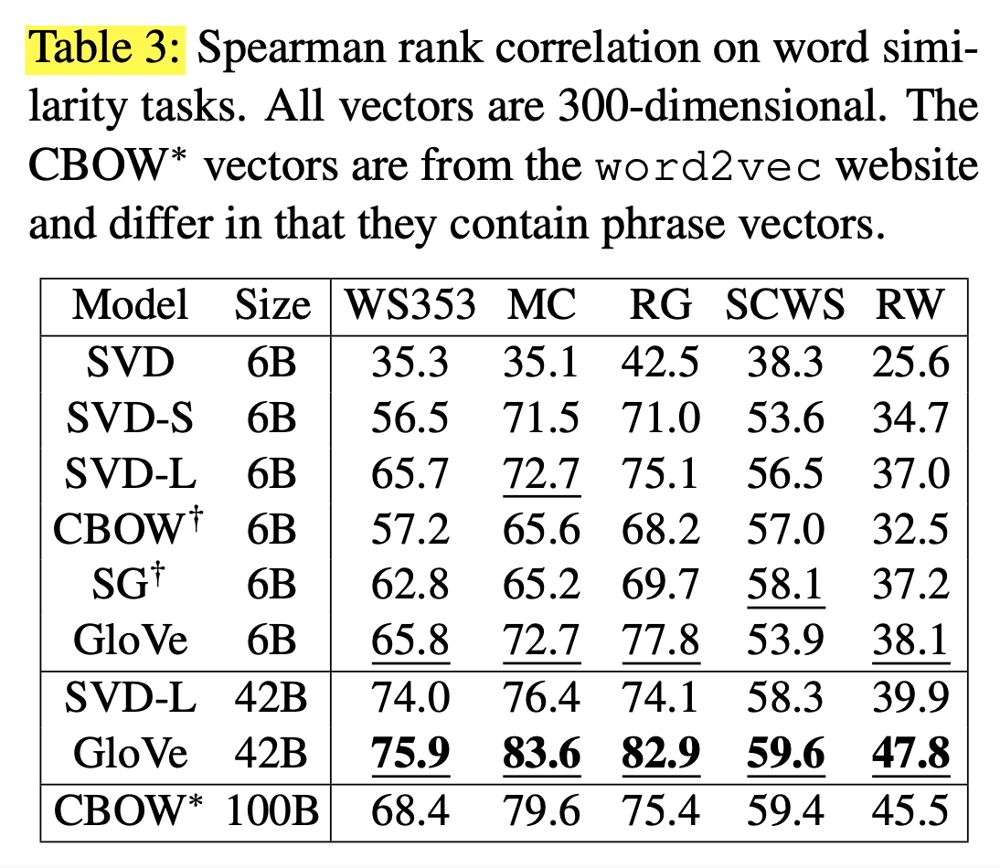
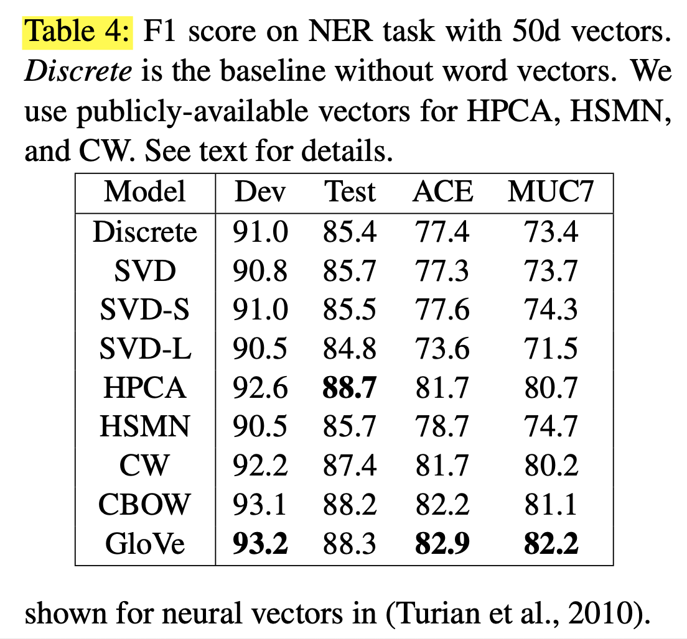
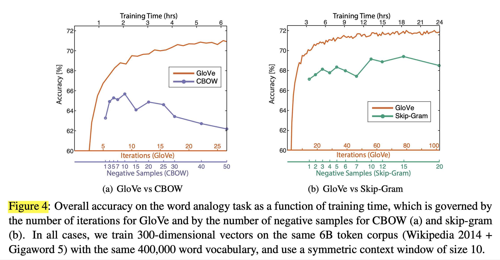

# Glove: Global vectors for word representation (2014), J. Pennington et al.

###### contributors: [@GitYCC](https://github.com/GitYCC)

\[[paper](http://anthology.aclweb.org/D/D14/D14-1162.pdf)\] \[[code](https://github.com/stanfordnlp/GloVe)\]

---

**Prerequisite**

- [Efficient estimation of word representations in vector space (2013), T. Mikolov et al.](efficient-estimation-of-word-representations-in-vector-space.md)
- [Distributed representations of words and phrases and their compositionality (2013), T. Mikolov et al.](distributed-representations-of-words-and-phrases-and-their-compositionality.md)

 **Introduction**

- The two main model families for learning word vectors are: 1) global matrix factorization methods, such as latent semantic analysis (LSA) (Deer- wester et al., 1990) and 2) local context window methods, such as the skip-gram model of Mikolov et al. (2013c). Currently, both families suffer significant drawbacks. While methods like LSA ef- ficiently leverage statistical information, they do relatively poorly on the word analogy task, indicating a sub-optimal vector space structure. Methods like skip-gram may do better on the analogy task, but they poorly utilize the statistics of the corpus since they train on separate local context windows instead of on global co-occurrence counts.

**The GloVe Model**

- Although many such methods now exist, the question still remains as to how meaning is generated from these statistics, and how the resulting word vectors might represent that meaning.

- entries $X_{ij}$ tabulate the number of times word $j$ occurs in the context of word $i$

  - 
  - $X_{like,deep}=1$

- $P(j|i)=X_{ij}/X_{i}$

- "Learning ratios of co-occurrence probabilities" is better than "the probabilities themselves", the most general model takes the form:
  $$
  F(w_i,w_j,\tilde{w}_k)=\frac{P(k|i)}{P(k|j)}
  $$

- Since vector spaces are inherently linear structures, the most natural way to do this is with vector differences. With this aim, we can restrict our consideration to those functions $F$ that depend only on the difference of the two target words,
  $$
  F(w_i-w_j,\tilde{w}_k)=\frac{P(k|i)}{P(k|j)}
  $$

- While $F$ could be taken to be a complicated function parameterized by, e.g., a neural network, doing so would obfuscate the linear structure we are trying to capture. To avoid this issue, we can first take the dot product of the arguments,
  $$
  F((w_i-w_j)^T\tilde{w}_k)=\frac{P(k|i)}{P(k|j)}
  $$
  
- In addition, the relation between $w_i$/$w_j$ and $\tilde{w}_k$ is symmetrical because co-occurrence matrix is symmetrical. 
  $$
  F((w_i-w_j)^T\tilde{w}_k)=\frac{P(k|i)}{P(k|j)}=\frac{P(i|k)}{P(k|j)}=\frac{P(k|i)}{P(j|k)}=\frac{P(i|k)}{P(j|k)}  \ \ ↪︎【1】
  $$
And because $F(.)$ shows the ratio of co-occurrence probabilities, this relation should be satisfied:
  $$
  F((w_i-w_j)^T\tilde{w}_k)=\frac{1}{F((w_j-w_i)^T\tilde{w}_k)}
  $$
  To enforce such symmetry, we can have:
  $$
  F((w_i-w_j)^T\tilde{w}_k)=\frac{F(w_i^T\tilde{w}_k)}{F(w_j^T\tilde{w}_k)}
  $$
  
- to fullfill above equation, $F(x)=e^x$
  $$
  P(k\mid i)=\frac{X_{ik}}{X_i}=F(w_i^T\tilde{w}_k)=e^{w_i^T\tilde{w}_k}
  $$

  $$
  w_i^T\tilde{w}_k=logX_{ik}-logX_{i}
  $$

- We can absorb $log(X_i)$ as a constant bias term since it is invariant of $k$. But to maintain the symmetrical requirement between $i$ and $k$ (according to 【1】), we will split it into two bias terms:
  $$
  w_i^T\tilde{w}_k+b_i+\tilde{b}_k=logX_{ik}
  $$

- We propose a new weighted least squares regression model:
  $$
  J=\sum_{i,j=1}^{V}f(X_{ij})(w_i^T\tilde{w}_k+b_i+\tilde{b}_k-logX_{ik})^2
  $$
  The weighted function should obey: (1) $f(x=0)=0$, (2) should be non-decreasing, (3) should be relatively small for large values of x, so that frequent co-occurrences are not overweighted.

- we define $f(x)$ in this paper:
  $$
  f(x)=WHEN\{x<x_{max},\ (x/x_{max})^\alpha,\ 1\}
  $$

**Relationship to Other Models**

- LSA (Latent Semanic Analysis) is a count-based representation. It use SVD to solve which has high complexity.
- Word2vec is a prediction-based method which can not efficiently leverage statistical information.
- GloVe is also a count-based representation but its complexity is lower. And GloVe can efficiently leverage statistical information.

**Result**

**Conclusion**

- We construct a model that utilizes this main benefit of count data while simultaneously capturing the meaningful linear substructures prevalent in recent log-bilinear prediction-based methods like word2vec. 
- The result, GloVe, is a new global log-bilinear regression model for the unsupervised learning of word representations that outperforms other models on word analogy, word similarity, and named entity recognition tasks.

