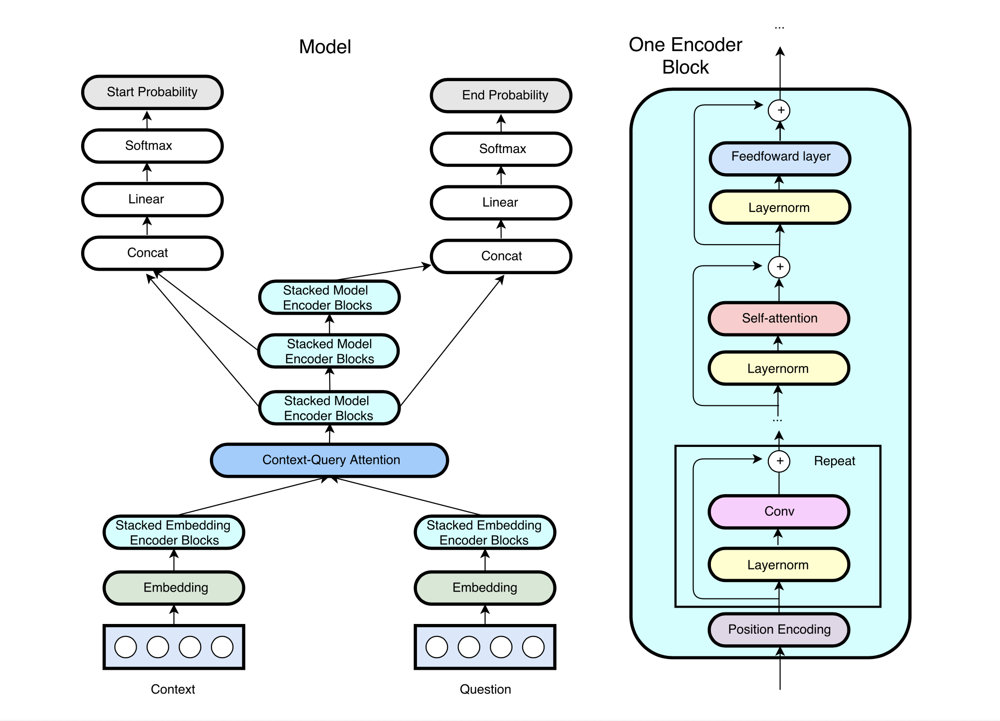
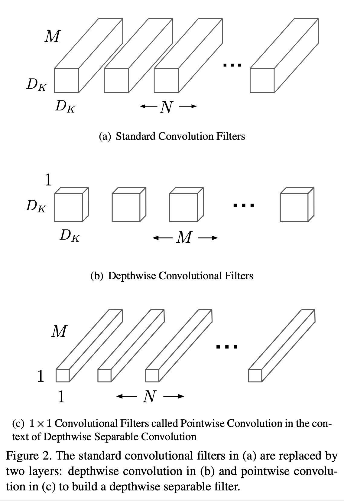
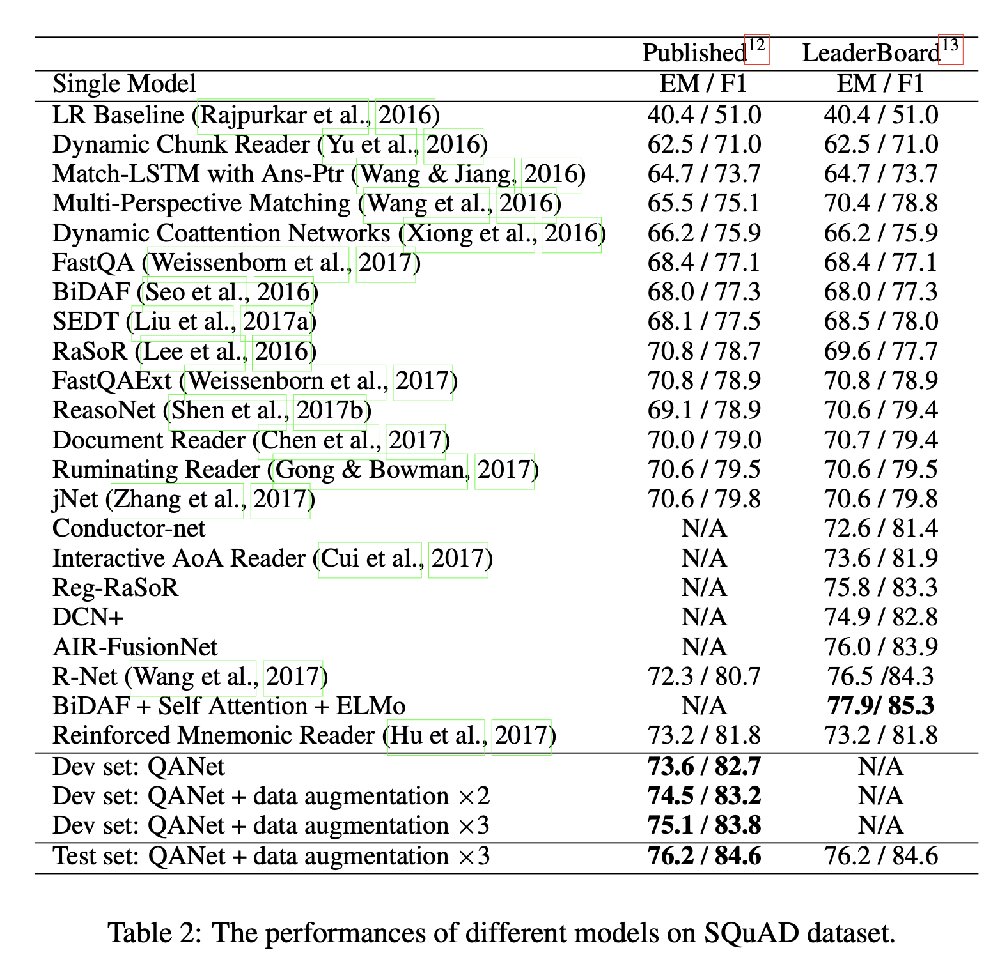
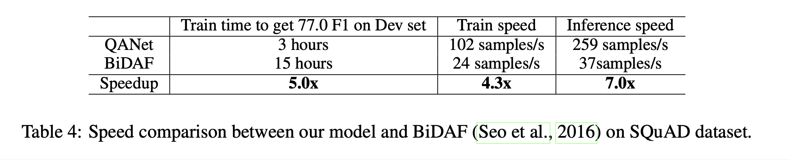

# QANet: Combining Local Convolution with Global Self-Attention for Reading Comprehension (2018), Adams Wei Yu et al.

###### contributors: [@GitYCC](https://github.com/GitYCC)

\[[paper](https://arxiv.org/abs/1804.09541)\] \[[tensorflow](https://github.com/NLPLearn/QANet)\] 

---

### Introduction

The contribution of this paper are as follows:

- We propose an efficient reading comprehension model that exclusively built upon convolutions and self-attentions. To the best of our knowledge, we are the first to do so. This combination maintains good accuracy, while achieving up to 13x speedup in training and 9x per training iteration, compared to the RNN counterparts. The speedup gain makes our model the most promising candidate for scaling up to larger datasets.
  - convolution captures the local structure of the text, while the self-attention learns the global interaction between each pair of words
- To improve our result on SQuAD, we propose a novel data augmentation technique to enrich the training data by paraphrasing. It allows the model to achieve higher accuracy that is better than the state-of-the-art.
  - This technique paraphrases the examples by translating the original sentences from English to another language and then back to English, which not only enhances the number of training instances but also diversifies the phrasing.

### QANet

- **`Embedding`** Input Embedding Layer 

  - Word Embedding: fixed during training and initialized from the $p_1$ = 300 dimensional pre-trained GloVe
    - All the out-of-vocabulary words are mapped to an `<UNK>` token, whose embedding is trainable with random initialization.
  - Character Embedding: maps each word to a vector space using character-level CNNs
    - Each character is represented as a trainable vector of dimension $p_2$ = 200, meaning each word can be viewed as the concatenation of the embedding vectors for each of its characters.
    - The length of each word is either truncated or padded to 16. We take maximum value of each row of this matrix to get a fixed-size vector representation of each word.
    - finally take the convolution on character embedding
  - Concatenation( Word Embedding, Character Embedding ) + two-layer highway network

- **`One Encoder Block`** 

  - A positional encoding is added to the input at the beginning of each encoder layer consisting of $sin$ and $cos$ functions at varying wavelengths, as defined in (Vaswani et al., 2017a).

  - We use depthwise separable convolutions rather than traditional ones, as we observe that it is memory efficient and has better generalization.

    - (from [MobileNets: Efficient Convolutional Neural Networks for Mobile Vision Applications](https://arxiv.org/pdf/1704.04861.pdf))

      

    - each conv layer: kernel size is $D_k=7$; the number of filters is $d=128$

  - self-attention-layer with 8 multi-head

- **`Stacked Embedding Encoder Blocks`**

  - use `One Encoder Block`
    - The number of conv layers within a block is 4.
    - The total number of encoder blocks is 1.

- **`Context-Query Attention`**

  - Similarity Matrix $S_{nm}=\alpha(C_{:n},Q_{:m})\in \real$
    - context part: $C_{:n}$ is n-th column vector of $C$
    - query part: $Q_{:m}$ is m-th column vector of $Q$
    - $\alpha$ is a trainable scalar function that encodes the similarity between its two input vectors, we choose: $\alpha(c,q)=w_{(S)}^T[c;q;c\circ q]$  
      -  $w_{(S)}$ is a trainable weight vector
      -  $\circ$ is elementwise multiplication
      -  $[;]$ is vector concatenation across row
  - Context-to-query (C2Q) Attention
    - $A=\bar{S}\cdot Q^T \in \real^{n\times d}$  
      - $\bar{S} \in \real^{n\times m}$  : normalize each row of $S$ by applying the softmax function
      - $Q\in \real^{d\times m}$
    - signifies which query words are most relevant to each context word
  - Query-to-context (Q2C) Attention
    - $B=\bar{S}\cdot \bar{\bar{S}}^T\cdot C^T\in \real^{n\times d}$
      - $\bar{S} \in \real^{n\times m}$  : normalize each row of $S$ by applying the softmax 
      - $\bar{\bar{S}} \in \real^{n\times m}$  : normalize each column of $S$ by applying the softmax
      - $C\in \real^{d\times n}$
    - signifies which (query words which is represented by weighted context word) are most relevant to each context word

- **`Stacked Model Encoder Blocks`**

  - use `One Encoder Block`
    - The number of conv layers within a block is 2.
    - The total number of encoder blocks is 7.

- Output layer
  - $p^{start}=softmax(w^T_1[M_0;M_1])$ and $p^{end}=softmax(w^T_2[M_0;M_2])$
    - $M_0$ , $M_1$ , $M_2$ are respectively the outputs of the three model encoders, from bottom to top
  - training: $L(\theta)=-\frac{1}{N}\sum_i log(p^{start}_{y_i^{start}})+log(p^{end}_{y_i^{end}})$
  - inference: The answer span $(k,l)$ where $k≤l$ with the maximum value of $p^{start}_kp^{end}_l$ is chosen, which can be computed in linear time with dynamic programming.

### Results

