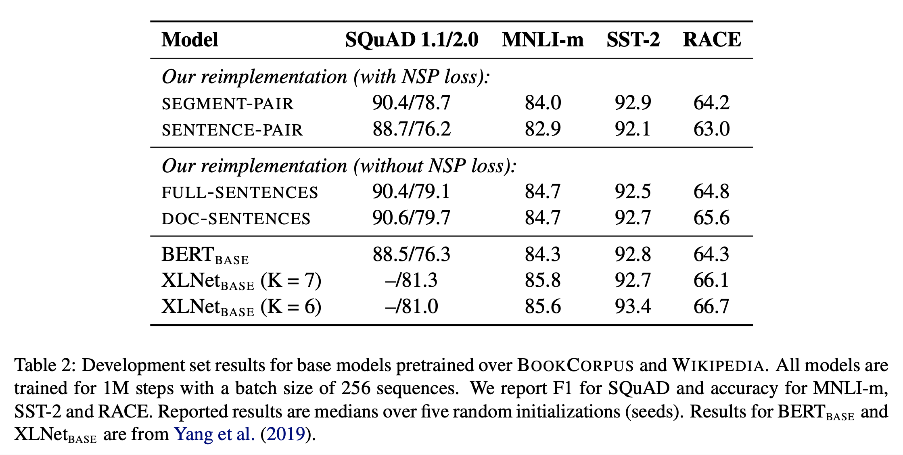
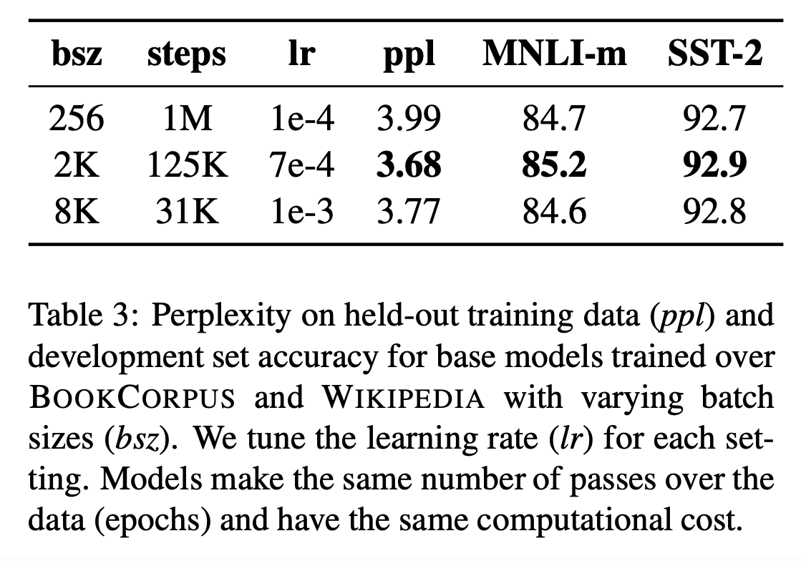

# RoBERTa: A Robustly Optimized BERT Pretraining Approach (2019), Yinhan Liu et al.

###### contributors: [@GitYCC](https://github.com/GitYCC)

\[[paper](https://arxiv.org/pdf/1907.11692.pdf)\] \[[pytorch](https://github.com/huggingface/transformers/blob/master/src/transformers/models/roberta/modeling_roberta.py)\]

---

- Our modifications are simple, they include: (1) training the model longer, with bigger batches, over more data; (2) removing the next sentence prediction objective; (3) training on longer sequences; and (4) dynamically changing the masking pattern applied to the training data.
- Analysis: Model Input Format and Next Sentence Prediction
  - SEGMENT-PAIR + NSP: This follows the original input format used in BERT (Devlin et al., 2019), with the NSP loss. Each input has a pair of segments, which can each contain multiple natural sentences.
  - SENTENCE-PAIR + NSP: 
    - Each input contains a pair of natural sentences.
    - Since these inputs are significantly shorter than 512 tokens, we increase the batch size so that the total number of tokens remains similar to SEGMENT-PAIR+NSP.
  - FULL-SENTENCES: 
    - NO NSP
    - Inputs may cross document boundaries. When we reach the end of one document, we begin sampling sentences from the next document and add an extra separator token `[SEP]` between documents.
  - DOC-SENTENCES:
    - NO NSP
    - not cross document boundaries
    - dynamically increase the batch size in these cases to achieve a similar number of total tokens as FULL- SENTENCES
  - 
    - Comparing between SEGMENT-PAIR + NSP and SENTENCE-PAIR + NSP, We find that using individual sentences hurts performance on downstream tasks.
    - Removing the NSP loss matches or slightly improves downstream task performance
- Analysis: Training with large batches
  - Past work in Neural Machine Translation has shown that training with very large mini-batches can both improve optimization speed and end-task performance when the learning rate is increased appropriately (Ott et al., 2018). Recent work has shown that BERT is also amenable to large batch training (You et al., 2019).
  - 
- Text Encoding: Byte-Pair Encoding (BPE) (Sennrich et al., 2016) is a hybrid between character- and word-level representations that allows handling the large vocab- ularies common in natural language corpora.
- We now aggregate these improvements and evaluate their combined impact. We call this configuration RoBERTa for **R**obustly **o**ptimized **BERT** **a**pproach. Specifically, RoBERTa is trained with 
  - dynamic masking
  - FULL-SENTENCES without NSP loss
  - large mini-batches
  - a larger byte-level BPE

