# Exploring the Limits of Transfer Learning with a Unified Text-to-Text Transformer (2020), Colin Raffel et al.

###### contributors: [@GitYCC](https://github.com/GitYCC)

\[[paper](https://arxiv.org/pdf/1910.10683.pdf)\] \[[code](https://github.com/google-research/text-to-text-transfer-transformer)\]

---

### Introduction

- In this paper, we explore the landscape of transfer learning techniques for NLP by introducing a unified framework that converts all text-based language problems into a text-to-text format.
- Motivated by a need for more rigorous understanding, we leverage a unified approach to transfer learning that allows us to systematically study different approaches and push the current limits of the field.
- “Colossal Clean Crawled Corpus” (C4), a data set consisting of hundreds of gigabytes of clean English text scraped from the web.
  - about 750 GB
- “Text-to-Text Transfer Transformer” (T5).
- The basic idea underlying our work is to treat every text processing problem as a “text-to-text” problem, i.e. taking text as input and producing new text as output.
  - 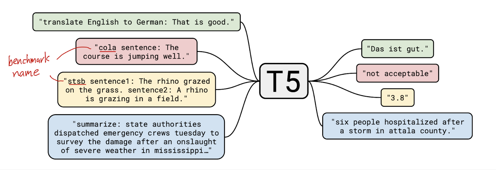

### Setup

- Model
  - To summarize, our model is roughly equivalent to the original Transformer proposed by Vaswani et al. (2017) with the exception of removing the Layer Norm bias, placing the layer normalization outside the residual path, and using a different position embedding scheme.
  - Instead of using a sinusoidal position signal or learned position embeddings, relative position embeddings is used here
    - We use a simplified form of position embeddings where each “embedding” is simply a scalar that is added to the corresponding logit used for computing the attention weights. For efficiency, we also share the position embedding parameters across all layers in our model, though within a given layer each attention head uses a different learned position embedding.
    - Typically, a fixed number of embeddings are learned, each corresponding to a range of possible key-query offsets. In this work, we use 32 embeddings for all of our models with ranges that increase in size logarithmically up to an offset of 128 beyond which we assign all relative positions to the same embedding. Note that a given layer is insensitive to relative position beyond 128 tokens, but subsequent layers can build a sensitivity to larger offsets by combining local information from previous layers.
- Downstream Tasks
  - Sentence acceptability judgment (CoLA (Warstadt et al., 2018))
  - Sentiment analysis (SST-2 (Socher et al., 2013))
  - Paraphrasing/sentence similarity (MRPC (Dolan and Brockett, 2005), STS-B (Cer et al., 2017), QQP (Iyer et al., 2017))
  - Natural language inference (MNLI (Williams et al., 2017), QNLI (Rajpurkar et al., 2016), RTE (Dagan et al., 2005), CB (De Marneff et al., 2019))
  - Coreference resolution (WNLI and WSC (Levesque et al., 2012))
  - Sentence completion (COPA (Roemmele et al., 2011))
  - Word sense disambiguation (WIC (Pilehvar and Camacho-Collados, 2018))
  - Question answering (MultiRC (Khashabi et al., 2018), ReCoRD (Zhang et al., 2018), BoolQ (Clark et al., 2019))
- Input and Output Format
  - In order to train a single model on the diverse set of tasks described above, we cast all of the tasks we consider into a “text-to-text” format—that is, a task where the model is fed some text for context or conditioning and is then asked to produce some output text. This framework provides a consistent training objective both for pre-training and fine-tuning.

### Experiments

- Baseline

  - Model: described above. A standard encoder-decoder structure
  - Training
    - standard maximum likelihood (teacher forcing)
    - optimization: AdaFactor
    - greedy decoding
    - pre-training on C4 and fine-tuning on downstream tasks
    - learning rate schedule: $1/\sqrt{max(n, k)}$ (inverse square root), where $n$ is the current training iteration and $k$ is the number of warm-up steps (set to $10^4$ in all of our experiments). This sets a constant learning rate of $0.01$ for the first $10^4$ steps
  - Vocabulary: SentencePiece
  - Unsupervised Objective
    - 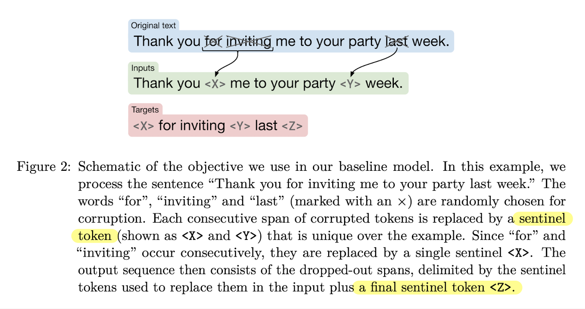
  - Baseline Performance
    - 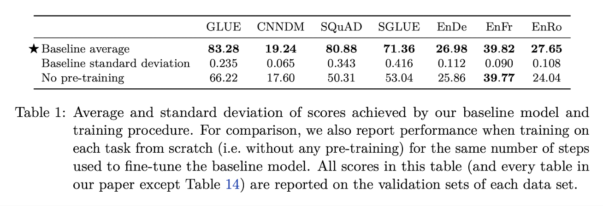

- Architectures

  - Model Structures
    - 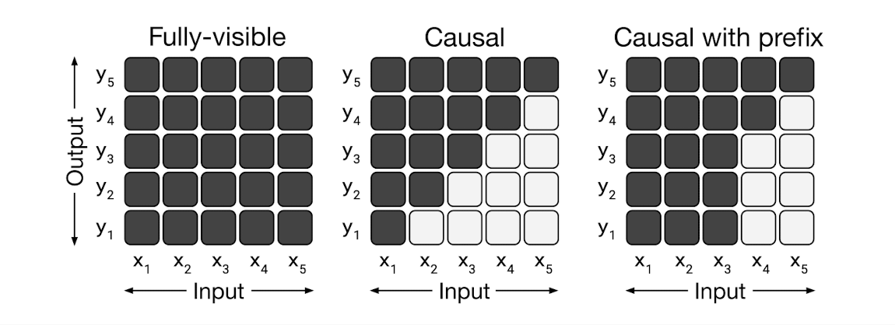
    - 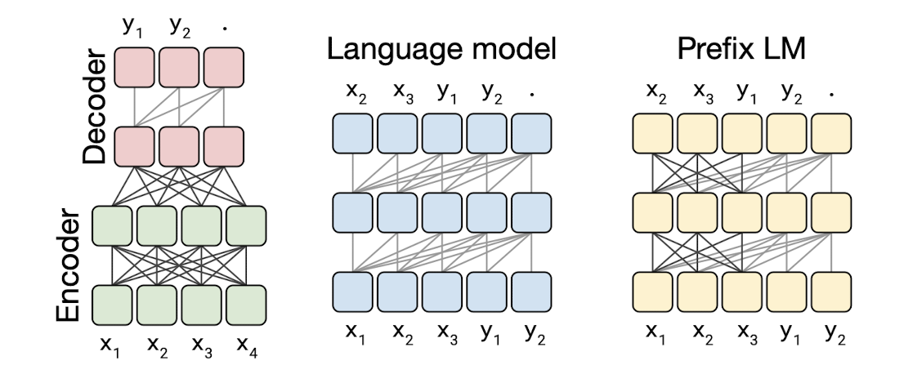
    - Prefix LM: A fundamental and frequently cited drawback of using a *language model* in the text-to-text setting is that causal masking forces the model’s representation of the $i$-th entry of the input sequence to only depend on the entries up until $i$. This issue can be avoided simply by changing the masking pattern. Instead of using a causal mask, we use fully-visible masking during the prefix portion of the sequence. This masking pattern and a schematic of the resulting “prefix LM”.
      - The prefix LM architecture closely resembles BERT for classification tasks. The main difference between a prefix LM and the BERT architecture is that the classifier is simply integrated into the output layer of the Transformer decoder in the prefix LM.
  - Objectives: Denoising or LM
  - Results:
    - Surprisingly, we found that sharing parameters across the encoder and decoder performed nearly as well. In contrast, halving the number of layers in the encoder and decoder stacks significantly hurt performance.
    - We also note that the shared parameter encoder-decoder outperforms the decoder-only prefix LM, suggesting that the addition of an explicit encoder-decoder attention is beneficial.
    - 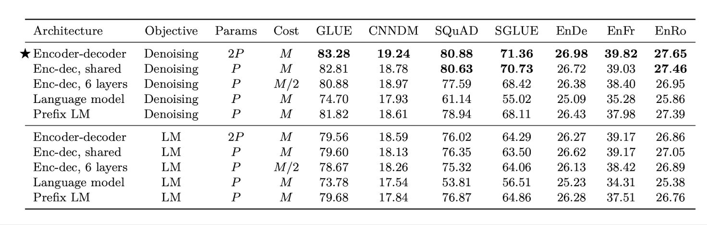

- Unsupervised Objectives

  - Disparate High-Level Approaches on Encoder-decoder Model
    - 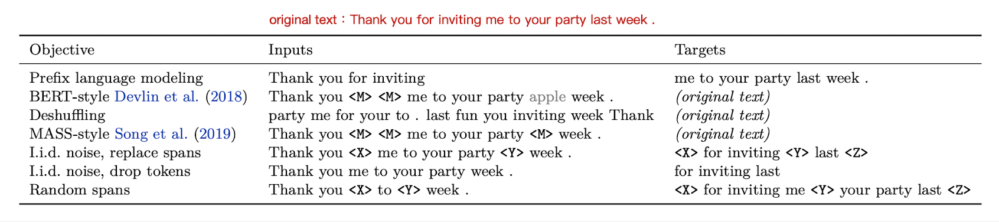
    - 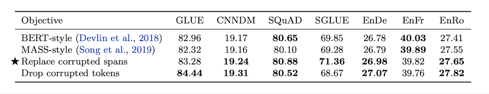
  - A flow chart of our exploration of unsupervised objectives.
    - 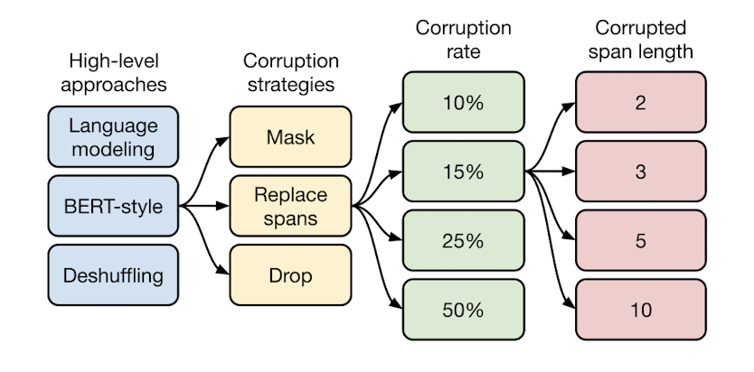

- Training Strategy

  - Fine-tuning Methods

    - Adapter Layers: When fine- tuning, only the adapter layer and layer normalization parameters are updated. The main hyperparameter of this approach is the inner dimensionality $d$ of the feed-forward network, which changes the number of new parameters added to the model.
    - Gradual Unfreezing: To adapt this approach to our encoder-decoder model, we gradually unfreeze layers in the encoder and decoder in parallel, starting from the top in both cases.
    - 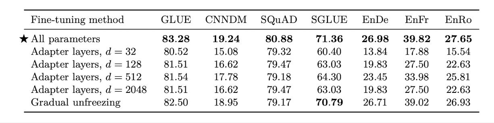

  - Multi-task Learning

    - Examples-proportional mixing: A natural way to set the mixing proportions is to sample in proportion to the size of each task’s data set.

      - problem of examples-proportional mixing: not sufficiently trained on low-resource languages

    - Equal mixing: In this case, we sample examples from each task with equal probability.

      - problem of equal mixing: the low-resource tasks have overfit, the high-resource tasks have not seen enough data, or the model has not seen enough unlabeled data to learn general-purpose language capabilities

    - Temperature-scaled mixing: we raise each task’s mixing rate $r_m$ to the power of $1/T$ and renormalize the rates so that they sum to $1$. 
      $$
      renormalize(r_1^{1/T}, r_2^{1/T}, ...)
      $$

      - When $T = 1$, this approach is equivalent to examples-proportional mixing and as $T$ increases the proportions become closer to equal mixing.

    - 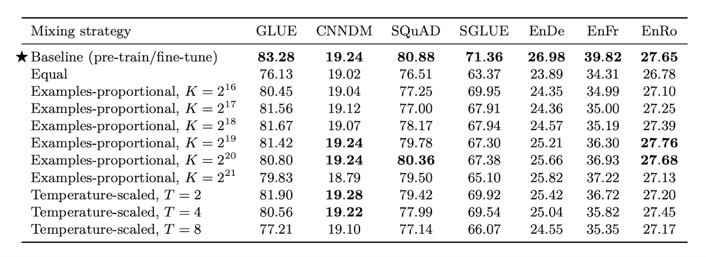

  - Combining Multi-Task Learning with Fine-Tuning

    - 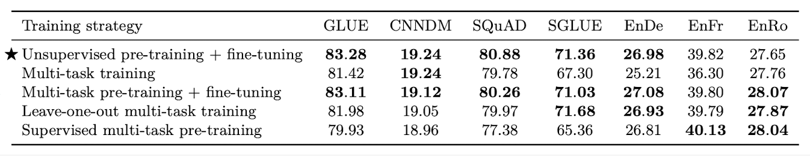

- Putting It All Together

  - We start with our baseline training approach and make the following changes:
    - Objective: Instead of the i.i.d. denoising objective in our baseline, use the span-corruption objective (mean span length of 3 and corrupt 15% of the original sequence)
    - Longer training
    - Model sizes: Base, Small, Large, 3B and 11B
    - Multi-task pre-training: We showed that pre-training on a multi-task mixture of unsupervised and supervised tasks before fine-tuning worked as well as pre-training on the unsupervised task alone. It also has the practical benefit of being able to monitor “downstream” performance for the entire duration of training, rather than just during fine-tuning. We therefore used multi-task pre-training in our final set of experiments.
    - Fine-tuning on individual GLUE and SuperGLUE tasks
    - Beam search
    - Test set
  - Results
    - 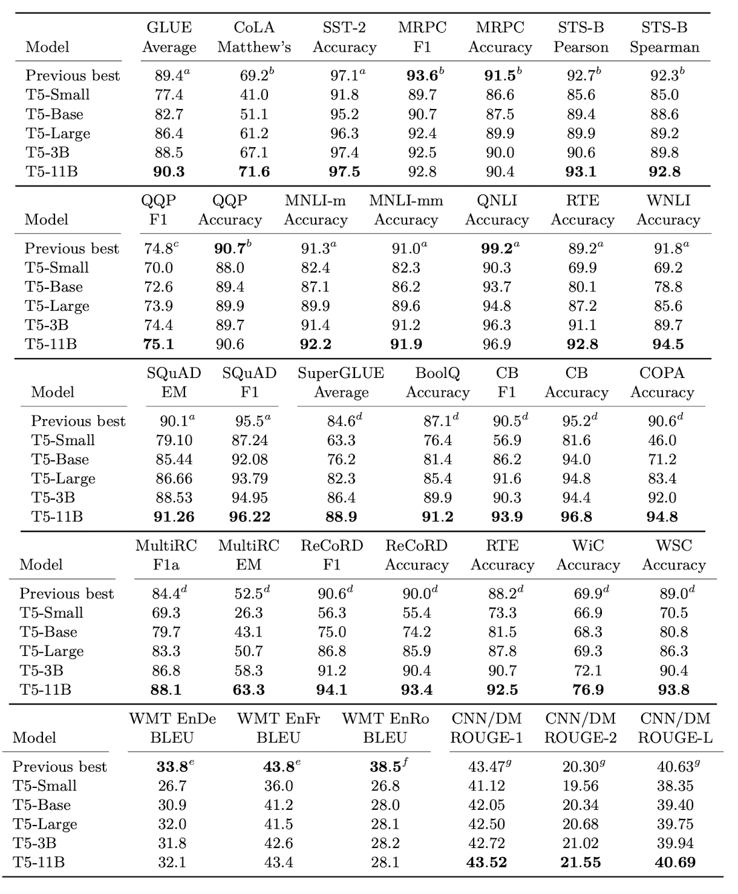
    - 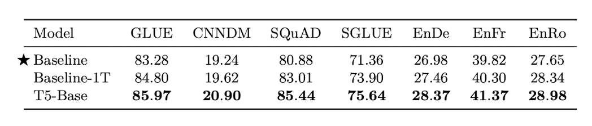

