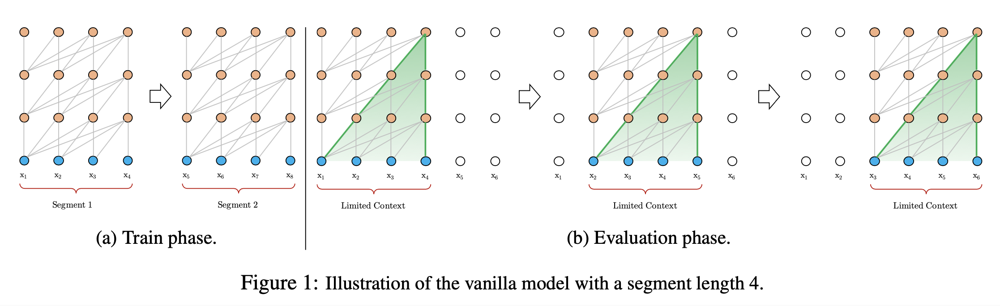
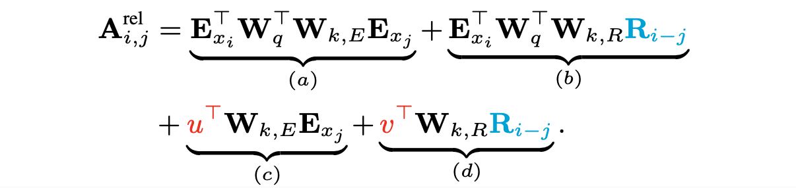

# Transformer-XL: Attentive Language Models Beyond a Fixed-Length Context (2019), Zihang Dai et al.

###### contributors: [@GitYCC](https://github.com/GitYCC)

\[[paper](https://arxiv.org/pdf/1901.02860.pdf)\] \[[pytorch](https://github.com/huggingface/transformers/blob/master/src/transformers/models/transfo_xl/modeling_transfo_xl.py#L734)\]

---

### Prerequisite

**Attention Is All You Need** (2017), A. Vaswani et al. \[➤ [summary](nlp/attention-is-all-you-need.md)\]

### Abstract / Introduction

- Transformer-XL (meaning extra long)
- We propose a novel neural architecture Transformer-XL that enables learning dependency beyond a fixed length without disrupting temporal coherence.
- The fixed-length segments in Vanilla Transformer are created by selecting a consecutive chunk of symbols without respecting the sentence or any other semantic boundary. Hence, the model lacks necessary contextual information needed to well predict the first few symbols, leading to inefficient optimization and inferior performance. We refer to this problem as "context fragmentation".
- Our main technical contributions include introducing the notion of recurrence in a purely self-attentive model and deriving a novel positional encoding scheme (relative positional encoding formulation).

### Models

**Vanilla Transformer Language Models**

- In order to apply Transformer or self-attention to language modeling, the central problem is how to train a Transformer to effectively encode an arbitrarily long context into a fixed size representation.
- One feasible but crude approximation is to split the entire corpus into shorter segments of manageable sizes, and only train the model within each segment, ignoring all contextual information from previous segments. This is the idea adopted by Al-Rfou et al. (2018). We call it the vanilla model and visualize it in Fig. 1a.

**Segment-Level Recurrence with State Reuse**

- To address the limitations of using a fixed-length context, we propose to introduce a recurrence mechanism to the Transformer architecture. During training, the hidden state sequence computed for the previous segment is fixed and cached to be reused as an extended context when the model processes the next new segment, as shown in Fig. 2a.

- Formally, let the two consecutive segments of length $L$ be $s_τ = [x_{τ,1},··· ,x_{τ,L}]$ and $s_{τ+1} = [x_{τ+1,1},··· ,x_{τ+1,L}]$ respectively. Denoting the $n$-th layer hidden state sequence produced for the $τ$-th segment $s_τ$ by $h^n_τ ∈ R^{L×d}$, where $d$ is the hidden dimension. Then, the $n$-th layer hidden state for segment $s_{τ +1}$ is produced (schematically) as follows,
  $$
  \tilde{h}^{n-1}_{τ+1}=\text{concat}\{\text{StopGradient}(h^{n-1}_{τ}), h^{n-1}_{τ+1}\} \\
  q^{n}_{τ+1}=h^{n-1}_{τ+1}W^T_q \\
  k^{n}_{τ+1}=\tilde{h}^{n-1}_{τ+1}W^T_k \\
  v^{n}_{τ+1}=\tilde{h}^{n-1}_{τ+1}W^T_v \\
  h^{n}_{τ+1}=\text{Transformer-Layer}(q^{n}_{τ+1},k^{n}_{τ+1},v^{n}_{τ+1})
  $$

- Consequently, the largest possible dependency length grows linearly w.r.t. the number of layers as well as the segment length, i.e., $O(N × L)$, as visualized by the shaded area in Fig. 2b.

**Relative Positional Encodings**

- We show the necessity of using relative positional encodings rather than absolute ones, in order to enable state reuse without causing temporal confusion. Hence, as an additional technical contribution, we introduce a simple but more effective relative positional encoding formulation that generalizes to attention lengths longer than the one observed during training.

- If we simply adapt positional encoding in Vanilla Transformer to our recurrence mechanism, the hidden state sequence would be computed schematically by
  $$
  h_{τ+1} =f(h_τ,E_{s_{τ+1}}+U_{1:L}) \\
  h_τ =f(h_{τ−1},E_{s_{τ}} +U_{1:L})
  $$

  - where: $E_{s_{τ}}$ is the word embedding sequence of $s_τ$, and $f$ represents a transformation function.
  - As a result, the model has no information to distinguish the positional difference between $x_{τ,j}$ and $x_{τ+1,j}$ for any $j = 1,...,L$, resulting in a sheer performance loss.

- In the standard Transformer (Vaswani et al., 2017), the attention score between query $q_i$ and key vector $k_j$ within the same segment can be decomposed as

  - 

    - from: $A_{i,j}^{abs}=[W_q(E_{x_i}+U_i)]^TW_k(E_{x_j}+U_j)$

  - 

    - Replace $U_i$ and $U_j$ with a sinusoid encoding matrix $R_{i-j}$ without learnable parameters.
    - Separate the two weight matrices $W_{k,E}$ and $W_{k,R}$ for producing the content-based key vectors and location-based key vectors respectively.
    - Since the query vector is the same for all query positions, it suggests that the attentive bias towards different words should remain the same regardless of the query position. So we replace $U^T_iW^T_q$ with trainable parameters $u$ and $v$.
    - Under the new parameterization, each term has an intuitive meaning: term (a) represents content-based addressing, term (b) captures a content-dependent positional bias, term (c) governs a global content bias, and (d) encodes a global positional bias.

- Transformer-XL:

$$
\tilde{h}^{n-1}_{τ}=\text{concat}\{\text{StopGradient}(h^{n-1}_{τ}), h^{n-1}_{τ}\} \\
q^{n}_{τ}=h^{n-1}_{τ}W^{n\ T}_q \\
k^{n}_{τ}=\tilde{h}^{n-1}_{τ}W^{n\ T}_{k,E} \\
v^{n}_{τ}=\tilde{h}^{n-1}_{τ}W^{n\ T}_v \\
A_{τ,i,j}^{n}= q^{n\ T}_{τ,i}k^{n}_{τ,j}+q^{n\ T}_{τ,i}W^{n}_{k,R}R_{i-j}+u^Tk_{τ,j}+v^TW^{n}_{k,R}R_{i-j}\\
a^{n}_{τ}=\text{Masked-Softmax}(A_{τ,i,j}^{n})v^{n}_{τ} \\
o^{n}_{τ}=\text{LayerNorm}(\text{Linear}(a^{n}_{τ})+h^{n-1}_{τ}) \\
h^{n}_{τ}=\text{Positionwise-Feed-Forward}(o^{n}_{τ})
$$

