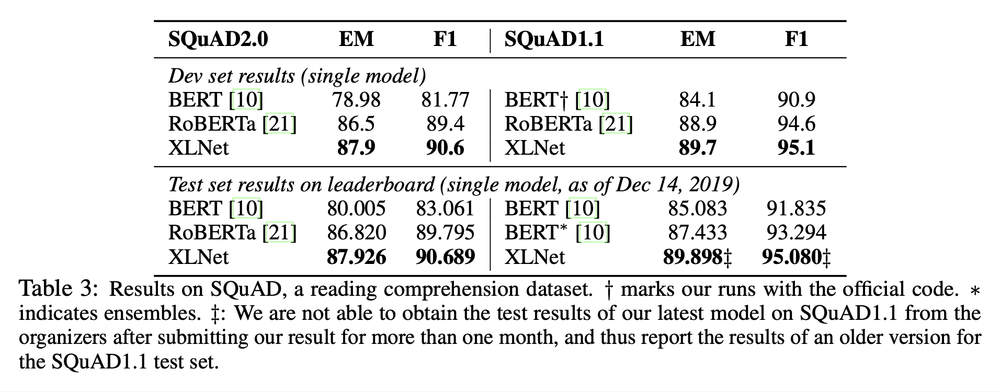

# XLNet: Generalized Autoregressive Pretraining for Language Understanding (2020), Zhilin Yang et al.

###### contributors: [@GitYCC](https://github.com/GitYCC)

\[[paper](https://arxiv.org/pdf/1901.02860.pdf)\] \[[pytorch](https://github.com/huggingface/transformers/blob/master/src/transformers/models/transfo_xl/modeling_transfo_xl.py#L734)\]

---

### Prerequisite

**Transformer-XL: Attentive Language Models Beyond a Fixed-Length Context** (2019), Zihang Dai et al. \[➤ [summary](nlp/Transformer-XL.md)\]

### Introduction

- Autoencoding (AE) Based Pretraining v.s. Autoregressive (AR) Based Pretraining
  - Pros of Autoencoding Based Pretraining: achieves better performance
  - Cons of Autoencoding Based Pretraining: pretrain-finetune discrepancy beacause of using `[MASK]`
- Since the predicted tokens are masked in the input, BERT is not able to model the joint probability using the product rule as in AR language modeling. In other words, BERT assumes the predicted tokens are independent of each other given the unmasked tokens, which is oversimplified as high-order, long-range dependency is prevalent in natural language

- We propose XLNet, a generalized autoregressive method that leverages the best of both AR language modeling and AE while avoiding their limitations.
  - permutation operation: each position learns to utilize contextual information from all positions, i.e., capturing bidirectional context
  - remove `[MASK]`: XLNet does not suffer from the pretrain-finetune discrepancy that BERT is subject to. Meanwhile, the autoregressive objective also provides a natural way to use the product rule for factorizing the joint probability of the predicted tokens, eliminating the independence assumption made in BERT.
- In addition to a novel pretraining objective, XLNet improves architectural designs for pretraining.
  - XLNet integrates the segment recurrence mechanism and relative encoding scheme of Transformer-XL into pretraining
  - Naively applying a Transformer(-XL) architecture to permutation-based language modeling does not work because the factorization order is arbitrary and the target is ambiguous. As a solution, we propose to reparameterize the Transformer(-XL) network to remove the ambiguity.

### Proposed Method

**The pros and cons of the two pretraining objectives are compared in the following aspects:**

- Independence Assumption: 
  - BERT based on an independence assumption; 
  - AR Based Pretraining used the product rule that holds universally without such an independence assumption.
- Input noise:
  - The input to BERT contains artificial symbols like `[MASK]` that never occur in downstream tasks, which creates a pretrain-finetune discrepancy.
  - AR language modeling does not rely on any input corruption and does not suffer from this issue.
- Context dependency:
  - The AR representation is only conditioned on the tokens up to position $t$ (i.e. tokens to the left).
  - BERT representation has access to the contextual information on both sides.

**Objective: Permutation Language Modeling**

- let $Z_T$ be the set of all possible permutations of the length-$T$ index sequence $[1, 2,..., T ]$. We use $z_t$ and $z<t$ to denote the $t$-th element and the first $t−1$ elements of a permutation $z ∈ Z_T$ . Then, our proposed permutation language modeling objective can be expressed as follows:
  $$
  max_{\theta}E_{z\sim Z_T}[\sum_{t=1}^Tlogp_\theta (x_{Z_t}|x_{z<t})]
  $$

- Both benefits
  - capture the bidirectional context
  - as this objective fits into the AR framework, it naturally avoids the independence assumption and the pretrain-finetune discrepancy
- rely on a proper attention mask in Transformers to achieve permutation of the factorization order

**Architecture: Two-Stream Self-Attention for Target-Aware Representations**

- While the permutation language modeling objective has desired properties, naive implementation with standard Transformer parameterization may not work. Beacause the representation $h_{\theta}(x_{z<t})$ does not depend on which position it will predict, the same distribution is predicted regardless of the target position, which is not able to learn useful representations.
  - => Solution: Use "Relative Positional Encodings" in attention
  - 
- Two-Stream Self-Attention
  - For the XLNet training parameterization to work, there are two requirements that are contradictory in a standard Transformer architecture:
    - (1) to predict the token $x_{z_t}$ , $g_θ (x_{z<t} , z_t )$ should only use the position $z_t$ and not the content $x_{z_t}$, otherwise the objective becomes trivial
    - (2) to predict the other tokens $x_{z_j}$ with $j>t$, $g_θ(x_{z<t},z_t)$ should also encode the content $x_{z_t}$ to provide full contextual information
  - To resolve such a contradiction, we propose to use two sets of hidden representations instead of one:
    - The content representation $h_θ (x_{z≤t})$, or abbreviated as $h_{z_t}$ , which serves a similar role to the standard hidden states in Transformer. This representation encodes both the context and $x_{z_t}$ itself.
    - The query representation $g_θ(x_{z<t},z_t)$, which only has access to the contextual information $x_{z<t}$ and the position $z_t$, but not the content $x_{z_t}$ , as discussed above.
  - Usage:
    - We can use the last-layer query representation $g^{(M)}_{z_t}$ to pretrain XLNet.
      - In BERT, use `[MASK]` 
    - During finetuning, we can simply drop the query stream and use the content stream $h_θ (x_{z≤t})$ as a normal Transformer(-XL).
  - 
  - 
- Partial Prediction: To reduce the optimization difficulty, we choose to only predict the last tokens in a factorization order.
  - $K=\frac{\text{len(labels)}}{\text{len(predict_labels)}}$
  - the paper suggests $K\sim 6$ (is equal to partial ratio $\sim 14.3\%$ which closes to `[MASK]` ratio in BERT pretraining)

**Incorporating Ideas from Transformer-XL**

- We integrate two important techniques in Transformer-XL: 
  - the relative positional encoding scheme
  - the segment recurrence mechanism
- Suppose we have two segments taken from along sequence $s$; i.e., $\tilde{x}=s_{1:T}$ and $x=s_{T+1:2T}$. Let $\tilde{z}$ and $z$ be permutations of $[1···T]$ and $[T + 1 ··· 2T ]$ respectively. Then, based on the permutation $\tilde{z}$, we process the first segment, and then cache the obtained content representations $\tilde{h}(m)$ for each layer $m$. Then, for the next segment $x$, the attention update with memory can be written as
  

**Modeling Multiple Segments**

- Although we follow the two-segment data format, XLNet-Large does not use the objective of next sentence prediction as it does not show consistent improvement in our ablation study.
- Relative Segment Encodings: 
  - Architecturally, different from BERT that adds an absolute segment embedding to the word embedding at each position, we extend the idea of relative encodings from Transformer-XL to also encode the segments.
  - Given a pair of positions $i$ and $j$ in the sequence, if $i$ and $j$ are from the same segment, we use a segment encoding $s_{ij} = s_+$ or otherwise $s_{ij} = s_−$, where $s_+$ and $s_−$ are learnable model parameters for each attention head. The segment encoding $s_{ij}$ is used to compute an attention weight $a_{ij}=(q_i+b)^Ts_{ij}$ , where $q_i$ is the query vector as in a standard attention operation and $b$ is a learnable head-specific bias vector. Finally, the value $a_{ij}$ is added to the normal attention weight.
  - two benefits
    - relative encodings improves generalization
    - it opens the possibility of finetuning on tasks that have more than two input segments, which is not possible using absolute segment encodings.

**Discussion**

- Both BERT and XLNet, partial prediction plays a role of reducing optimization difficulty by only predicting tokens with sufficient context. However, the independence assumption disables BERT to model dependency between targets.
- For example, select the two tokens `[New, York]` as the prediction targets
  

### Experiments

