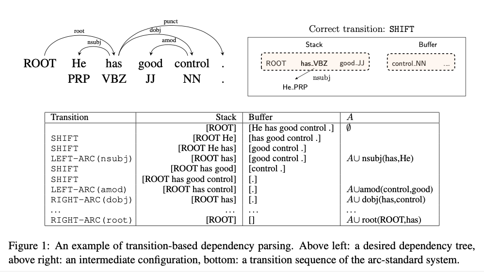
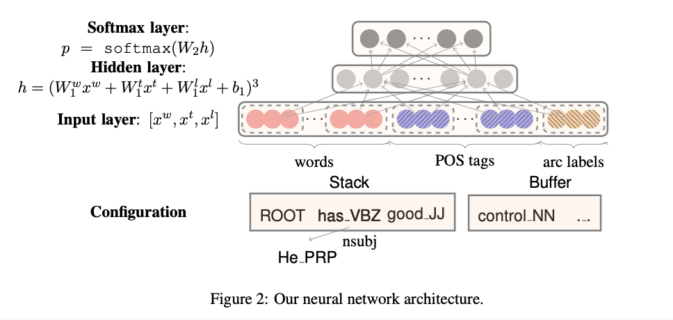
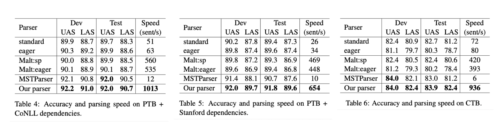

# A Fast and Accurate Dependency Parser using Neural Networks (2014), Chen and Manning. 

###### contributors: [@GitYCC](https://github.com/GitYCC)

\[[paper](https://nlp.stanford.edu/pubs/emnlp2014-depparser.pdf)\]

---

**TL;DR**

In this paper, we train a neural net- work classifier to make parsing decisions within a transition-based dependency parser. The neu- ral network learns compact dense vector represen- tations of words, part-of-speech (POS) tags, and dependency labels.

**Transition-based Dependency Parsing**

- In the arc-standard system, a configuration $c = (s,b,A)$ consists of a stack $s$, a buffer $b$, and a set of dependency arcs $A$.
- Depend on a configuration $c = (s,b,A)$ to determine actions:
  - LEFT-ARC($l$): adds an arc $s1 → s2$ with label $l$ and removes $s2$ from the stack. Pre-condition: $|s| ≥ 2$.
  - RIGHT-ARC($l$): adds an arc $s2 → s1$ with label $l$ and removes $s1$ from the stack. Pre- condition: $|s| ≥ 2$.
  - SHIFT: moves $b1$ from the buffer to the stack. Precondition: $|b| ≥ 1$.

- Its features suffer from the following problems:
  - Sparsity
  - Incompleteness: Because even with expertise and man- ual handling involved, they still do not in- clude the conjunction of every useful word combination.
  - Expensive feature computation

**Neural Network Based Parser**

- We choose a set of elements based on the stack / buffer positions for each type of information (word, POS or label), which might be useful for our predictions.
- POS and label embeddings
- Cube activation function: Using $g(x) = x^3$ can model the product terms of $x_i$, $x_j$, $x_k$ for any three different elements at the input layer directly. In our case, $x_i$, $x_j$, $x_k$ could come from different dimensions of three embeddings.
- The choice of $S_w$ (words), $S_t$ (POS tags), $S_l$ (arc labels)
  - Following (Zhang and Nivre, 2011), we pick a rich set of elements for our final parser. In detail, $S_w$ contains $n_w$ = 18 elements: (1) The top 3 words on the stack and buffer: $s1, s2, s3, b1, b2, b3$; (2) The first and second leftmost / rightmost children of the top two words on the stack: $lc1(si), rc1(si), lc2(si), rc2(si)$, $i = 1, 2$. (3) The leftmost of leftmost / rightmost of rightmost children of the top two words on the stack: $lc1(lc1(si)), rc1(rc1(si))$, $i = 1, 2$.
  - We use the corresponding POS tags for $S_t$ (nt = 18), and the corresponding arc labels of words excluding those 6 words on the stack/buffer for $S_l$ ($n_l$ = 12). A good advantage of our parser is that we can add a rich set of elements cheaply, instead of hand-crafting many more indicator features.
- prediction target: dependents and their labels

**results**

- UAS (unlabeled attachment score): # of correct dependents / # of dependents
- LAS (labeled attachment score): # of correct dependents with labels / # of dependents with labels

