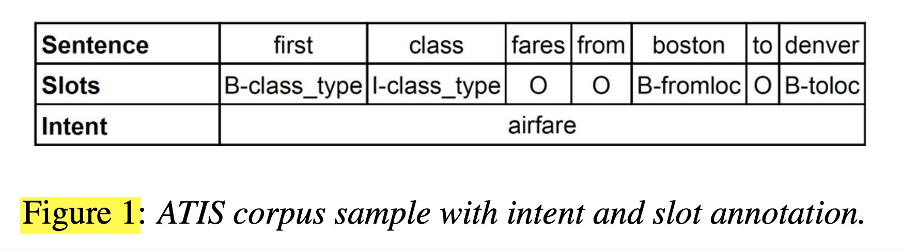

# Attention-Based Recurrent Neural Network Models for Joint Intent Detection and Slot Filling (2016), Bing Liu et al.

###### contributors: [@GitYCC](https://github.com/GitYCC)

\[[paper](https://arxiv.org/abs/1609.01454)\] \[[tensorflow](https://github.com/HadoopIt/rnn-nlu)\] \[[pytorch](https://github.com/DSKSD/RNN-for-Joint-NLU)\]

---

### Introduction

- Intent detection and slot filling are usually processed separately.
  - intent detection can be treated as a semantic utterance classification problem
    - methods: SVMs, deep neural network
  - slot filling can be treated as a sequence labeling task
    - methods: maximum entropy Markov models (MEMMs), conditional random fields (CRFs), RNNs
- In this work, we propose an attention-based neural network model for joint intent detection and slot filling.
- problem define
  - 
  - IOB Tagging on slots:
    - `B_` means the beginning of a chunk
    - `I_` means being inside a chunk
    - `O` tag indicates that a token belongs to no chunk
  - evaluation
    - F1 score on slot filling
    - Error rate on intent classification

### Model

#### Model 1: Encoder-Decoder Model with Aligned Inputs

- The bidirectional RNN encoder reads the source word sequence forward and backward.
  - hidden states: $h_i=[fh_i,bh_i]$
- decoders for intent classification and slot filling
  - we use the last state of the backward encoder RNN to compute the initial decoder hidden state, donated $s_0$
  - intent RNN
    - to classify intent
    - $y_{intent}=softmax(W\cdot concat(s_0,c_{intent}))$
  - slot filling RNN
    - unidirectional RNN (use LSTM here)
    - apply encoder-decoder framework to predict the slot tagging sequence (the length of sequence is fixed)
- attention
  - $c_i=\sum_{j=1}^{T}\alpha_{i,j}h_j$
    - $\alpha_{i,j}=\frac{exp(e_{i,j})}{\sum_{k=1}^{T}exp(e_{i,k})}$
    - $e_{i,k}=NN_{feed-forward}(s_{i-1},h_k)$
  - $c_{intent}=\sum_{j=1}^{T}\alpha'_{j}h_j$
    - $\alpha'_{j}=\frac{exp(e'_{j})}{\sum_{k=1}^{T}exp(e'_{k})}$
    - $e'_{k}=NN_{feed-forward}(s_0,h_k)$   (where: $s_0$ is the initial decoder state)
- aligned inputs
  - condition the decoder by hidden states of encoder

#### Model 2: Attention-Based RNN Model

- Use bi-directional LSTMs
- Slot label dependency is modeled in the forward RNN.
- hidden states: $h_i=[fh_i,bh_i]$
- attention: $c_i=\sum_{j=1}^{T}\alpha_{i,j}h_j$
  - $\alpha_{i,j}=\frac{exp(e_{i,j})}{\sum_{k=1}^{T}exp(e_{i,k})}$
  - $e_{i,k}=NN_{feed-forward}(s_{i},h_k)$
  - where: $s_i$ is the state of forward RNN
- This hidden state $h_i$ is combined with the context vector $c_i$ to produce the label distribution
- If attention is not used, we apply mean-pooling over time on the hidden states $\bold{h}$ followed by logistic regression to perform the intent classification. If attention is enabled, we instead take the weighted average of the hidden states $\bold{h}$ over time.
  - $c_{intent}=\sum_{j=1}^{T}\alpha'_{j}h_j$
    - $\alpha'_{j}=\frac{exp(e'_{j})}{\sum_{k=1}^{T}exp(e'_{k})}$
    - $e'_{k}=NN_{feed-forward}(s_0,h_k)$   (where: $s_0$ is the last state of backward RNN)

### Result

#### Independent Training

#### Joint Training

- Joint Training is better than indepent training

