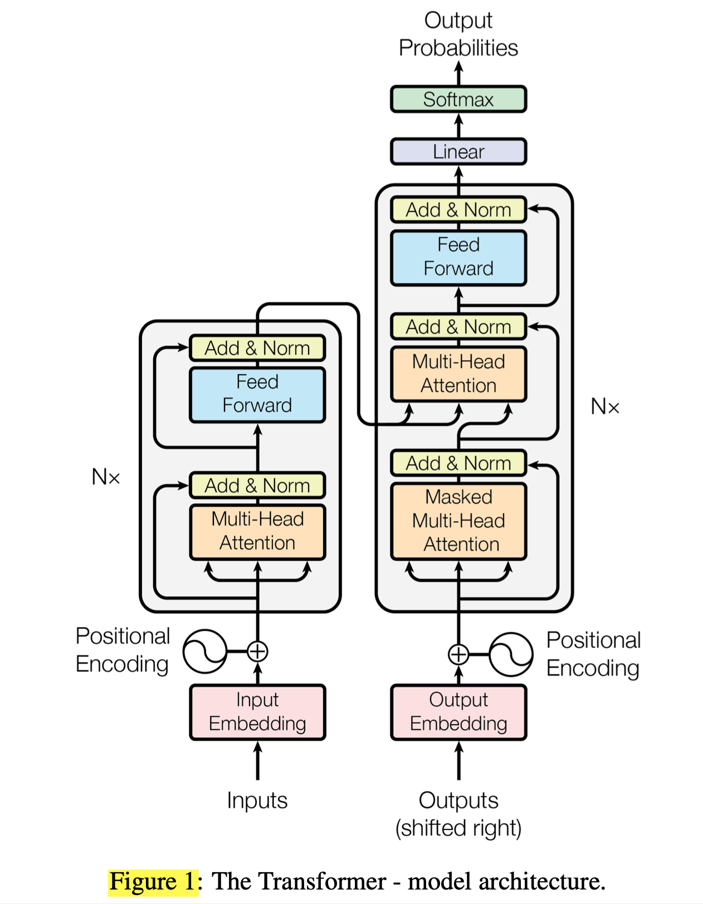
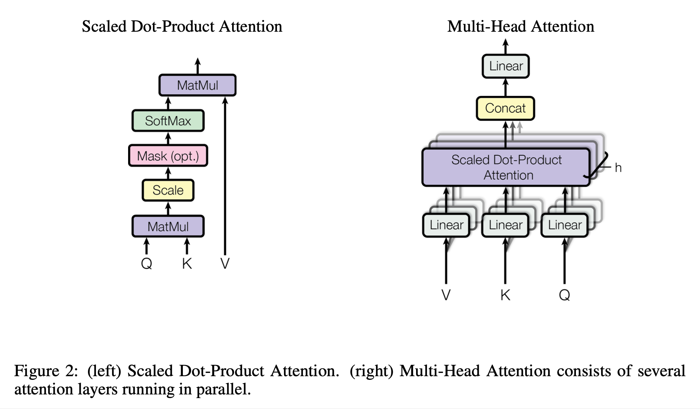
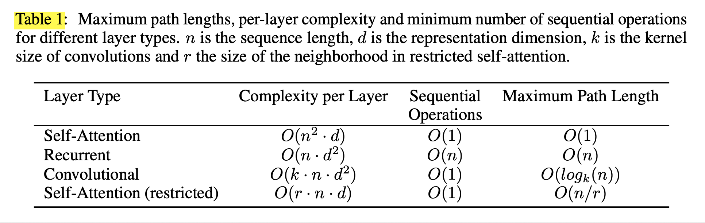
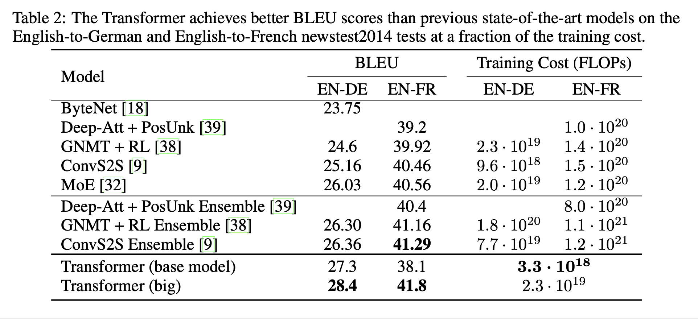
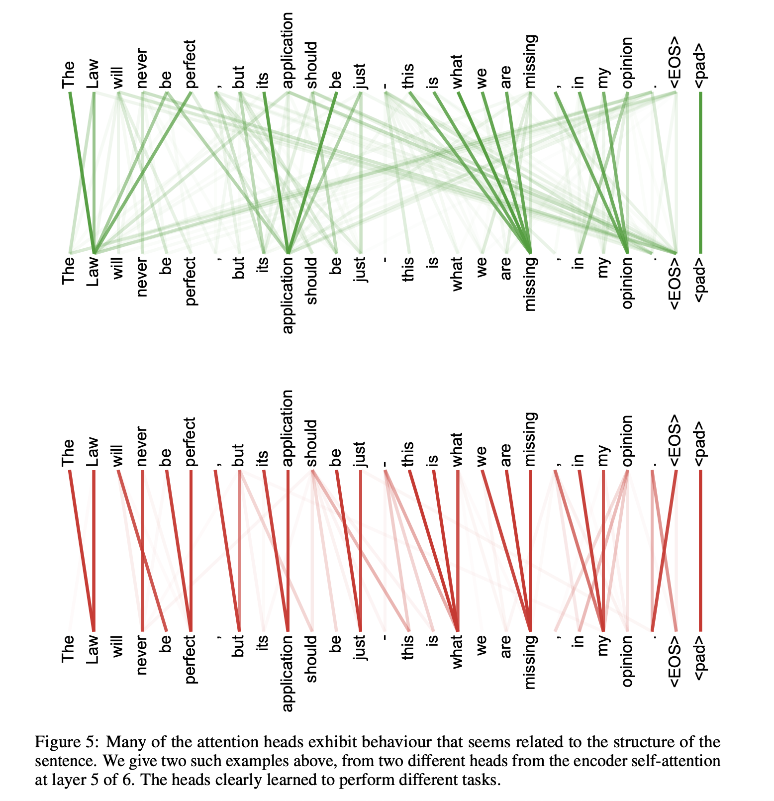

# Attention Is All You Need (2017), A. Vaswani et al.

###### contributors: [@GitYCC](https://github.com/GitYCC)

\[[paper](https://arxiv.org/pdf/1706.03762)\] \[[pytorch](https://github.com/jadore801120/attention-is-all-you-need-pytorch)\]

---

**TR;DL**

- In this work, we presented the Transformer, the first sequence transduction model based entirely on attention, replacing the recurrent layers most commonly used in encoder-decoder architectures with multi-headed self-attention.
- For translation tasks, the Transformer can be trained significantly faster than architectures based on recurrent or convolutional layers. On both WMT 2014 English-to-German and WMT 2014 English-to-French translation tasks, we achieve a new state of the art. In the former task our best model outperforms even all previously reported ensembles.

**Background**

- Self-attention has been used successfully in a variety of tasks including reading comprehension, abstractive summarization, textual entailment and learning task-independent sentence representations.
- The Transformer is the first transduction model relying entirely on self-attention to compute representations of its input and output without using sequence-aligned RNNs or convolution.

**Model Architecture**



- left: encoder and right: decoder

  - The Transformer follows this overall architecture using stacked self-attention and point-wise, fully connected layers for both the encoder and decoder

- the input embedding, the output embedding and the pre-softmax linear transformation share the same weight matrix

  - Similarly to other sequence transduction models, we use learned embeddings to convert the input

    tokens and output tokens to vectors of dimension $d_{model}$.

  - In the embedding layers, we multiply those weights by $\sqrt{d_{model}}$

- positional encoding

  - Since our model contains no recurrence and no convolution, in order for the model to make use of the order of the sequence, we must inject some information about the relative or absolute position of the tokens in the sequence.

  - The positional encodings have the same dimension $d_{model}$ as the embeddings, so that the two can be summed. There are many choices of positional encodings, learned and fixed.

  - In this work, we use sine and cosine functions of different frequencies:
    $$
    PE_{(pos,2i)} =sin(pos/10000^{2i/d_{model}})
    $$

    $$
    PE_{(pos,2i+1)} =cos(pos/10000^{2i/d_{model}})
    $$

    where $pos$ is the position and $i$ is the dimension. That is, each dimension of the positional encoding corresponds to a sinusoid.

  - We also experimented with using learned positional embeddings instead, and found that the two versions produced nearly identical results.

```python
class PositionalEncoding(nn.Module):

    def __init__(self, d_model, n_position=200):
        super(PositionalEncoding, self).__init__()
        # Not a parameter
        self.register_buffer('pos_table',
                             self._get_sinusoid_encoding_table(n_position, d_model))

    def _get_sinusoid_encoding_table(self, n_position, d_model):
        ''' Sinusoid position encoding table '''

        def get_position_angle_vec(position):
            return [position / np.power(10000, 2 * (hid_j // 2) / d_model)
                    for hid_j in range(d_model)]

        sinusoid_table = np.array([get_position_angle_vec(pos_i)
                                   for pos_i in range(n_position)])
        sinusoid_table[:, 0::2] = np.sin(sinusoid_table[:, 0::2])  # dim 2i
        sinusoid_table[:, 1::2] = np.cos(sinusoid_table[:, 1::2])  # dim 2i+1

        return torch.FloatTensor(sinusoid_table).unsqueeze(0)

    def forward(self, x):
        return x + self.pos_table[:, :x.size(1)].clone().detach()
```

- multi-head attention and masked multi-head attention

  - 

  - Scaled Dot-Product Attention:
    $$
    Attention(Q, K, V )=softmax(\frac{QK^T}{\sqrt{d_k}})V
    $$

    - why scaling? We suspect that for large values of $d_k$, the dot products grow large in magnitude, pushing the softmax function into regions where it has extremely small gradients . To counteract this effect, we scale the dot products by $\frac{1}{\sqrt{d_k}}$.

  - Multi-Head Attention:
    $$
    MultiHead(Q, K, V ) = Concat(head_1, ..., head_h)W^O
    $$

    $$
    where:\ head_i = Attention(QW_i^Q , K W_i^K , V W_i^V )
    $$

    - dimension: 
      - $dim(W_i^Q)=d_{model}\times d_k$
      - $dim(W_i^K)=d_{model}\times d_k$
      - $dim(W_i^V)=d_{model}\times d_v$
      - $dim(W^O)=h*d_{v}\times d_{model}$

  - Applications of Attention in our Model

    - encoder-decoder attention: allows every position in the decoder to attend over all positions in the input sequence
    - Each position in the encoder can attend to all positions in the previous layer of the encoder.
    - self-attention layers in the decoder allow each position in the decoder to attend to all positions in the decoder up to and including that position. We need to prevent leftward information flow in the decoder to preserve the auto-regressive property. We implement this inside of scaled dot-product attention by masking out all values in the input of the softmax which correspond to illegal connections. 

  - Add & Norm

    - a residual connection around each of the two sub-layers, followed by [layer normalization](https://arxiv.org/abs/1607.06450)

```python
class ScaledDotProductAttention(nn.Module):
    ''' Scaled Dot-Product Attention '''

    def __init__(self, temperature, attn_dropout=0.1):
        super().__init__()
        self.temperature = temperature
        self.dropout = nn.Dropout(attn_dropout)
  
    def forward(self, q, k, v, mask=None):
  
        attn = torch.matmul(q / self.temperature, k.transpose(2, 3))
  
        if mask is not None:
            attn = attn.masked_fill(mask == 0, -1e9)
  
        attn = self.dropout(F.softmax(attn, dim=-1))
        output = torch.matmul(attn, v)
        return output, attn
  
class MultiHeadAttention(nn.Module):
    ''' Multi-Head Attention module '''
  
    def __init__(self, n_head, d_model, d_k, d_v, dropout=0.1):
        super().__init__()
  
        self.n_head = n_head
        self.d_k = d_k
        self.d_v = d_v
  
        self.w_qs = nn.Linear(d_model, n_head * d_k, bias=False)
        self.w_ks = nn.Linear(d_model, n_head * d_k, bias=False)
        self.w_vs = nn.Linear(d_model, n_head * d_v, bias=False)
        self.fc = nn.Linear(n_head * d_v, d_model, bias=False)
  
        self.attention = ScaledDotProductAttention(temperature=d_k ** 0.5)
  
        self.dropout = nn.Dropout(dropout)
        self.layer_norm = nn.LayerNorm(d_model, eps=1e-6)
  
  
    def forward(self, q, k, v, mask=None):
  
        d_k, d_v, n_head = self.d_k, self.d_v, self.n_head
        sz_b, len_q, len_k, len_v = q.size(0), q.size(1), k.size(1), v.size(1)
  
        residual = q
  
        # Pass through the pre-attention projection: b x lq x (n*dv)
        # Separate different heads: b x lq x n x dv
        q = self.w_qs(q).view(sz_b, len_q, n_head, d_k)
        k = self.w_ks(k).view(sz_b, len_k, n_head, d_k)
        v = self.w_vs(v).view(sz_b, len_v, n_head, d_v)
  
        # Transpose for attention dot product: b x n x lq x dv
        q, k, v = q.transpose(1, 2), k.transpose(1, 2), v.transpose(1, 2)
          
        if mask is not None:
            mask = mask.unsqueeze(1)   # For head axis broadcasting.
  
        q, attn = self.attention(q, k, v, mask=mask)
  
        # Transpose to move the head dimension back: b x lq x n x dv
        # Combine the last two dimensions to concatenate all the heads together: b x lq x (n*dv)
        q = q.transpose(1, 2).contiguous().view(sz_b, len_q, -1)
        q = self.dropout(self.fc(q))
          
        q += residual
        q = self.layer_norm(q)
  
        return q, attn
```


- Position-wise Feed-Forward Networks
  $$
  FFN(x) = max(0, xW_1 + b_1 )W_2 + b_2
  $$


```python
class PositionwiseFeedForward(nn.Module):
    ''' A two-feed-forward-layer module '''

    def __init__(self, d_in, d_hid, dropout=0.1):
        super().__init__()
        self.w_1 = nn.Linear(d_in, d_hid) # position-wise
        self.w_2 = nn.Linear(d_hid, d_in) # position-wise
        self.layer_norm = nn.LayerNorm(d_in, eps=1e-6)
        self.dropout = nn.Dropout(dropout)

    def forward(self, x):
        residual = x
        x = self.w_2(F.relu(self.w_1(x)))
        x = self.dropout(x)
        x += residual
        x = self.layer_norm(x)
        return x
```

- Encoder:

```python
class EncoderLayer(nn.Module):
    ''' Compose with two layers '''

    def __init__(self, d_model, d_inner, n_head, d_k, d_v, dropout=0.1):
        super(EncoderLayer, self).__init__()
        self.slf_attn = MultiHeadAttention(n_head, d_model, d_k, d_v, dropout=dropout)
        self.pos_ffn = PositionwiseFeedForward(d_model, d_inner, dropout=dropout)

    def forward(self, enc_input, slf_attn_mask=None):
        enc_output, enc_slf_attn = self.slf_attn(
            enc_input, enc_input, enc_input, mask=slf_attn_mask)
        enc_output = self.pos_ffn(enc_output)
        return enc_output, enc_slf_attn

class Encoder(nn.Module):
    ''' A encoder model with self attention mechanism. '''

    def __init__(
            self, n_src_vocab, d_word_vec, n_layers, n_head, d_k, d_v,
            d_model, d_inner, pad_idx, dropout=0.1, n_position=200):

        super().__init__()

        self.src_word_emb = nn.Embedding(n_src_vocab, d_word_vec, padding_idx=pad_idx)
        self.position_enc = PositionalEncoding(d_word_vec, n_position=n_position)
        self.dropout = nn.Dropout(p=dropout)
        self.layer_stack = nn.ModuleList([
            EncoderLayer(d_model, d_inner, n_head, d_k, d_v, dropout=dropout)
            for _ in range(n_layers)])
        self.layer_norm = nn.LayerNorm(d_model, eps=1e-6)

    def forward(self, src_seq, src_mask, return_attns=False):

        enc_slf_attn_list = []

        enc_output = self.dropout(self.position_enc(self.src_word_emb(src_seq)))

        for enc_layer in self.layer_stack:
            enc_output, enc_slf_attn = enc_layer(enc_output, slf_attn_mask=src_mask)
            enc_slf_attn_list += [enc_slf_attn] if return_attns else []

        if return_attns:
            return enc_output, enc_slf_attn_list
        return enc_output,
```

- Decoder
  - We also modify the self-attention sub-layer in the decoder stack to prevent positions from attending to subsequent positions.

```python
class DecoderLayer(nn.Module):
    ''' Compose with three layers '''

    def __init__(self, d_model, d_inner, n_head, d_k, d_v, dropout=0.1):
        super(DecoderLayer, self).__init__()
        self.slf_attn = MultiHeadAttention(n_head, d_model, d_k, d_v, dropout=dropout)
        self.enc_attn = MultiHeadAttention(n_head, d_model, d_k, d_v, dropout=dropout)
        self.pos_ffn = PositionwiseFeedForward(d_model, d_inner, dropout=dropout)

    def forward(
            self, dec_input, enc_output,
            slf_attn_mask=None, dec_enc_attn_mask=None):
        dec_output, dec_slf_attn = self.slf_attn(
            dec_input, dec_input, dec_input, mask=slf_attn_mask)
        dec_output, dec_enc_attn = self.enc_attn(
            q=dec_output, k=enc_output, v=enc_output, mask=dec_enc_attn_mask)
        dec_output = self.pos_ffn(dec_output)
        return dec_output, dec_slf_attn, dec_enc_attn

class Decoder(nn.Module):
    ''' A decoder model with self attention mechanism. '''

    def __init__(
            self, n_trg_vocab, d_word_vec, n_layers, n_head, d_k, d_v,
            d_model, d_inner, pad_idx, n_position=200, dropout=0.1):

        super().__init__()

        self.trg_word_emb = nn.Embedding(n_trg_vocab, d_word_vec, padding_idx=pad_idx)
        self.position_enc = PositionalEncoding(d_word_vec, n_position=n_position)
        self.dropout = nn.Dropout(p=dropout)
        self.layer_stack = nn.ModuleList([
            DecoderLayer(d_model, d_inner, n_head, d_k, d_v, dropout=dropout)
            for _ in range(n_layers)])
        self.layer_norm = nn.LayerNorm(d_model, eps=1e-6)

    def forward(self, trg_seq, trg_mask, enc_output, src_mask, return_attns=False):

        dec_slf_attn_list, dec_enc_attn_list = [], []

        dec_output = self.dropout(self.position_enc(self.trg_word_emb(trg_seq)))

        for dec_layer in self.layer_stack:
            dec_output, dec_slf_attn, dec_enc_attn = dec_layer(
                dec_output, enc_output, slf_attn_mask=trg_mask, dec_enc_attn_mask=src_mask)
            dec_slf_attn_list += [dec_slf_attn] if return_attns else []
            dec_enc_attn_list += [dec_enc_attn] if return_attns else []

        if return_attns:
            return dec_output, dec_slf_attn_list, dec_enc_attn_list
        return dec_output,
```

- put all together

```python
def get_pad_mask(seq, pad_idx):
    return (seq != pad_idx).unsqueeze(-2)

def get_subsequent_mask(seq):
    ''' For masking out the subsequent info. '''
    sz_b, len_s = seq.size()
    subsequent_mask = (1 - torch.triu(
        torch.ones((1, len_s, len_s), device=seq.device), diagonal=1)).bool()
    return subsequent_mask

class Transformer(nn.Module):
    ''' A sequence to sequence model with attention mechanism. '''

    def __init__(
            self, n_src_vocab, n_trg_vocab, src_pad_idx, trg_pad_idx,
            d_word_vec=512, d_model=512, d_inner=2048,
            n_layers=6, n_head=8, d_k=64, d_v=64, dropout=0.1, n_position=200,
            trg_emb_prj_weight_sharing=True, emb_src_trg_weight_sharing=True):

        super().__init__()

        self.src_pad_idx, self.trg_pad_idx = src_pad_idx, trg_pad_idx

        self.encoder = Encoder(
            n_src_vocab=n_src_vocab, n_position=n_position,
            d_word_vec=d_word_vec, d_model=d_model, d_inner=d_inner,
            n_layers=n_layers, n_head=n_head, d_k=d_k, d_v=d_v,
            pad_idx=src_pad_idx, dropout=dropout)

        self.decoder = Decoder(
            n_trg_vocab=n_trg_vocab, n_position=n_position,
            d_word_vec=d_word_vec, d_model=d_model, d_inner=d_inner,
            n_layers=n_layers, n_head=n_head, d_k=d_k, d_v=d_v,
            pad_idx=trg_pad_idx, dropout=dropout)

        self.trg_word_prj = nn.Linear(d_model, n_trg_vocab, bias=False)

        for p in self.parameters():
            if p.dim() > 1:
                nn.init.xavier_uniform_(p) 

        assert d_model == d_word_vec, \
        'To facilitate the residual connections, \
         the dimensions of all module outputs shall be the same.'

        self.x_logit_scale = 1.
        if trg_emb_prj_weight_sharing:
            # Share the weight between target word embedding & last dense layer
            self.trg_word_prj.weight = self.decoder.trg_word_emb.weight
            self.x_logit_scale = (d_model ** -0.5)

        if emb_src_trg_weight_sharing:
            self.encoder.src_word_emb.weight = self.decoder.trg_word_emb.weight


    def forward(self, src_seq, trg_seq):

        src_mask = get_pad_mask(src_seq, self.src_pad_idx)
        trg_mask = get_pad_mask(trg_seq, self.trg_pad_idx) & get_subsequent_mask(trg_seq)

        enc_output, *_ = self.encoder(src_seq, src_mask)
        dec_output, *_ = self.decoder(trg_seq, trg_mask, enc_output, src_mask)
        seq_logit = self.trg_word_prj(dec_output) * self.x_logit_scale

        return seq_logit.view(-1, seq_logit.size(2))
```

**Why Self-Attention**



- Low Complexity per Layer: 
  - In terms of computational complexity, self-attention layers are faster than recurrent layers when the sequence length $n$ is smaller than the representation dimensionality $d$, which is most often the case with sentence representations used by state-of-the-art models in machine translations, such as word-piece and byte-pair representations. 
  - To improve computational performance for tasks involving very long sequences, self-attention could be restricted to considering only a neighborhood of size $r$ in the input sequence centered around the respective output position.
- Low Sequential Operations: The amount of computation that can be parallelized, as measured by the minimum number of sequential operations required. 
- Low Maximum Path Length: The path length between long-range dependencies in the network. Learning long-range dependencies is a key challenge in many sequence transduction tasks. The shorter these paths between any combination of positions in the input and output sequences, the easier it is to learn long-range dependencies.

- More interpretable

**Results**



- [BLEU (Bilingual Evaluation Understudy)](https://en.wikipedia.org/wiki/BLEU)



