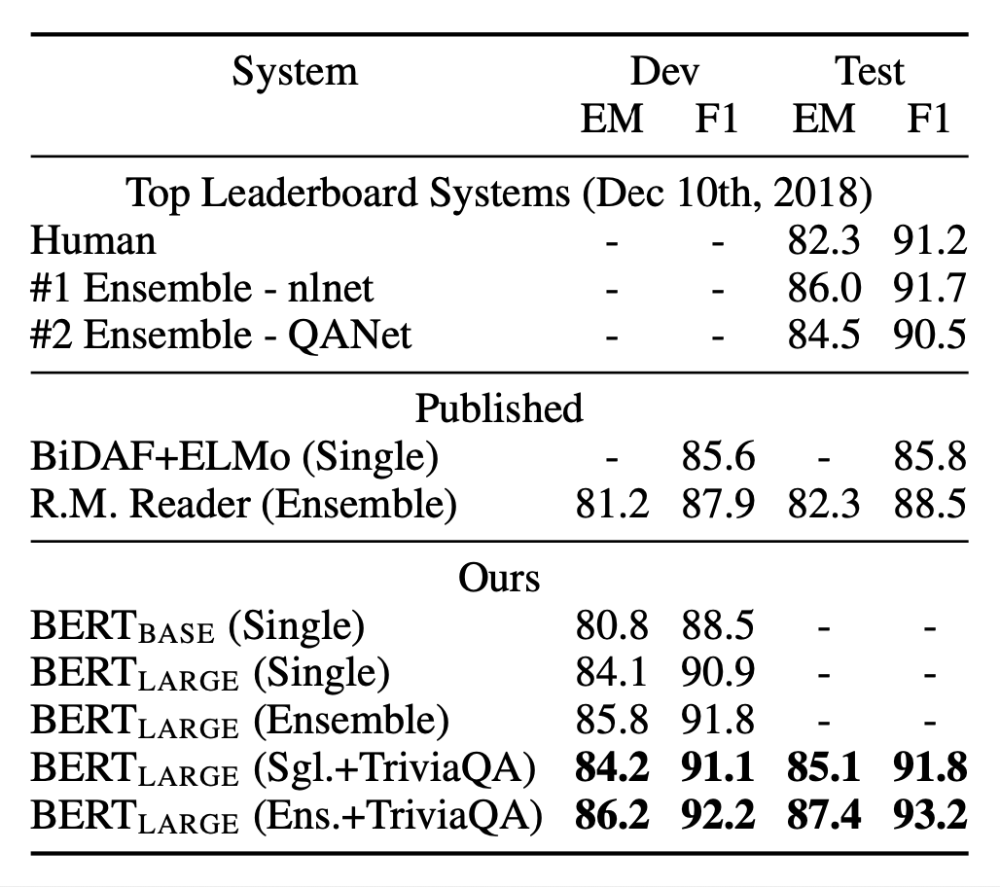
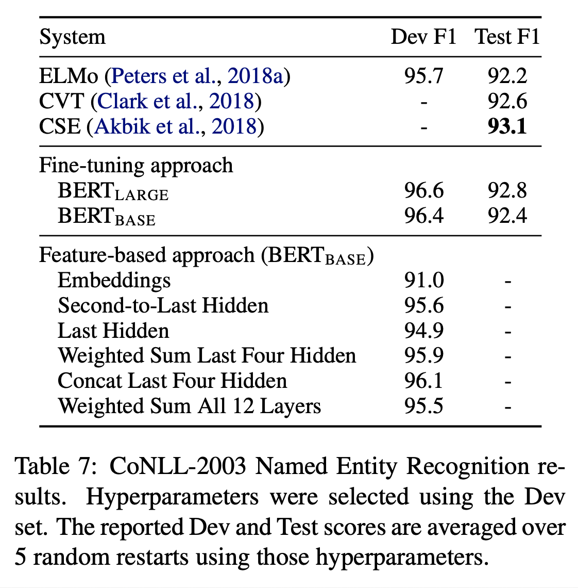

# BERT: Pre-training of Deep Bidirectional Transformers for Language Understanding (2019), Jacob Devlin et al.

###### contributors: [@GitYCC](https://github.com/GitYCC)

\[[paper](https://arxiv.org/abs/1810.04805)\] \[[pytorch](https://github.com/huggingface/transformers)\] \[[tensorflow](https://github.com/google-research/bert)\]

---

### Prerequisite

**Attention Is All You Need** (2017), A. Vaswani et al. \[➤ [summary](nlp/attention-is-all-you-need.md)\]


### Abstract

- Unlike recent language representation models (Peters et al., 2018a; Rad- ford et al., 2018), BERT is designed to pre-train deep bidirectional representations from unlabeled text by jointly conditioning on both left and right context in all layers.
- As a result, the pre-trained BERT model can be fine-tuned with just one additional output layer to create state-of-the-art models for a wide range of tasks, such as question answering and language inference, without substantial task-specific architecture modifications.


### Introduction

There are two existing strategies for applying pre-trained language representations to downstream tasks:

- feature-based: use the pre-trained representations as additional features
  - such as ELMo
- fine-tuning: trained on the downstream tasks by simply fine-tuning all pre-trained parameters
  - such as Generative Pre-trained Transformer (OpenAI GPT)

The two approaches share the same objective function during pre-training, where they use unidirectional language models to learn general language representations.


---

We argue that current techniques restrict the power of the pre-trained representations, especially for the fine-tuning approaches.

- The major limitation is that standard language models are unidirectional

- could be very harmful when applying fine-tuning based approaches to token-level tasks such as question answering (QA), where it is crucial to incor- porate context from both directions.

BERT alleviates the previously mentioned unidirectionality constraint by using a “masked language model” (MLM) pre-training objective.

---

The contributions of our paper are as follows:

- We demonstrate the importance of bidirectional pre-training for language representations. BERT uses masked language models to enable pre-trained deep bidirectional representations.
- We show that pre-trained representations reduce the need for many heavily-engineered task-specific architectures. BERT is the first fine-tuning based representation model that achieves state-of-the-art performance on a large suite of sentence-level and token-level tasks, outperforming many task-specific architectures.


### BERT

- Model Architecture: BERT’s model architecture is a multi-layer bidirectional Transformer encoder based on the original implementation described in **Attention Is All You Need** (2017), A. Vaswani et al. \[➤ [summary](nlp/attention-is-all-you-need.md)\]

  - 

  - Self-attention: 
    $$
    Attention(Q, K, V )=softmax(\frac{QK^T}{\sqrt{d_k}})V
    $$

  - Multi-Head Attention:
    $$
    MultiHead(Q, K, V ) = Concat(head_1, ..., head_h)W^O
    $$

  - In this work, we denote the number of layers (i.e., Transformer blocks) as L​, the hidden size as H​, and the number of self-attention heads as A​

    - $BERT_{BASE}$ (L=12, H=768, A=12, Total Parameters=110M)
    - $BERT_{LARGE}$ (L=24, H=1024, A=16, Total Parameters=340M)

- Input Representations

  - 

  - ref: https://medium.com/@_init_/why-bert-has-3-embedding-layers-and-their-implementation-details-9c261108e28a

  - Three embedding to be learnt with training: token embedding, segment embedding, position embedding

  - Token Embeddings: WordPiece

    - The use of WordPiece tokenization enables BERT to only store 30,522 “words” in its vocabulary and very rarely encounter out-of-vocab words in the wild when tokenizing English texts.
    - The first token of every sequence is always a special classification token (`[CLS]`). The final hidden state corresponding to this token is used as the aggregate sequence representation for classification tasks.
    - Sentence pairs are packed together into a single sequence. We differentiate the sentences in two ways. First, we separate them with a special token (`[SEP]`). Second, we add a learned embedding (segment embeddings) to every token indicating whether it belongs to sentence $A$ or sentence $B$.

  - Segment Embeddings

    - example:

      ```
      [CLS] I like cats [SEP] I like dogs
        0   0  0    0     0   1  1    1
      ```

  - Position Embeddings

    - is not "Position Encoding"

    - example:

      ```
      [CLS] I like cats [SEP] I like dogs
        0   1  2    3     4   5  6    7
      ```


- Pre-training BERT: we pre-train BERT using two unsuper- vised tasks
  - Task #1: Masked LM
    - we mask 15% of all WordPiece tokens in each sequence at random
    - BUT... mismatch between pre-training and fine-tuning, since the `[MASK]` token does not appear during fine-tuning
    - SO... If the i-th token is chosen, we replace the i-th token with (1) the `[MASK]` token 80% of the time (2) a random token 10% of the time (3) the unchanged i-th token 10% of the time.
  - Task #2: Next Sentence Prediction (NSP)
    - Many important downstream tasks such as Question Answering (QA) and Natural Language Inference (NLI) are based on understanding the relationship between two sentences, which is not directly captured by language modeling.
    - 50% of the time B is the actual next sentence that follows A (labeled as `IsNext`), and 50% of the time it is a random sentence from the corpus (labeled as `NotNext`)
- Fine-tuning BERT
  - the self- attention mechanism in the Transformer allows BERT to model many downstream tasks— whether they involve single text or text pairs—by swapping out the appropriate inputs and outputs
  - 


### Results

- GLUE
  - The only new parameters introduced during fine-tuning are classification layer weights $W ∈ \real^{K ×H}$ , where K is the number of labels. We compute a standard classification loss with $C$ and $W$ , i.e., $log(softmax(C W^T ))$
  - We use a batch size of 32 and fine-tune for 3 epochs over the data for all GLUE tasks.
  - 
- SQuAD v1.1
  - We only introduce a start vector $S ∈ \real^H$ and an end vector $E ∈ \real^H$ during fine-tuning.
  - its probability: $P_i=\frac{exp(S\cdot T_i)}{\sum_k exp(S\cdot T_k)}$ and $P_j=\frac{exp(E\cdot T_j)}{\sum_k exp(E\cdot T_k)}$
  - The score of a candidate span from position $i$ to position $j$ is defined as $S\cdot T_i + E\cdot T_j$, and the maximum scoring span where $j ≥ i$ is used as a prediction --> $\hat{s_{i,j}}=max_{j≥i} S\cdot T_i + E\cdot T_j$
  - We fine-tune for 3 epochs with a learning rate of 5e-5 and a batch size of 32.
  - 
- SQuAD v2.0: allow no answers
  - We treat questions that do not have an answer as having an answer span with start and end at the `[CLS]` token.
  - For prediction, we compare the score of the no-answer span: $s_{null} = S\cdot C + E\cdot C$ to the score of the best non-null span $\hat{s_{i,j}}=max_{j≥i} S\cdot T_i + E\cdot T_j$. We predict a non-null answer when $\hat{s_{i,j}} > s_{null} + τ$ , where the threshold $τ$ is selected on the dev set to maximize F1.
  - We fine-tuned for 2 epochs with a learning rate of 5e-5 and a batch size of 48.
  - 
- SWAG
  - Given a sentence, the task is to choose the most plausible continuation among four choices.
  - When fine-tuning on the SWAG dataset, we construct four input sequences, each containing the concatenation of the given sentence (sentence A) and a possible continuation (sentence B).
  - 3 epochs with a learning rate of 2e-5 and a batch size of 16
  - 


### Feature-based Approach with BERT

- Advantage of feature-based approach
  - Not all tasks can be easily represented by a Transformer encoder architecture, and therefore require a task-specific model architecture to be added.
  - There are major computational benefits to pre-compute an expensive representation of the training data once and then run many experiments with cheaper models on top of this representation.
- This demonstrates that BERT is effective for both fine- tuning and feature-based approaches.
  - 

