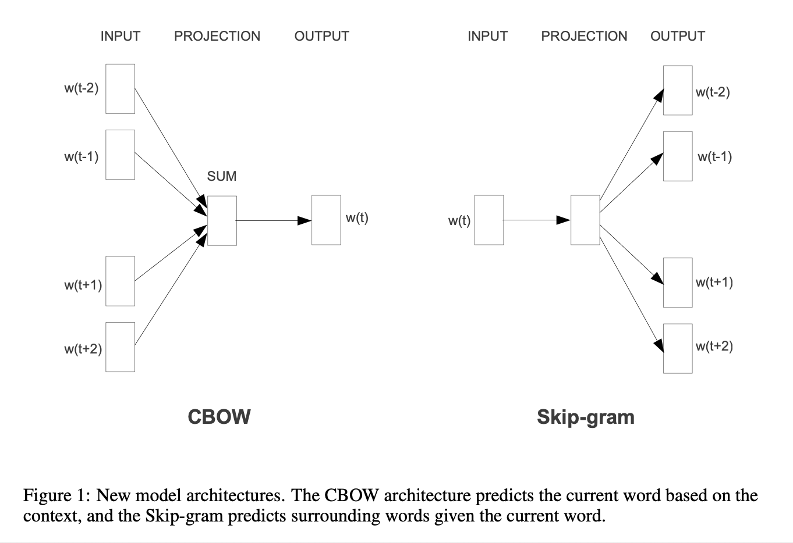

# Distributed representations of words and phrases and their compositionality (2013), T. Mikolov et al.

###### contributors: [@GitYCC](https://github.com/GitYCC)

\[[paper](http://papers.nips.cc/paper/5021-distributed-representations-of-words-and-phrases-and-their-compositionality.pdf)\] \[[code](https://github.com/dav/word2vec)\]

---

**TL;DR**

Contribution of our paper is to improve Word2Vec:

- apply on phrases instead of only words
  - We show how to train distributed representations of words and phrases with the Skip-gram (CBOW) model and demonstrate that these representations exhibit linear structure that makes precise analogical reasoning possible.
  - A very interesting result of this work is that the word vectors can be somewhat meaningfully combined using just simple vector addition.
- negative sampling algorithm
  - which is an extremely simple training method that learns accurate representations especially for frequent words.
- subsampling of the frequent words
  - We also found that the subsampling of the frequent words results in both faster training and significantly better representations of uncommon words. 

**Introduction**

- In this paper we present several extensions of the original Skip-gram model. We show that sub- sampling of frequent words during training results in a significant speedup (around 2x - 10x), and improves accuracy of the representations of less frequent words.
- that results in faster training and better vector representations for frequent words, compared to more complex hierarchical softmax that was used in the prior work
- Word representations are limited by their inability to represent idiomatic phrases that are not com- positions of the individual words. For example, “Boston Globe” is a newspaper, and so it is not a natural combination of the meanings of “Boston” and “Globe”.
- For example, vec(“Russia”) + vec(“river”) is close to vec(“Volga River”), and vec(“Germany”) + vec(“capital”) is close to vec(“Berlin”). This compositionality suggests that a non-obvious degree of language understanding can be obtained by using basic mathematical operations on the word vector representations.

**Hierarchical Softmax**

- problem: If number of classes = $V$, we need $O(V)$ to compute any probability in softmax, because $p_i=e^{z_i}/\sum_j e^{z_j}$ has the term $\sum_j e^{z_j}$. And $V$ is number of words which is a huge number.
- The hierarchical softmax uses a binary tree representation of the output layer with the $W$ words as its leaves and, for each node, explicitly represents the relative probabilities of its child nodes.

- details we discussed in previous summay: [Efficient estimation of word representations in vector space (2013), T. Mikolov et al.](efficient-estimation-of-word-representations-in-vector-space.md)

**Negative Sampling**

- Mathematical Express of Word2Vec with softmax:
  $$
  W^{(o)}=softmax[U^TVW^{(i)}]
  $$
  where: $W^{(o)}$ : words of output, $W^{(i)}$ : words of input (count of words is $W$); $V\in \real^{K\times W}$ : input word matrix, $U\in \real^{K\times W}$ : output word matrix

- Because softmax is too expensive, we simply use sigmoid $\sigma$ 
  $$
  W^{(o)}=\sigma[U^TVW^{(i)}]
  $$

- Suppose input word $W^{(i)}_i\in \{0,1\}$ and output word $W^{(o)}_j\in \{0,1\}$:
  $$
  loss=-\sum_{j\in positive}\sum_{i,k}log\ \sigma(U^T_{kj}V_{ki}W^{(i)}_i)-\sum_{j\in negative}\sum_{i,k}log\ \sigma(-U^T_{kj}V_{ki}W^{(i)}_i)
  $$
  because $W^{(i)}_i\in \{0,1\}$ and $W^{(o)}_j\in \{0,1\}$, we could find corresponding vector $v_i$ and $u_j$, so
  $$
  loss=-\sum_{j\in positive}\sum_{i}log\ \sigma(u_j\cdot v_i)-\sum_{j\in negative}\sum_{i}log\ \sigma(-u_j\cdot v_i)
  $$

- In skip-gram,
  $$
  loss_{i=w_I,j=w_O}=-log\ \sigma(u_{w_I}\cdot v_{w_O})-\sum_{j\in negative}log\ \sigma(-u_j\cdot v_{w_I})
  $$
  apply important sampled from $P(w)$ (word frequency), we get negative sampling:
  $$
  loss_{i=w_I,j=w_O}=-log\ \sigma(u_{w_I}\cdot v_{w_O})-\sum_{k=1}^{K}E_{w_k\sim P(w_k)}[log\ \sigma(-u_k\cdot v_{w_I})]
  $$

**Subsampling of Frequent Words**

In very large corpora, the most frequent words can easily occur hundreds of millions of times (e.g., “in”, “the”, and “a”). Such words usually provide less information value than the rare words.

Discarded with probability computed by the formula
$$
P(w_i)=1-\sqrt{\frac{t}{f(w_i)}}
$$
where: $t$ is a chosen threshold, typically around $10^{-5}$; $0<f(w_i)<1$ is the frequency of word

- when $f(w_i)\leq t$, no discarded
- larger  $f(w_i)$, larger discarded probability

Although this subsampling formula was chosen heuristically, we found it to work well in practice.

**Learning Phrases**

We decided to use a simple data-driven approach, where phrases are formed based on the unigram and bigram counts, using
$$
score(w_i,w_j)=\frac{count(w_iw_j)-\delta}{count(w_i)\times count(w_j)}
$$
The $\delta$ is used as a discounting coefficient and prevents too many phrases consisting of very infrequent words to be formed.

**Phrase Skip-Gram Results**

- Surprisingly, while we found the Hierarchical Softmax to achieve lower performance when trained without subsampling, it became the best performing method when we downsampled the frequent words. This shows that the subsampling can result in faster training and can also improve accuracy, at least in some cases.

**Additive Compositionality**

- Interestingly, we found that the Skip-gram representations exhibit another kind of linear structure that makes it possible to meaningfully combine words by an element-wise addition of their vector representations. This phenomenon is illustrated in Table 5.
- The additive property of the vectors can be explained by inspecting the training objective. The word vectors are in a linear relationship with the inputs to the softmax nonlinearity. As the word vectors are trained to predict the surrounding words in the sentence, the vectors can be seen as representing the distribution of the context in which a word appears. These values are related logarithmically to the probabilities computed by the output layer, **so the sum of two word vectors is related to the product of the two context distributions**. The product works here as the AND function: words that are assigned high probabilities by both word vectors will have high probability, and the other words will have low probability.
- Thus, if “Volga River” appears frequently in the same sentence together with the words “Russian” and “river”, the sum of these two word vectors will result in such a feature vector that is close to the vector of “Volga River”.

