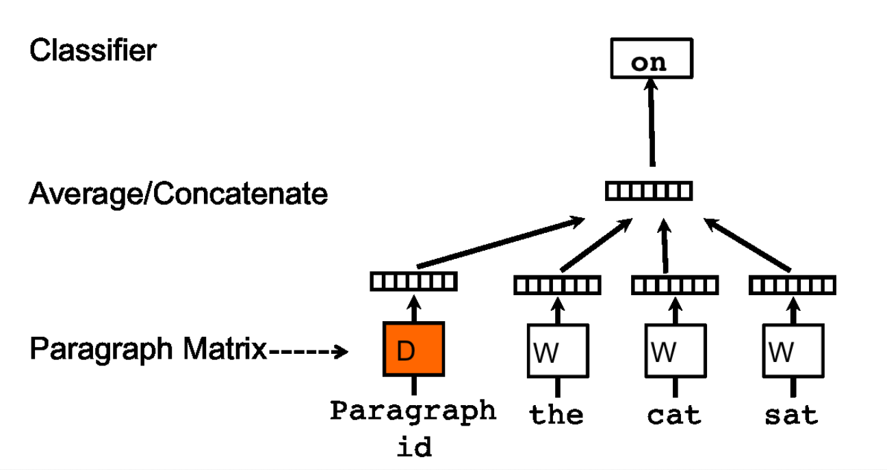
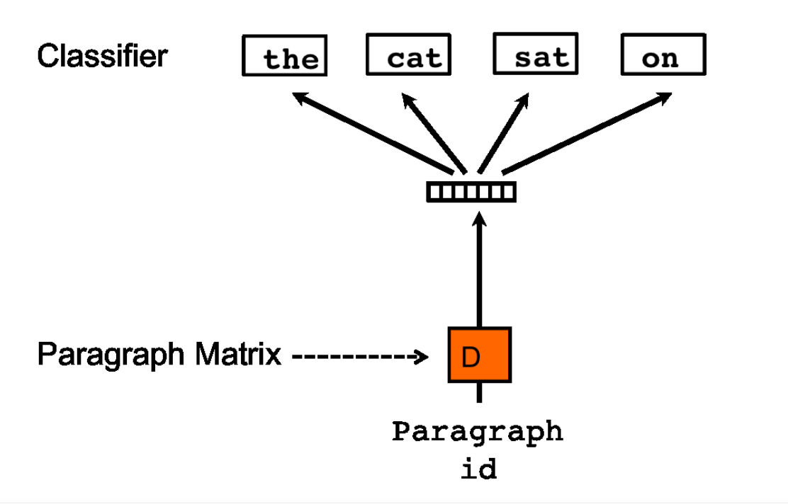

# Distributed Representations of Sentences and Documents (2014), Q. Le and T. Mikolov et al.

###### contributors: [@GitYCC](https://github.com/GitYCC)

\[[paper](https://arxiv.org/abs/1405.4053)\]

---

### Introduction

- known as **doc2vec**
- bag-of-words features have two major weaknesses: they lose the ordering of the words and they also ignore semantics of the words
- Empirical results show that Paragraph Vectors outperform bag-of-words models as well as other techniques for text representations.
- Unlike some of the previous approaches, it is general and applicable to texts of any length: sentences, paragraphs, and documents. It does not require task-specific tuning of the word weighting function nor does it rely on the parse trees.

### Distributed Memory Model of Paragraph Vectors (PV-DM)

- On training stage: training to get word vectors $W$ , softmax weights $U$, $b$ and paragraph vectors $D$ on already seen paragraphs, $y=b+Uh(x_{t-k},...,x_{t+k};para\_id;W;D)$
- On inference stage: to get paragraph vectors $D$ for new paragraphs (never seen before) by adding more columns in $D$ and gradient descending on $D$ while holding $W$, $U$, $b$ fixed. We use $D$ to make a prediction about some particular labels using a standard classifier, e.g., logistic regression.

### Distributed Bag of Words version of Paragraph Vector (PV-DBOW)

- On training stage: training to get softmax weights $U$, $b$ and paragraph vectors $D$ on already seen paragraphs, $y=b+Uh(para\_id;D)$
- On inference stage: to get paragraph vectors $D$ for new paragraphs (never seen before) by adding more columns in $D$ and gradient descending on $D$ while holding  $U$, $b$ fixed. 