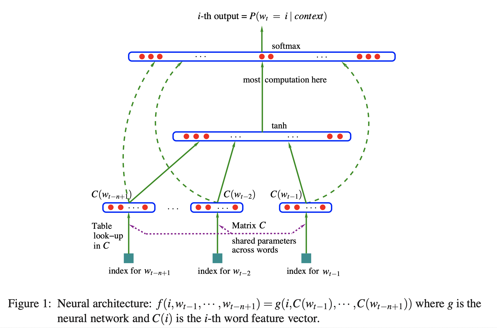
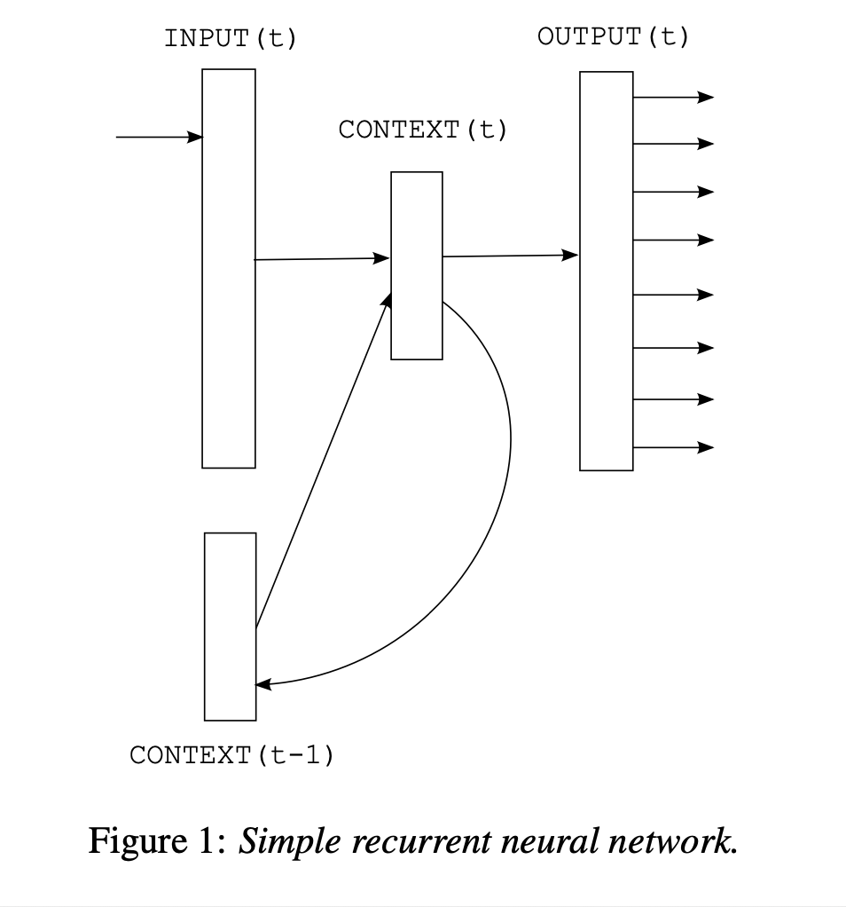
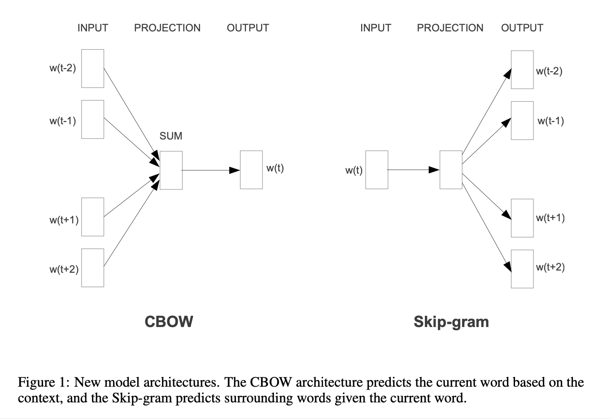
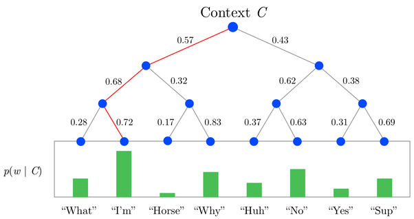
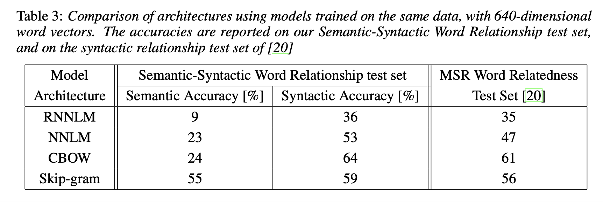
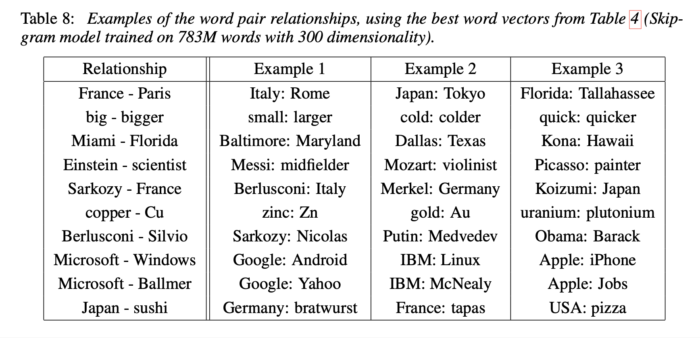

# Efficient estimation of word representations in vector space (2013), T. Mikolov et al.

###### contributors: [@GitYCC](https://github.com/GitYCC)

\[[paper](http://arxiv.org/pdf/1301.3781)\] \[[code](https://github.com/dav/word2vec)\]

---

**Model Architectures**

- Many different types of models were proposed for estimating continuous representations of words, including the well-known Latent Semantic Analysis (LSA) and Latent Dirichlet Allocation (LDA). In this paper, we focus on distributed representations of words learned by neural networks

- Previous NN for estimating continuous representations of words

  - Feedforward Neural Net Language Model (NNLM)

    - Y. Bengio, R. Ducharme, P. Vincent. A neural probabilistic language model. Journal of Ma- chine Learning Research, 3:1137-1155, 2003.
    - 

  - Recurrent Neural Net Language Model (RNNLM)

    - T. Mikolov, M. Karafia ́t, L. Burget, J. Cernocky ́, S. Khudanpur. Recurrent neural network based language model, In: Proceedings of Interspeech, 2010.
    - 
    - overcome certain limitations of the feedforward NNLM, such as the need to specify the context length
  
- new design: Continuous Bag-of-Words Model and Continuous Skip-gram Model
  - 
  - simpler model than previous models
  - no non-linear activation function in hidden layers
  - output activation function: hierarchical softmax
    - In our models, we use hierarchical softmax where the vocabulary is represented as a Huffman binary tree. This follows previous observations that the frequency of words works well for obtaining classes in neural net language models 
  - Hierarchical Softmax 🙋‍♂️🙋‍♂️🙋‍♂️
    - good reference: https://www.quora.com/What-is-hierarchical-softmax
    - problem: If number of classes = $V$, we need $O(V)$ to compute any probability in softmax, because $p_i=e^{z_i}/\sum_j e^{z_j}$ has the term $\sum_j e^{z_j}$. And $V$ is number of words which is a huge number.
    - 
    - That hierarchical softmax use Hoffman tree to get any probability could solve this problem. 
    - Any non-leaf node keeps a weight $\theta_k$ which determines right/left path probability by sigmoid function $1/(1+e^{-z\cdot\theta_k})$. This weight $\theta_k$ co-trains with hidden layers.
    - Because we use Hoffman tree (depended on word frequency), most frequently word needs less parameters to determine its probability. It's reasonable.
    - When using hierarchical softmax, if number of classes = $V$, we need only $O(log_2(V))$ to compute any probability. 

**Result**

- We observed that it is possible to train high quality word vectors using very simple model architectures, compared to the popular neural network models (both feedforward and recurrent).

- To compare the quality of different versions of word vectors, previous papers typically use a table showing example words and their most similar words, and understand them intuitively. Although it is easy to show that word France is similar to Italy and perhaps some other countries, it is much more challenging when subjecting those vectors in a more complex similarity task, as follows.
- We follow previous observation that there can be many different types of similarities between words, for example, word *big* is similar to *bigger* in the same sense that *small* is similar to *smaller*. Example of another type of relationship can be word pairs *big* - *biggest* and *small* - *smallest*
  - $big-biggest=small-smallest$

