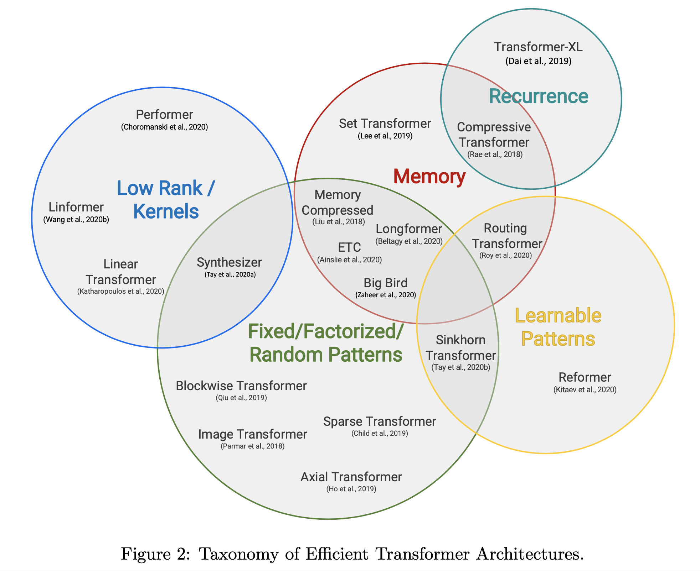
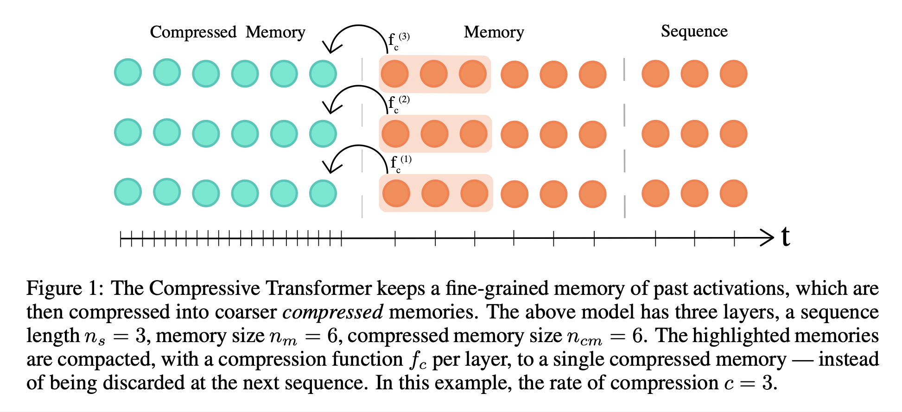

# Efficient Transformers: A Survey (2020), Yi Tay et al.

###### contributors: [@GitYCC](https://github.com/GitYCC)

\[[paper](https://arxiv.org/pdf/2009.06732.pdf)\] 

---

### Background on Transformers


### A Survey of Efficient Transformer Models




A Taxonomy of Efficient Transformers

- Fixed Patterns (FP): simply sparsifies the attention matrix by limiting the field of view to fixed
- Learnable Patterns (LP): aim to learn the access pattern in a data-driven fashion (A key characteristic of learning patterns is to determine a notion of token relevance and then assign tokens to buckets or clusters.)
- Memory (M): leverage a side memory module that can access multiple tokens at once
- Low-Rank (LR): the key idea is to assume low-rank structure in the N × N self-attention matrix
- Kernels (KR): view the attention mechanism through kernelization
- Recurrence (RC)


**1. Memory Compressed Transformer**

- Including two types of attention: Local Attention Span and Memory-compressed Attention
- Local Attention Span: proposed dividing the input sequence into blocks of similar length and run self-attention within each block independently
- Memory-compressed Attention: The idea of memory compressed attention is to reduce the number of keys and queries using a strided convolution, while the queries remain unchanged. For example, applying a convolution with kernel size and strides of $k$, the computational and memory cost of the attention mechanism reduces to $O(n*n/k)$. Memory compressed attention lets the model exchange the information globally across the input sequence as opposed to the local attention.


**2. Image Transformer**

- Localized Attention Span:  for all queries from a single query block (Q), the model attends to the same memory block (K, V)
- restrictions
  - lost global information
  - local-attention still has quadratic complexity to the region length


**3. Set Transformer**

- set-input problems: invariant to the permutation, or ordering, of the input features
- Eelements
  - $Att(Q, K, V ; ω) = ω(QK^⊤) V$
  - $Multihead(Q,K,V;λ,ω)=concat(O_1,··· ,O_h)W^O$
    - where: $O_j =Att(QW_j^Q,KW_j^K,VW_j^V;ω_j)$
  - $rFF$: parameterized feed-forward layer that operates on each row of its input matrix separately
  - Multihead Attention Block: $MAB(X, Y) = LayerNorm (H + rFF(H))$
    - where: $H = LayerNorm (X + Multihead(X, Y, Y ))$
  - Set Attention Block: $SAB(X) = MAB(X, X)$
  - Induced Set Attention Block: $ISAB_m(X) = MAB (X, MAB(I_m, X))$
    - where: $I_m$ inducing points
    - replace $SAB$ with $ISAB$ to solve the quadratic time complexity problem
  - Pooling by Multihead Attention: $PMA_k(X)= MAB(S_k,rFF(X))$
    - where: $S_k\in \R^{k×d}$ is a learnable set of $k$ seed vectors
    - Note that the output of $PMA$ is a set of $k$ items. We use one seed vector ($k = 1$) in most cases, but for problems such as amortized clustering which requires $k$ correlated outputs, the natural thing to do is to use $k$ seed vectors.
- Encoders: two ways
  - $Encoder(X) = SAB(SAB(X))$
  - $Encoder(X) = ISAB_m(ISAB_m(X))$
- Decoder: $Decoder(X) = rFF (SAB (PMA_k(X))) $


**4. Sparse Transformer**

- strided pattern: figure 3 (b)
  - $A^{(1)}_i = \{t,t + 1,...,i\}\ for\ t = max(0,i − l)$
  - $A^{(2)}_i =\{j:(i−j)\ mod\ l=0\}$
  - This formulation is convenient if the data naturally has a structure that aligns with the stride, like images or some types of music. 
- fixed pattern: figure 3 (c)
  - $A^{(1)}_i = \{j : (⌊j/l⌋ = ⌊i/l⌋)\}$, where the brackets denote the floor operation
  - $A^{(2)}_i = \{j : j\ mod\ l ∈\{t,t+1,...,l\}\}$, where $t=l−c$
  - This formulation is convenient if the data is without a periodic structure, like text.
- restrictions: requires custom GPU kernels to implement a specific block-sparse variant of matrix-matrix-multiplication and cannot be easily implemented on other hardware such as TPUs


**5. Axial Transformer**

- Axial Transformer simply applies multiple attentions, each along a single axis of the input tensor.
- An advantage of Axial Transformer over similar methods like Sparse Transformer is that while it provides the global receptive field, it is straightforward to implement it and does not require a custom kernel for an efficient implementation.


**6. Longformer**

- Its key distinction compared to Sparse Transformer is “Dilated Sliding Windows”, which can enable better long-range coverage without sacrificing sparsity. But, for classification tasks, the Longformer adopts global tokens (e.g., CLS tokens) that have access to all input sequences.


**7. Extended Transformer Construction (ETC)**

- It introduces a new global-local attention mechanism. There are four components to this new attention mechanism, namely (1) global-to-global (*g2g*), global-to-local (*g2l*), local-to-global (*l2g*) and local-to-local (*l2l*).

- restrictions: Intuitively, it is easy to observe that ETC cannot be used for auto-regressive decoding. This is because we are not able to compute causal masks because of the global attention.


**8. BigBird**

- The Big Bird model comprises of several key components, namely (1) global tokens, (2) random attention (queries attend to random keys) and (3) fixed patterns (local sliding windows).
- restrictions: cannot be used to autoregressively decode


**9. Routing Transformer**

- It proposes a clustering-based attention mechanism that learns the attention sparsity in a data driven fashion.
- Our strategy first assigns queries and keys to clusters. Then only queries and keys from the same cluster are considered for attention.
  - $X_i′= \sum_{j\in C_i,j\leq i} A_{ij}V_j$
- Update Centroids
  - Queries, Keys and Values: $Q, K, V ∈ \R^{n×d}$
  - Centroid: $\bold{μ} ∈ \R^{k×d}$
  - $Q$ ← LayerNorm($Q$),  $K$ ← LayerNorm($K$)    *[scale, bias disabled]*
  - $Q_{prod}←\bold{μ}Q^T$, $K_{prod}←\bold{μ}K^T$   *[similarity between centroids and queries or keys]*
  - $Q_m$ ← one-hot[argmax($Q_{prod}$)], $K_m$ ← one-hot[argmax($K_{prod}$)]   *[clustering]*
  - Update centroids:  $\bold{μ}←λ\bold{μ}+(1−λ)Q_mQ/2+(1−λ)K_mK/2$


**10. Reformer**

- LSH Attention: To get $b$ hashes, we first fix a random matrix $R$ of size $[d_k , b/2]$. We then define $h(x) = arg max([xR; −xR])\in \{1,2,..,b\}$ where $[u; v]$ denotes the concatenation of two vectors.
- Memory Efficiency with LSH Attention: The key idea behind LSH attention is to classify tokens into buckets and then process them bucket by bucket in a chunked fashion. To this end, queries are first sorted by bucket number and then by sequence order within the same bucket. During computation, tokens only attend to same bucket **in its own chunk and previous chunk**. The chunking and sorted bucketing techniques help to improve the overall efficiency of the Reformer model.
- In terms of parameter costs, the Reformer shares queries and keys, which reduces the cost of the QKV transforms by a third.


**11. Sinkhorn Transformers**

- The Sinkhorn Transformer belongs to the family of learned patterns. This model is a chunked/blocked model that learns sparse patterns by re-sorting the input key and values in a block-wise fashion and then applying local block-based attention.
  $$
  A_{ij}=Q_i\psi_S(K)_j^T\ \text{if}\ ⌊j/b⌋ = ⌊i/b⌋\ \text{else}\ 0
  $$
  where $\psi_S$ applies a sorting operator on the sequence length dimension.

- Sorting Network: The sorting operator is parameterized by a meta sorting network. Let $X$ be the input sequence of dimension $N × d$.
  $$
  ψ_S(X) = \phi_S(F_S(BlockSum(X))) BlockShape(X)
  $$
  where $F_S (.)$ is a parameterized function such as a two layer feed-forward network with ReLU activation. The output of $F_S (.)$ is a tensor of $n_B × n_B$ . The BlockSum function learns the sum embeddings of local blocks. The BlockShape function reshapes the input tensor into $\R^{N×d} → \R^{n_B×b×d}$. Here, we note that $N = n_B × b$, where $b$ is the size of the block and nB is the number of total blocks.

- Sinkhorn Sorting: $\phi$ is the Sinkhorn balancing operator which converts the $n_B × n_B$ matrix into a soft permutation matrix. 

  - The matrix $\phi(.)$ becomes a sorting matrix (or permutation matrix) if it is doubly stochastic (matrix is nonnegative and both rows and columns all sum to 1). More specifically, a permutation matrix is special case of a doubly stochastic matrix (where rows and columns sum to 1 and all entries are either 0 or 1). Since every permutation matrix is a convex combination of doubly stochastic matrices, we consider learning doubly stochastic matrices as a a form of relaxed permutation matrix.
  - $\phi(.)$: a series of row- and column-wise normalizations are applied on the input matrix
  - To this end, (Sinkhorn, 1964) shows that iterative normalization of $R$ ($R=F_S(BlockSum(X))$ here) converges to the doubly stochastic limit if $R$ has support, i.e., a nonnegative matrix with a positive diagonal. Note that since $R$ is nonnegative by design due to the usage of ReLU in $F_S$. Gradients of the iterative Sinkhorn normalization can be computed, enabling end-to-end training.


**12. Linformer**

- Low Rank Projections on Length Dimensions:
  - The Linformer projects the $N × d$ dimensional keys ($K$->$K'$) and values ($V$->$V'$) to $k×d$ dimensions using additional projection layers. Note that this is a reduction on the length dimension instead of the key and value dimensions.
  - The attention matrix $Softmax(QK′)$ multiplies with $V′ ∈ \R^{k×d}$ to result in an output tensor of dimensions $N × d$.


**13. Linear Transformer**

- Kernel Method
  - 
  - At normal transformer, $sim(q,k)=exp(\frac{qk^T}{\sqrt{d}})$
  - Using kernel method, $sim(q,k)=\phi(q)^T\phi(k)$
  - With this choice, we can rewrite $V_i′$ as
    
  - recurrence relations:
    
  - The authors choose $\phi(x)=elu(x)+1$
    - 
    - so $\phi(x)\geq0$


**14. Performer**

- Performer can estimate regular (softmax) full-rank-attention Transformers with provable accuracy, but using only linear (as opposed to quadratic) space and time complexity, without relying on any priors such as sparsity or low-rankness.
- $Att_↔(Q, K, V) = D^{-1}AV$ ,           $A = exp(QK^T/\sqrt{d})$ ,           $D = diag(A1_L)$
  - $D^{-1}A$  means softmax of $QK^T/\sqrt{d}$
- kernel function decomposition
  - $K(x, y)= E[\phi(x)^⊤\phi(y)]$
    - $\phi(u)$ is called a random feature map, including random projection
  - $\phi(u)=\frac{h(x)}{\sqrt{m}}(f_1(w_1^⊤u), ..,f_1(w_m^⊤u), ..., f_l(w_1^⊤u), .., f_l(w_m^⊤u))$
    - $w_1,...,w_m\overset{iid}{\sim}\mathcal{D}$
  - Proved: $h(u) = 1$, $l = 2$, $f_1 = sin$, $f_2 = cos$ correspond to shift-invariant kernels, in particular $\mathcal{D} = \mathcal{N} (0, I_d )$ leads to the Gaussian kernel $K_{gauss}$
  - softmax-kernel: $exp(x^⊤y)=exp(∥x∥^2/2 )K_{gauss}(x,y)exp(∥y∥^2/2)$
    - so, $h(u) = exp(∥u∥^2/2 )$, $l = 2$, $f_1 = sin$, $f_2 = cos$,  $\mathcal{D} = \mathcal{N} (0, I_d )$
  - $AV=Q'(K')^⊤V$ ,   $Q'=\phi(Q)$,   $K'=\phi(K)$
    - 
- Orthogonal Random Features: by the standard Gram-Schmidt orthogonalization procedure
- Fast Attention via Orthogonal Random Features (FAVOR): kernel function decomposition + orthogonal random features


**15. Synthesizers**

- Their model removes the notion of query-key-values in the self-attention module and directly synthesizes the alignment matrix instead.

- Dense Synthesizers

  - $A = W_2(σ_R(W_1(X) + b_1)) + b_2$
  - $Y = Softmax(A)G(X)$  
    - where: $G(X)$ is another parameterized function $\R^{N×d} → \R^{N×d}$ that is analogous to $V$ (value) in the standard Transformer model

- Factorized Dense Synthesizer

  - $A=H_B(B)∗H_C(C)$, where $B,C =F_B(X_i),F_C(X_i)$

    - where $F_B (.)$ projects onto $b$ dimensions and $F_C (.)$ projects $X_i$ onto $c$ dimensions with $c × b = N$ . $H_B$, $H_C$ are repeat functions. In this case, $H_B(·)$ is a projection of $\R^b → \R^{bc}$ and $H_C(·)$ is a projection of $\R^c → \R^{cb}$.

    - ```python
      x = torch.randn([batch_size, sentence_length, channel_dim])
      B = self.a_proj(x).repeat([1, 1, c])  # [bs, length, b * c]
      C = self.a_proj(x).repeat([1, 1, b])  # [bs, length, c * b]
      energy = A * B  # [bs, length, length]
      ```

- Random Synthesizers

  - $Y=Softmax(R)G(X)$
    - where $R ∈ \R^{N×N}$ is a trainable and/or non-trainable matrix

- Factorized Random Synthesizers

  - $Y = Softmax(R_1R_2^⊤)G(X)$
    - where $R_1,R_2 ∈ \R^{N×k}$


**16. Transformer-XL**

- Segment Recurrence
  $$
  \tilde{h}^{n-1}_{τ+1}=\text{concat}\{\text{StopGradient}(h^{n-1}_{τ}), h^{n-1}_{τ+1}\} \\
  q^{n}_{τ+1}=h^{n-1}_{τ+1}W^T_q \\
  k^{n}_{τ+1}=\tilde{h}^{n-1}_{τ+1}W^T_k \\
  v^{n}_{τ+1}=\tilde{h}^{n-1}_{τ+1}W^T_v \\
  h^{n}_{τ+1}=\text{Transformer-Layer}(q^{n}_{τ+1},k^{n}_{τ+1},v^{n}_{τ+1})
  $$

- Relative Positional Encodings
  


**17. Compressive Transformers**

- We build on the ideas of the TransformerXL which maintains a memory of past activations at each layer to preserve a longer history of context. The TransformerXL discards past activations when they become sufficiently old (controlled by the size of the memory). The key principle of the Compressive Transformer is to compress these old memories, instead of discarding them, and store them in an additional compressed memory.

- Compression: These memories are compressed with a variety of compression functions such as (1) mean/max pooling (2) 1D convolutions, (3) dilated convolutions, and (4) most used (e.g., sorted by usage of attention).

- Memory Reconstruction: In order to better retain memories over long sequences, the

  Compressive Transformer implements an auto-encoding loss that learns to reconstruct the

  original memory from its compressed version.



