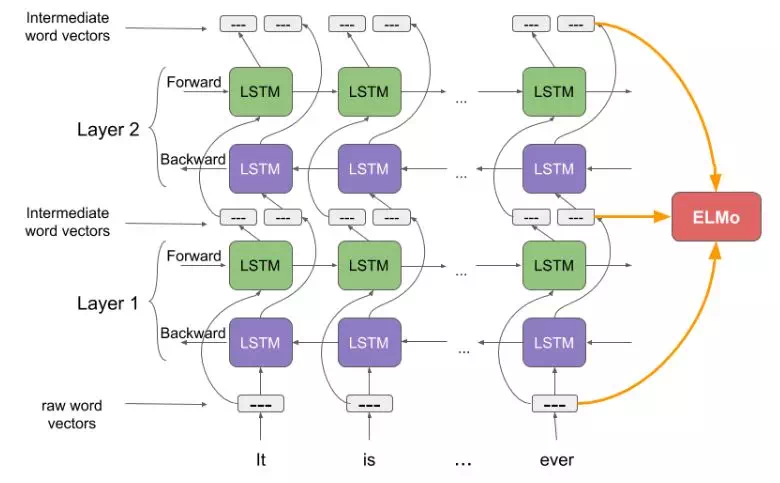
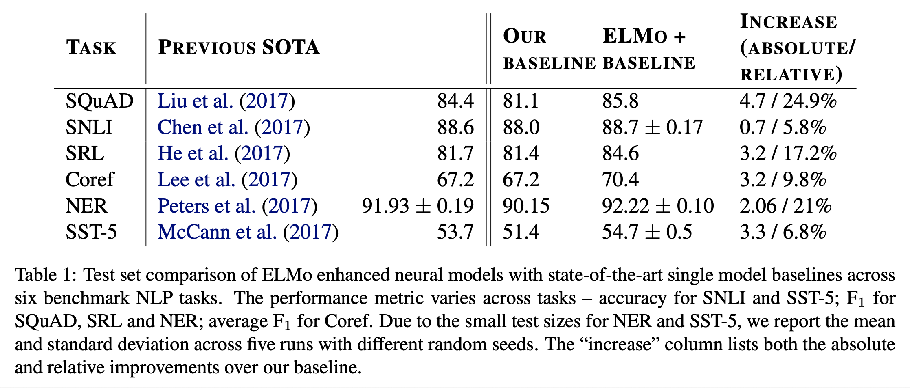
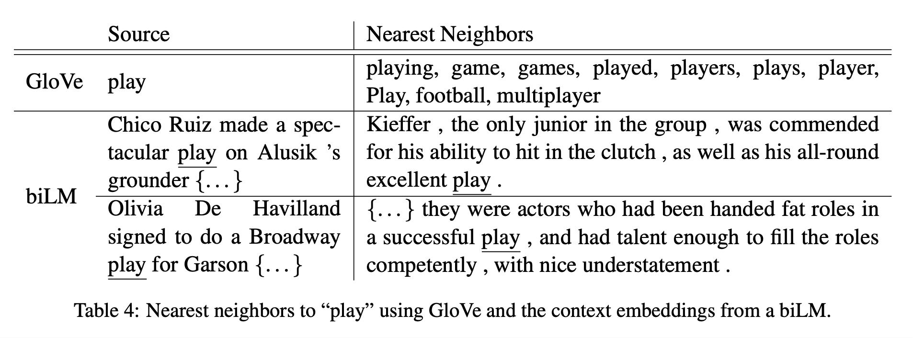
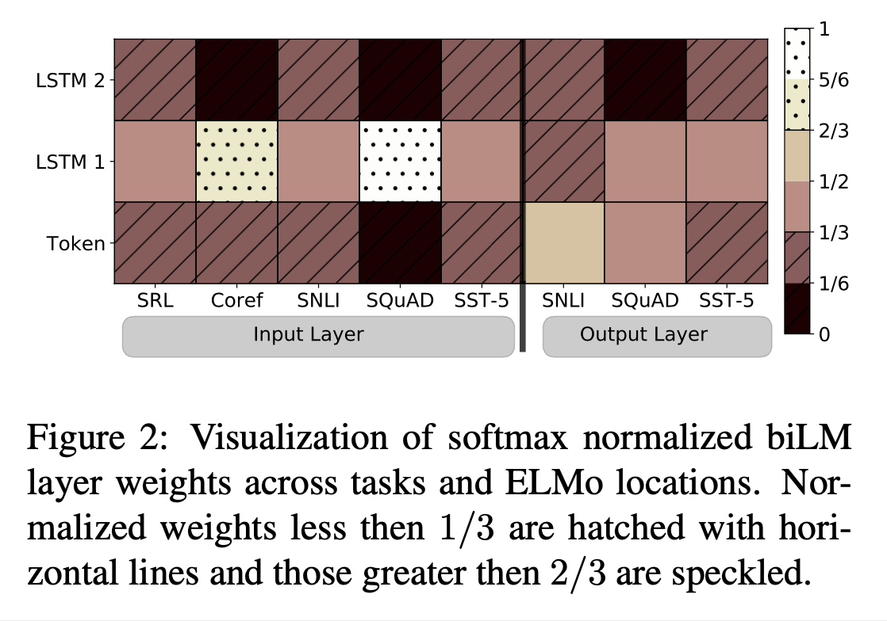

# Deep contextualized word representations (2018), C. Clark et al.

###### contributors: [@GitYCC](https://github.com/GitYCC)

\[[paper](https://arxiv.org/abs/1802.05365)\] 

---

### Introduction

- Our word vectors are learned functions of the internal states of a deep bidirectional language model (biLM), which is pre- trained on a large text corpus. We show that these representations can be easily added to existing models and significantly improve the state of the art across six challenging NLP problems
- We also present an analysis showing that exposing the deep internals of the pre-trained network is crucial, allowing downstream models to mix different types of semi-supervision signals.
- Challenge of pre-trained word representations
  - complex characteristics of word use (e.g., syntax and semantics)
  - how these uses vary across linguistic contexts (i.e., to model polysemy)
- In this paper, we introduce a new type of deep contextualized word representation that directly addresses above both challenges.
- We use vectors derived from a bidirectional LSTM that is trained with a coupled language model (LM) objective on a large text corpus. For this reason, we call them ELMo (Embeddings from Language Models) representations.

### ELMo: Embeddings from Language Models

- What is language model (LM)?
  - In brief, given previous words, to predict next word
  - Usually use forward RNN to create LM

(above picture is from [this blog](https://medium.com/我就問一句-怎麼寫/nlp-model-elmo-6bd828a824a))

- Raw word vectors: a context-independent token representation $x_k^{LM}$ 
  - A context-independent token representation is trained based on character level RNN that for represent each token with a feature vector
- LM
  - Forward LM
    - pass $x_k^{LM}$  through $L$ layers of forward LSTMs. At each position $k$, each LSTM layer outputs a context-dependent representation $\overrightarrow{h}_{k,j}^{LM}$ where $j = 1,\dots,L$. The top layer LSTM output, $\overrightarrow{h}_{k,L}^{LM}$ , is used to predict the next token $t_{k+1}$ with a Softmax layer.
  - Backward LM
    - A backward LM is similar to a forward LM, except it runs over the sequence in reverse, predicting the previous token given the future context
  - We tie the parameters for both the token representation and Softmax layer in the forward and backward direction while maintaining separate parameters for the LSTMs in each direction. Overall, this formulation is similar to the approach of Peters et al. (2017), with the exception that we share some weights between directions instead of using completely independent parameters.
- ELMo
  - $ELMo_{k}^{task}=\gamma^{task}\sum_{j=0}^{L}s_j^{task}h_{k,j}^{LM}$
    - $h_{k,j}^{LM}\equiv [\overrightarrow{h}_{k,j}^{LM},\overleftarrow{h}_{k,j}^{LM}]$ , where: $j=1,\dots,L$
    - set $h_{k,0}^{LM}\equiv x_k^{LM}$
    - $s_j^{task}$ are softmax-normalized weights
    - the scalar parameter $\gamma^{task}$ allows the task model to scale the entire ELMo vector
  - Considering that the activations of each biLM layer have a different distribution, in some cases it also helped to apply layer normalization (Ba et al., 2016) to each biLM layer before weighting.
- Flow: We simply run the biLM and record all of the layer representations for each word (freeze the weights of the biLM). Then, we let the end task model learn a linear combination of these representations.

### Results

- Question answering on SQuAD
  - F1 improved by 4.7% from 81.1% to 85.8%
- Textual entailment on SNLI
  - Textual entailment is the task of determining whether a “hypothesis” is true, given a “premise”.
  - Accuarcy improved by 0.7% from 88.0% to 88.7%
- Semantic role labeling (SRL)
  - A semantic role labeling (SRL) system models the predicate-argument structure of a sentence, and is often described as answering “Who did what to whom”.
  - F1 improved by 3.2% from 81.4% to 84.6%
- Coreference resolution (Coref)
  - Coreference resolution is the task of clustering mentions in text that refer to the same underlying real world entities.
  - average F1 improved by 3.2% from 67.2% to 70.4%
- Named entity extraction (NER)
  - extract four different entity types (PER, LOC, ORG, MISC)
  - F1 improved by 2.06% from 90.15% to 92.22%
- Sentiment analysis on SST-5
  - The fine-grained sentiment classification task with five labels (from very negative to very positive) 
  - Accuarcy improved by 3.3% from 51.4% to 54.7%

- ELMo is a context-dependent word embedding

- Figure 2 visualizes the softmax-normalized learned layer weights. 
- At the input layer, the task model favors the first biLSTM layer. For coreference and SQuAD, the this is strongly favored, but the distribution is less peaked for the other tasks. 
- The output layer weights are relatively balanced, with a slight preference for the lower layers.

